# El proceso y la matemática del domo

Este es el documento que abre la documentación del laboratorio. Cuenta el
proceso completo de punta a punta, la matemática que lo sostiene y lo que se
aprendió de las referencias y de la cúpula real. Lo que ya tiene documento
propio no se repite aquí, se enlaza:

- [02_Sala_Unreal.md](02_Sala_Unreal.md) — la sala en Unreal Engine 5.8 y el contrato de geometría.
- [03_Puente_Spout.md](03_Puente_Spout.md) — cómo llega la señal de TouchDesigner a la cúpula virtual.
- [04_Senal_TouchDesigner.md](04_Senal_TouchDesigner.md) — el sistema de señal `DOMO`, sus módulos y su calibración.
- [../06_Modelos/Domos_de_Colombia.md](../06_Modelos/Domos_de_Colombia.md) — las salas de domo del país y cómo corregir sus datos.

## 1. Qué es esto y para quién

Es un laboratorio abierto de domo. Tiene tres piezas que se pueden usar juntas
o por separado:

1. **La señal.** Un sistema en TouchDesigner que toma video 360, domemasters,
   VR180 o video plano y entrega un domemaster fisheye con el FOV de la sala,
   más una versión equirectangular para la sala virtual. Sale por Spout, NDI o
   a disco.
2. **La sala VR.** Un modelo de planetario a escala del Planetario de Bogotá,
   generado por script en Blender y visualizado en Unreal con la cúpula como
   única fuente de luz. Sirve para ver en realidad virtual, desde una butaca,
   lo que se está produciendo, antes de pisar la cúpula real.
3. **Los modelos de salas de Colombia.** Una tabla y un JSON con las cúpulas
   del país (diámetro, inclinación, FOV, aforo, proyección), para que el mismo
   proceso se pueda repetir con otra sala cambiando constantes y no código.

Está pensado para quien produce contenido fulldome (artistas, estudiantes,
mediadores de planetario) y no tiene acceso diario a una cúpula, y para quien
quiera montar el mismo flujo con otra sala u otro motor.

## 2. El proceso en una página

```
sala real ──medidas──► Blender ──FBX──► Unreal (sala VR, cúpula emisiva)
                                              ▲
                                              │ Spout, lienzo equirectangular
TouchDesigner: IN_360 / IN_180 / IN_169 ──► equi ──► domo (fisheye) ──► out_domo
                                                        │
                                                        ├─► Spout / NDI ─► servidor de la cúpula real
                                                        └─► grabar (HAP)
patrón de prueba ──► se mira en la cúpula real y en la VR ──► Yaw, Pitch, FOV
```

1. **Sala real → modelo.** Las cotas de la sala entran como constantes de
   `01_Blender/generar_sala_domo.py`: radio de 11,5 m (23 m de diámetro),
   ecuador de la cúpula a 3 m, tarima central, sector de control de 7 m de
   arco contra el muro, 360 butacas en 6 cuñas, 4 puertas. El script corre en
   headless, borra la escena y la reconstruye entera, hornea las texturas PBR y
   exporta FBX y glTF. Los renders de control están en `05_Preview/`.

   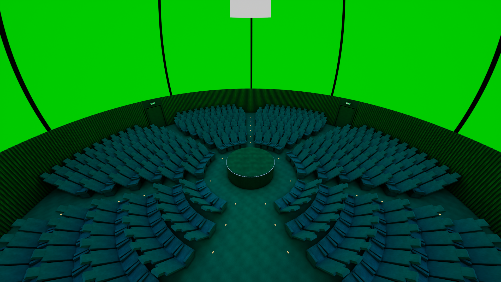
   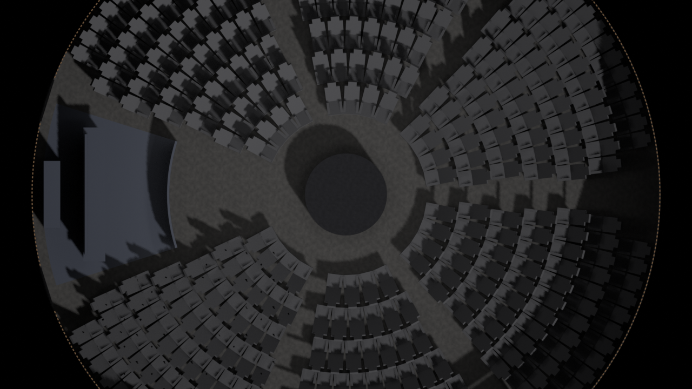

2. **Modelo → Unreal.** `importar_sala.py` importa el FBX, crea los materiales
   y arma el nivel. La cúpula (`SM_Domo`) lleva las normales hacia adentro y un
   UV con U = azimut y V = elevación: la textura que reciba se lee como lienzo
   equirectangular; la única corrección del lado de Unreal es voltear la U
   (`EspejoU`, porque la U de la cúpula crece hacia la izquierda de quien mira
   desde adentro). El material de la
   cúpula es Unlit y emisivo; con Lumen, esa emisión ilumina butacas y muro.
   Detalle en [02_Sala_Unreal.md](02_Sala_Unreal.md).

   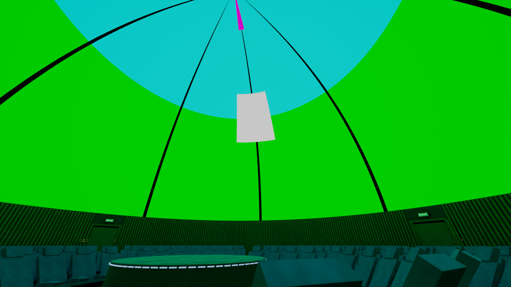

3. **TouchDesigner manda por Spout.** El sistema `DOMO` produce el lienzo
   equirectangular común y lo publica con el sender `TD_Domo_Lab`. En Unreal,
   `ASpoutDomeReceiver` lo recibe cada tick y lo pone en el parámetro
   `SpoutTexture` de `MI_Domo`. Detalle en [03_Puente_Spout.md](03_Puente_Spout.md).

4. **Verificación con patrón.** `shaders/patron.frag` pinta el lienzo con
   franjas de color, meridianos, un cuadro blanco al frente y una marca en el
   cénit. Se mira en el domemaster y en la sala VR y se corrigen `Yaw`, `Pitch`
   y el modelo de sala hasta que el frente, el cénit y la costura caen donde
   deben. Con ese patrón se midieron todas las orientaciones de la sección 3.9.

   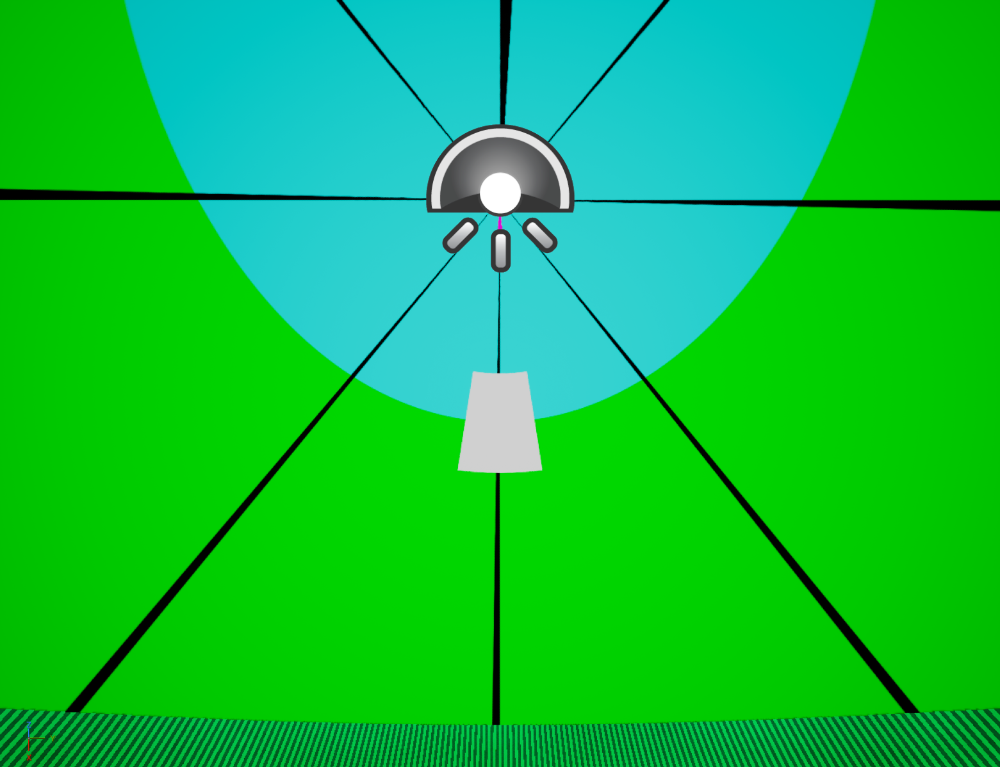

## 3. La matemática

Todo lo que sigue está implementado en `00_TouchDesigner/build_domo.py`,
`00_TouchDesigner/shaders/*.frag` y `00_TouchDesigner/video_dome/dome_map.frag`.
Los ángulos van en radianes dentro de los shaders y en grados en los
parámetros; las fórmulas se escriben tal como las calcula el código.

### 3.1 Coordenadas del domo

Una dirección en la cúpula se describe con dos ángulos: el **azimut** $a$,
medido alrededor del cénit con $a = 0$ en el frente de la sala, y la
**elevación** $e$, con $e = 0$ en el horizonte (la *springline*, donde arranca
la cúpula) y $e = 90°$ en el cénit. La base es (derecha, frente, cénit), y la
dirección unitaria es:

$$
\vec P(a, e) = (\sin a \cos e,\; \cos a \cos e,\; \sin e)
$$

Al revés, de una dirección a los ángulos: $a = \operatorname{atan2}(P_x, P_y)$ y
$e = \arcsin P_z$. Esta es la función `dirFrom` del shader y es la única
convención de dirección que usa todo el sistema.

El ángulo cenital $\theta$ (medido desde el cénit hacia abajo) es el
complemento: $\theta = 90° - e$. Un domo de 180° cubre $0 \le \theta \le 90°$.

### 3.2 Equirectangular ↔ dirección

El lienzo equirectangular es un rectángulo 2:1 donde las dos coordenadas son
los dos ángulos, lineales. Con la convención del sistema (`u = 0.5` frente,
`v = 0.5` horizonte, `v = 1` cénit):

$$
u = \tfrac12 + \frac{a}{360°}, \qquad v = \tfrac12 + \frac{e}{180°}
$$

y por tanto $a = (u - \tfrac12)\cdot 360°$, $e = (v - \tfrac12)\cdot 180°$. La
mitad superior del lienzo ($v > 0.5$) es la cúpula; la inferior queda bajo el
horizonte y en un domo de 180° no se ve. El lienzo se cierra sobre sí mismo en
$u = 0$ y $u = 1$, que es el azimut 180°, detrás del público.

Dos consecuencias prácticas salen de esa linealidad:

- Un corrimiento horizontal del lienzo es un giro puro en azimut. Por eso el
  `Yaw` se aplica como `Transform TOP` con `tx = Yaw / 360` y extensión
  `repeat`, no como rotación del `Projection TOP`.
- Un rectángulo dibujado en el lienzo no es un rectángulo en la cúpula: su
  ancho en grados de azimut se comprime por $\cos e$ al subir. Esta es la razón
  por la que las pantallas de video plano no se dibujan sobre el lienzo, sino
  por dirección (sección 3.5).

### 3.3 El domemaster: fisheye azimutal equidistante

El domemaster es una imagen cuadrada con un círculo adentro. El estándar
fulldome es la proyección **azimutal equidistante** (*angular fisheye*): el
radio en la imagen es lineal con el ángulo cenital. Con coordenadas
normalizadas $nc \in [-1, 1]^2$ del cuadro:

$$
r = |nc|, \qquad \theta = r \cdot \frac{FOV}{2}, \qquad \varphi = \operatorname{atan2}(nc_x, -nc_y)
$$

y la dirección en la cúpula:

$$
\vec P = (\sin\theta \sin\varphi,\; \sin\theta \cos\varphi,\; \cos\theta)
$$

Con $FOV = 180°$ la mitad del radio son exactamente 45°, el centro del círculo
es el cénit, el borde es el horizonte y fuera del círculo ($r > 1$) va negro
puro. El signo de $-nc_y$ pone el frente del domo **abajo** del cuadro, que es
la convención de entrega. Al revés, de una dirección al domemaster:

$$
r = \frac{\theta}{FOV/2}, \qquad nc = r\,(\sin\varphi,\; -\cos\varphi)
$$

Esta inversa es la que usa el editor con el mouse: como el radio *es* el
ángulo, pasar de un clic en el panel a azimut y elevación no necesita ninguna
proyección rara.

El "modelo de sala" del sistema es sencillamente este $FOV$: 180° para media
esfera, 90° y 45° para casquetes, o un valor propio. Un domemaster de 210°
(como el de la SATosphere de Montreal) es la misma fórmula con otro divisor.
Los fisheye fotográficos (equisolid, estereográfico, ortográfico) tienen otra
relación entre $r$ y $\theta$ y hay que remapearlos; la clasificación completa
está en Paul Bourke, `paulbourke.net/dome/fisheyetypes/`.

### 3.4 Por qué el mapeo se hace por píxel y no por geometría

El antecedente de este sistema (documentado en el repositorio
`Domo_TouchDesigner`, `04_Docs/Material_360_y_16-9.md`) lo resolvía con
geometría: una esfera con el video pegado por dentro, una cámara en el centro,
un `Render TOP` y un `Projection TOP` hacia el simulador. Se dejó por tres
cosas medidas el 17 de septiembre de 2026:

1. Los modos `fisheye180` y `dualparaboloid` del `Render TOP` deforman **en el
   vértice**, no en el píxel. Con poca teselación las rectas se ven rectas
   cuando deberían curvarse, y el dual paraboloid deja grietas negras radiales
   en la costura entre los dos paraboloides.
2. La ruta correcta con geometría, `cubemap` → `Projection TOP` (cubemap →
   fisheye, FOV 180), sí resuelve por píxel, pero cuesta seis caras de render
   por cuadro para mostrar un video que ya venía equirectangular.
3. Una pantalla curva para el 16:9 exigía un `Script SOP` con malla teselada y
   una segunda esfera de fondo, todo dentro de la misma escena.

El sistema actual no tiene geometría ni cámara. Un 360 ya está en el formato
del lienzo; un domemaster se convierte con un `Projection TOP`; y el video plano
se resuelve al revés que un render: el shader recorre cada píxel del domemaster,
calcula su dirección $\vec P$ con la fórmula de 3.3 y pregunta qué pantalla la
cubre. No hay teselado que pueda romperse porque no hay vértices.

### 3.5 Las pantallas de video plano

Cada pantalla se define por dónde apunta (`yaw`, `pitch`, `roll`), cuánto
abarca (`hfov`, `vfov`) y su forma (`mode`). Su centro y sus ejes son:

$$
\vec C = \vec P(\text{yaw}, \text{pitch}), \quad
\vec R = (\cos\text{yaw},\; -\sin\text{yaw},\; 0), \quad
\vec U = (-\sin\text{yaw}\sin\text{pitch},\; -\cos\text{yaw}\sin\text{pitch},\; \cos\text{pitch})
$$

y con `roll` los ejes giran: $\vec R' = \vec R\cos\rho + \vec U\sin\rho$,
$\vec U' = \vec U\cos\rho - \vec R\sin\rho$. Para cada píxel del domemaster se
proyecta su dirección sobre esa base: $x = \vec P\cdot\vec R$,
$y = \vec P\cdot\vec U$, $z = \vec P\cdot\vec C$, y se descarta si $z \le 0.001$
(la dirección mira al lado contrario de la pantalla).

**Plana (gnomónica).** Es una pantalla de cine de verdad: las rectas del video
siguen rectas en el espacio.

$$
u = \tfrac12 + \frac{x/z}{2\tan(hfov/2)}, \qquad v = \tfrac12 + \frac{y/z}{2\tan(vfov/2)}
$$

Hasta unos 100° de ancho es la que no se ve deformada; más allá estira las
esquinas.

**Curva (ángulos iguales).** Cada píxel ocupa los mismos grados de cúpula:

$$
u = \tfrac12 + \frac{\operatorname{atan2}(x, z)}{hfov}, \qquad v = \tfrac12 + \frac{\arcsin y}{vfov}
$$

**Banda.** Un rectángulo directo en azimut y elevación, sin marco propio, con
$\Delta a = a - \text{yaw}$ envuelto a $[-\pi, \pi]$:

$$
u = \tfrac12 + \frac{\Delta a}{hfov}, \qquad v = \tfrac12 + \frac{e - \text{pitch}}{vfov}
$$

Es la única que puede dar la vuelta entera (`hfov = 360`) sin deformarse en los
costados.

**Túnel.** Coordenadas polares alrededor del centro de la pantalla:

$$
q = \left(\frac{\operatorname{atan2}(x, z)}{hfov/2},\; \frac{\arcsin y}{vfov/2}\right), \quad
u = \frac{\operatorname{atan2}(q_y, q_x)}{2\pi} + \tfrac12, \quad
v = \operatorname{fract}\big((1 - |q|)\cdot \text{tile} - \text{travel}\big)
$$

con $|q| \le 1$. El video se enrosca hacia el centro y con `tile` arma anillos
que se alejan. Con material figurativo se lee como un remolino: es para
material abstracto.

En todas, la pantalla acepta el píxel solo si $0 \le u, v \le 1$; después se
aplica el espejo, el recorte (`cropx`, `cropy`, `cropw`, `croph`) y la
opacidad.

### 3.6 El cilindro

El video en una pared cilíndrica alrededor del público, no pegado a la cúpula.
Un rayo que sale del centro con elevación $e$ golpea una pared de radio 1 a
altura $\tan e$, así que:

$$
h = \tan e, \qquad h_0 = \tan(\text{pitch}), \qquad h_1 = \tan(\text{pitch} + vfov)
$$

$$
u = \tfrac12 + \frac{\Delta a}{hfov}, \qquad v = \frac{h - h_0}{h_1 - h_0} - \text{travel}
$$

Solo existe sobre el horizonte ($e > 0$) y dentro de $|\Delta a| \le hfov/2$.
La tangente comprime la imagen sola hacia el cénit: esa es la fuga, lo que
hace sentir que la ciudad sigue para arriba. Cerca del cénit $\tan e$ se va al
infinito, por eso el shader corta en $e = 89{,}1°$ (`EL_MAX = 1.5551`); más
arriba aparecían artefactos de precisión justo en el centro del domemaster.
Regla práctica: si la textura tiene horizonte o rectas, cilindro; el túnel es
para lo abstracto.

### 3.7 El anillo y la costura normalizada

Una sola pantalla al frente sirve a quien mira hacia ahí. En un planetario el
público está repartido y no hay un frente, así que una fila de la tabla puede
repetirse en anillo: `rep` copias sobre un arco `repspan`. El giro que recibe la
copia $k$ de $n$ es:

$$
\delta_k =
\begin{cases}
k \cdot \dfrac{span}{n} & \text{si } span \ge 359° \text{ (vuelta completa)}\\[2ex]
\left(k - \dfrac{n-1}{2}\right)\cdot \dfrac{span}{n-1} & \text{si es un abanico parcial}
\end{cases}
$$

Con la vuelta entera la copia 0 se queda donde el usuario puso la pantalla; con
un arco parcial las copias se centran sobre esa dirección.

Pegadas una al lado de la otra las copias se leen como un collage; la
**costura** (`blend`, en grados) las une. Cada copia se ensancha esos grados y
el borde suave ocupa exactamente el solape:

$$
hfov_c = hfov + blend, \qquad feather = \frac{blend}{hfov_c}
$$

El peso de un píxel dentro del marco es un producto de `smoothstep` en los
bordes que se degradan (`edges`: los cuatro, solo los costados, o solo arriba y
abajo). Lo decisivo es cómo se mezclan las copias de una misma fila: **se suman
los aportes y se dividen por el peso total**,

$$
\text{col} = \frac{\sum_k w_k\, T(uv_k)}{\sum_k w_k}, \qquad
\alpha = \min\Big(\sum_k w_k,\, 1\Big)\cdot \text{opacity}
$$

Con la mezcla secuencial que había antes, dos bordes suaves encimados sumaban
0,75 de cobertura y dejaban una banda oscura en cada costura. Las filas
distintas sí se apilan una sobre otra en el orden de la tabla (la última queda
arriba), que es lo que uno espera al poner un túnel debajo de una pantalla.

La cuenta de si el anillo cierra: el paso entre copias es $repspan / rep$ y
cada copia cubre $hfov + blend$. Si cubre menos que el paso queda hueco; si
cubre bastante más, la imagen se repite encima de sí misma.

### 3.8 La costura de un video 360

Un 360 mal cosido deja una línea vertical donde el borde izquierdo se
encuentra con el derecho, o en cualquier azimut si la costura del stitching
quedó dentro del cuadro. `shaders/costura.frag` funde una franja alrededor de
esa columna. Con $s$ la posición de la costura en $u$ y $w$ el ancho de la
franja:

$$
d = u - s - \lfloor u - s + \tfrac12 \rfloor \in [-\tfrac12, \tfrac12), \qquad
m = 1 - \operatorname{smoothstep}(0, w, |d|)
$$

$d$ es la distancia a la costura *con vuelta*, así funciona igual en $u = 0$.
Dentro de la franja ($m > 0$) se desenfoca en horizontal con un **núcleo
triangular** de 33 muestras:

$$
\text{blur}(p) = \frac{\sum_{i=-16}^{16} (1 - |t_i|)\; T\big(p + (t_i\, \rho\, m,\; 0)\big)}{\sum_i (1 - |t_i|)}, \qquad t_i = \frac{i}{16}
$$

con $\rho$ el radio del desenfoque, y el resultado se mezcla con el original
por $m$. Si además el lado derecho de la costura quedó desplazado o más oscuro
que el izquierdo, hay dos correcciones que actúan solo sobre ese lado, con un
peso $lado = \operatorname{step}(0, d)\,(1 - \operatorname{smoothstep}(0, 3w, |d|))$:
un corrimiento vertical $v' = v + \Delta y \cdot lado$ antes de muestrear, y una
ganancia $rgb \cdot \operatorname{mix}(1, g, lado)$. Una guía pinta la costura
en rojo ($|d| < 0.0006$) para encontrarla; luego se apaga.

### 3.9 Las mediciones de orientación con el patrón

El `Projection TOP` de TouchDesigner tiene un orden de rotaciones que no
conviene deducir de memoria. Con el patrón (`shaders/patron.frag`: verde y
cian en la cúpula, rojo y amarillo bajo el horizonte, meridianos negros cada
45°, columna gruesa en $u = 0$, cuadro blanco en $u = 0.5, v = 0.75$, marca
magenta en $v = 0.97$) se midió el 17 de septiembre de 2026:

| Operación | Ajuste medido | Qué hace |
|---|---|---|
| equirectangular → fisheye, sin rotar | — | deja el centro del fisheye en el horizonte del frente |
| `rx = 90` | sube el cénit al centro del círculo | la marca magenta queda en el centro |
| `ry = 90` | gira el domemaster | el frente (cuadro blanco) queda abajo, la costura arriba |
| `rx = 90 - Pitch` | inclina el contenido | `Pitch` positivo lleva el frente hacia el cénit |
| fisheye → equirectangular, `rx = -90` | reconstruye el lienzo | el cénit vuelve a $v = 1$ |
| `Transform TOP tx = -0.25` | deshace el `ry = 90` | el cuadro blanco vuelve a $(0.5, 0.75)$; sin esto el frente queda a 90° |

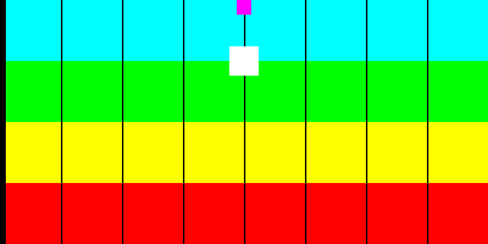
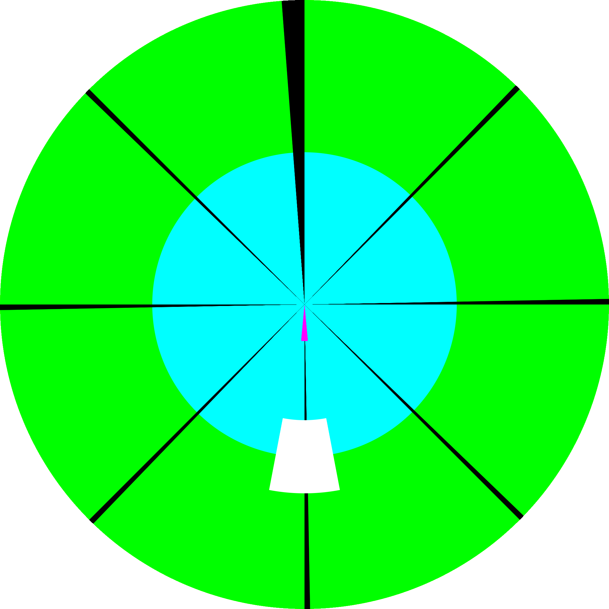
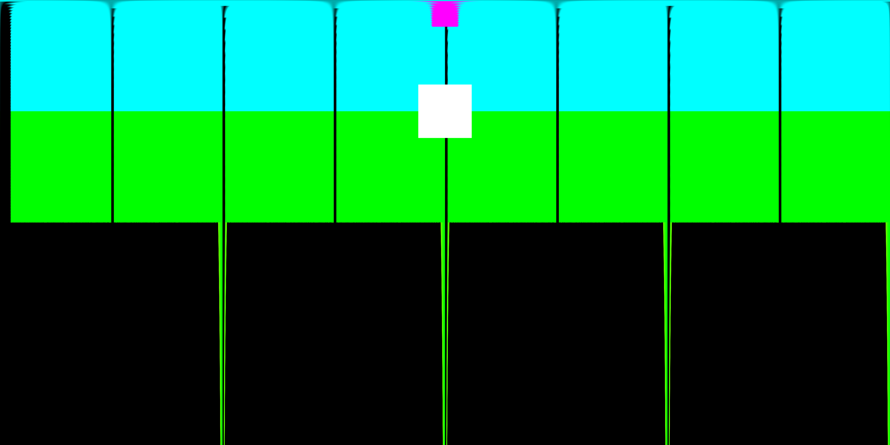

En la sala VR se verificó con las mismas capturas que la cúpula lee solo la
mitad superior del lienzo (verde abajo, cian arriba, nada de rojo ni
amarillo), que el frente $u = 0.5$ cae en $+X$ del nivel y que la costura va a
parar detrás del público.

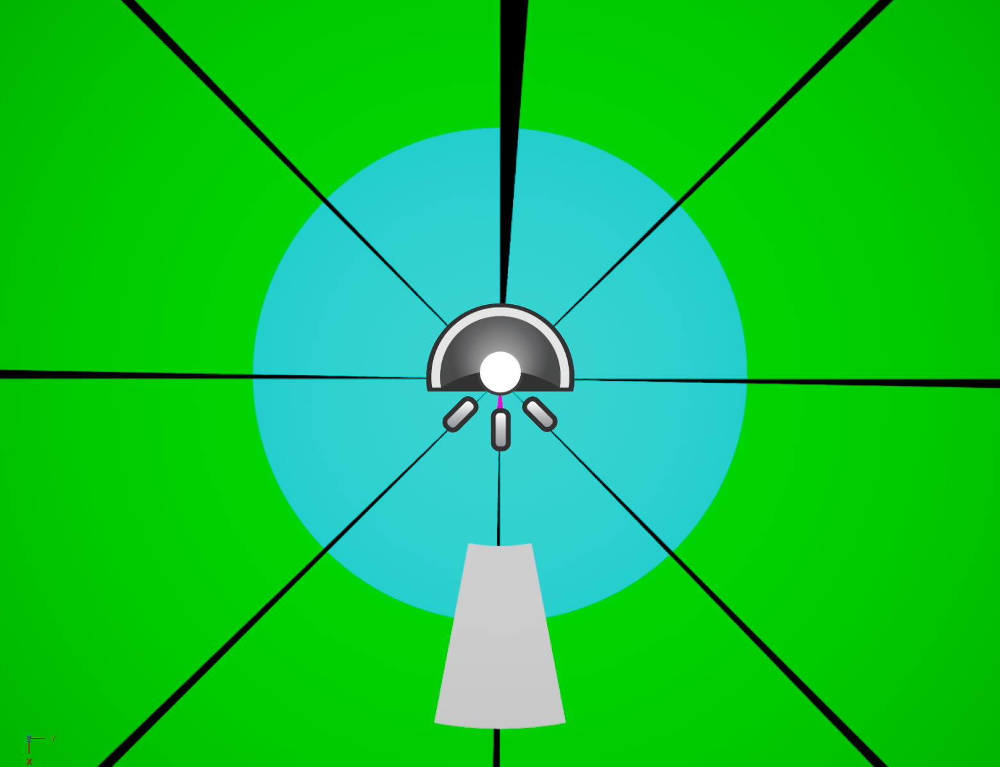
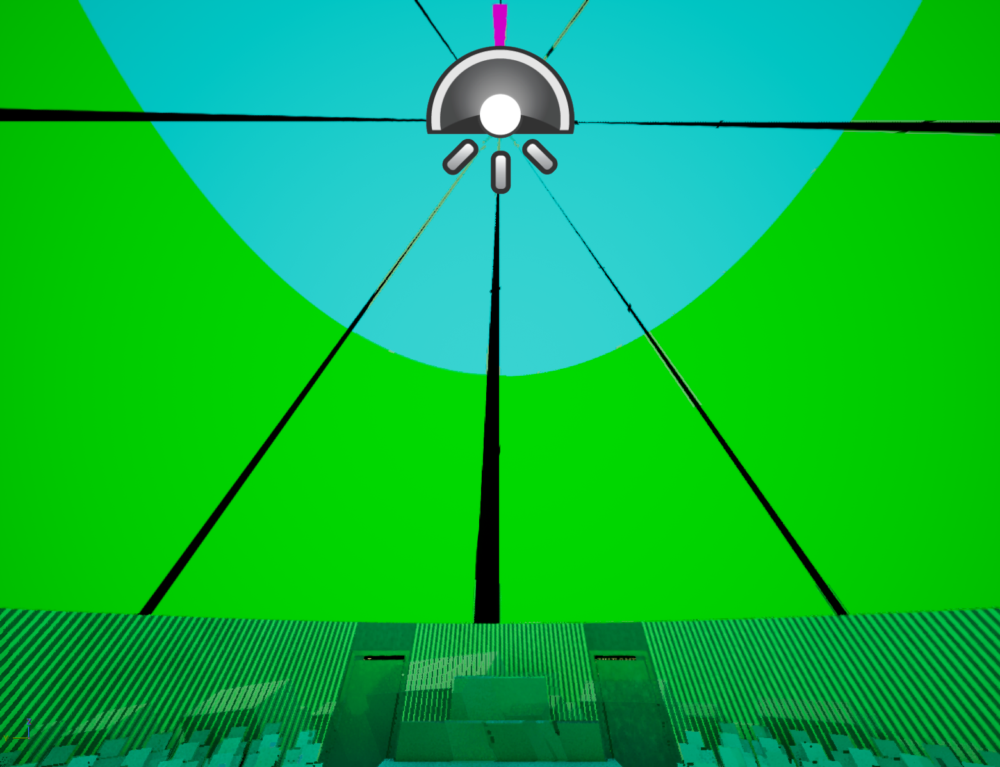
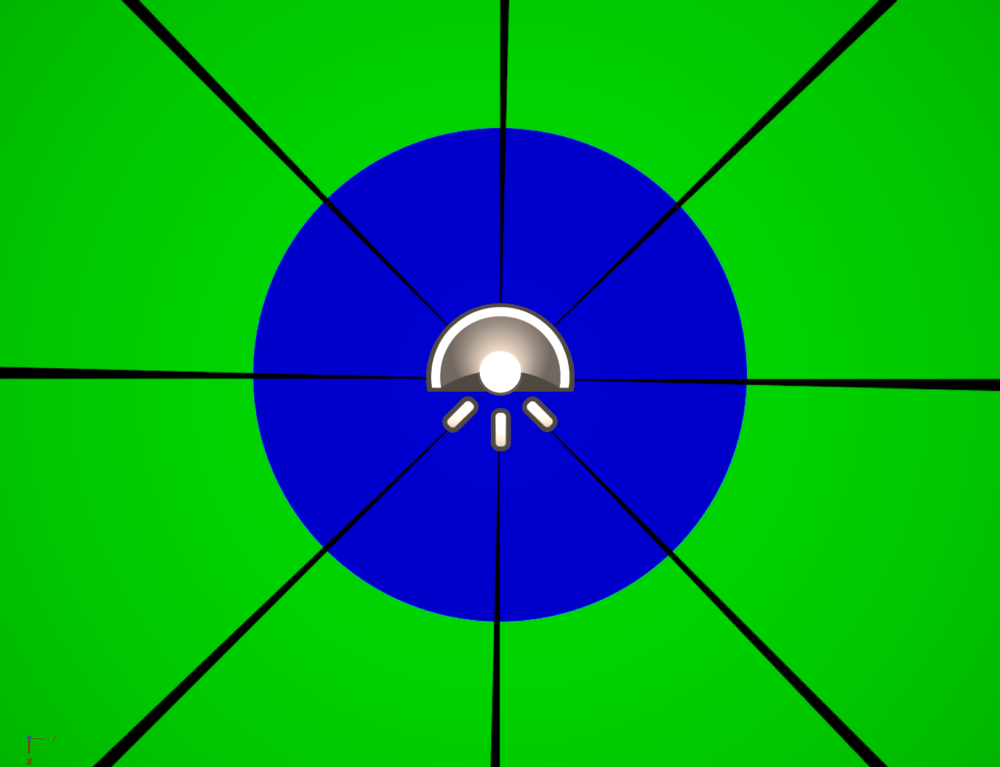
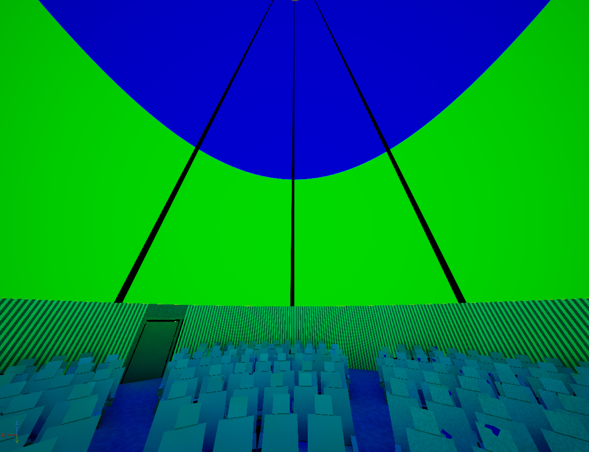

El procedimiento paso a paso para calibrar una sala nueva está en
[04_Senal_TouchDesigner.md, sección 7](04_Senal_TouchDesigner.md#7-cómo-calibrar-una-sala-nueva-con-el-patrón).

## 4. Notas de las referencias

Lo que sigue es paráfrasis con atribución de las notas del vault de
conocimiento, que a su vez resumen Fulldome 101 (Meisam Nemati, Interactive &
Immersive HQ, mayo de 2021) y el archivo de Paul Bourke (`paulbourke.net/dome/`),
más la experiencia directa en el Planetario de Bogotá.

### 4.1 Anatomía del domo

- **Azimut siempre 360°; FOV vertical 180° es lo normal.** Hay excepciones: la
  SATosphere de Montreal tiene 210° y la pantalla baja por debajo del
  horizonte. Renderizar a 180° en una sala de 210° deja pantalla sobrante;
  al revés se pierde el borde. Preguntar el FOV antes de renderizar.
- **Inclinación.** Muchos planetarios tienen la cúpula inclinada, típicamente
  45°, para que el público sentado mire cómodo. En un domo inclinado el sweet
  spot se desplaza. Bourke documenta cómo inclinar y rotar un fisheye para
  compensarlo (`/dome/fishtilt/`).
- **Orientación.** El domo tiene frente y espalda; la entrada suele estar en
  el lado *Back*, así que el público entra por atrás y mira al *Front*. Esa
  convención es la que pone el frente abajo en el domemaster.
- **Postura del público.** Acostado es lo normal en fulldome y permite usar el
  cénit; de pie cabe más gente pero el cénit se pierde como zona útil. No lo
  decide el artista, lo decide la sala. La sala de este repositorio tiene las
  butacas reclinadas 40° hacia atrás, con el espectador casi acostado.
- **El iDome** es la versión pequeña, vertical e individual: el espectador
  mira al centro de la pantalla, no hacia arriba (`/dome/iDome/`).
- **Sistemas de proyección.** Un solo proyector (lente fisheye, espejo
  esférico o doble fisheye) es simple pero corto de resolución; varios
  proyectores con solape y blending dan más resolución a cambio de calibración
  constante. El espejo esférico (*mirrordome*) lo desarrolló Bourke en 2003 y
  sigue siendo la vía barata para un domo propio (`/dome/faq/`).

### 4.2 Zonas del domo

La cúpula tiene 360° pero la atención no. **Sweet spot**: abajo, hacia el
frente, donde el público está orientado; en el domemaster cae en el tercio
inferior del círculo y ahí va la idea principal. **Cénit**: segunda prioridad,
funciona si el público está acostado. **Atrás**: mínima prioridad, no se deja
vacío porque sostiene la envolvente, pero ahí no va información que haya que
leer. El error típico es importar un HDRI con el interés en el medio: en la
cúpula queda sobre la cabeza. Los dos arreglos son desplazar el contenido
hacia abajo o rotar la cámara unos 45°. Para una obra interactiva la
consecuencia es directa: toda respuesta perceptible cae en el sweet spot o
cerca del cénit, porque lo que aparece atrás el público no lo atribuye a lo que
hizo.

### 4.3 Dome master

- Formato de entrega estándar: imagen circular dentro de un cuadro, azimutal
  equidistante. Centro = cénit; borde = springline; tercio inferior = frente;
  esquinas no se proyectan y ahí van los créditos (título y copyright
  abajo-izquierda, timecode arriba-izquierda).
- Si el material viene de cámara, la lente tiene que ser fisheye **circular**
  (180° en horizontal, vertical y diagonal), no diagonal. Bourke publicó las
  pruebas del círculo de imagen de la Lumix GH5 con la Sigma 4.5
  (`/dome/gh5_sigma/`).
- Tamaños: secuencia de imágenes cuadradas sin pérdida (PNG o TGA con RLE).
  Pre-renderizado: 2048², 3200², 3600², 4096² o mayor. Tiempo real e
  interactivo: 2048² salvo que la máquina sea muy holgada. La interactividad
  se paga en resolución.
- Antes de entregar: exportar el nodo anterior al simulador de cúpula, no su
  salida; timeline con el número exacto de cuadros a 30 o 60 fps; negro puro
  fuera del círculo. Bourke publicó un patrón de prueba fulldome para medir la
  resolución real de una sala (`/dome/testpattern/`).
- Dentro de TouchDesigner, `Render TOP` en Fish-Eye, `Projection TOP` con
  salida fisheye y `Sphere SOP` con textura *equiazimuth* usan el mismo mapeo.
  El `Projection TOP` tiene cuatro parámetros y nada más: entrada, salida, FOV
  y rotación; el FOV es lo que permite salir a 210° cuando la sala lo pide.

### 4.4 Lo aprendido en cúpula con público real

Experiencia directa en el Planetario de Bogotá, recogida el 12 de septiembre
de 2026. No está en ninguna fuente publicada.

- **Sí entra señal en vivo, por NDI**, desde TouchDesigner o Resolume según el
  contenido. Eso convierte la interactividad en producción, no en
  investigación.
- **La restricción es el ancho de banda.** La red es de 1 Gb y con cuatro o
  cinco fuentes NDI simultáneas se satura. Queda pendiente evaluar el salto a
  2,5 GbE y volver a medir.
- **Seguridad de la red.** Un canal de entrada abierto al público es también
  una superficie de ataque, aunque nadie tenga mala intención: la gente mandó
  mensajes que no se controlaban y se conectaron desde fuera de la sala hasta
  saturar el servidor. Red aislada, límite de clientes y moderación de lo que
  entra, desde el diseño.
- **Videos de respaldo.** Dejar videos corriendo en segundo plano: si la parte
  interactiva se cae o el servidor se satura, la sala nunca queda en negro.
- **Reglas de un verbo.** No hay obra que se enseñe sola, pero las reglas
  funcionan si son muy simples: mueve, toca, grita, gira. Una instrucción, un
  verbo, un resultado.
- Otras cosas probadas: biométrica con electrónica propia (EEG, EMG, ECG), que
  obliga a cumplir el régimen de datos personales antes de capturar nada;
  Unity con cámara equirectangular pasada a cubemap; Leap Motion, que depende
  de la luz de la sala; OSC desde tableta para el operador. Lo que falla en
  montaje: saturación del servidor (a veces toca reiniciar en mitad del
  montaje), calibración constante en multiproyector, luces que afectan toda
  visión por cámara, y latencia que se nota más en cúpula que en pantalla.

### 4.5 La sala de destino

La ficha del Planetario de Bogotá que hay en el vault viene de prensa, no de
una ficha técnica: 23 m de diámetro, 375 personas, pantalla Nanoseam de 420
paneles, proyección digital 4K con dos proyectores. Lo que decide el render
sigue sin confirmar en sala: FOV vertical, inclinación, resolución real del
domemaster que acepta el servidor y formato exigido. Los datos estructurados y
sus pendientes están en [../06_Modelos/Domos_de_Colombia.md](../06_Modelos/Domos_de_Colombia.md).

## 5. Decisiones y trampas medidas

- **17 sep 2026 · Mapeo por píxel, no por geometría.** Se abandonó la esfera
  con cubemap y los modos `fisheye180` / `dualparaboloid` del `Render TOP`
  (deforman en el vértice, grietas radiales). Ver 3.4.
- **17 sep 2026 · `Yaw` como corrimiento del lienzo.** `ry` o `rz` sobre un
  fisheye producen cosas distintas según `rx`; el `Transform TOP` con
  `tx = Yaw/360` es un giro puro. Ver 3.9.
- **17 sep 2026 · `rx = 90`, `ry = 90`, `tx = -0.25`.** Los tres números de la
  orientación se midieron con el patrón, no se dedujeron. Ver 3.9.
- **17 sep 2026 · Domemaster a 2048 por defecto.** Con todas las capas de
  `VIDEO_DOME` encendidas a 4096² × 16 bit se llena la memoria de video y
  TouchDesigner se cae. Subir `Res` solo para grabar.
- **17 sep 2026 · `convert_scene_unit = True` en el importador FBX de
  Unreal.** Sin esa bandera la sala entraba como una maqueta de 23 cm y se veía
  negra por el plano de recorte. Se corrigió del lado de Unreal, no en Blender,
  porque el mismo FBX produce el glTF.
- **17 sep 2026 · Nanite apagado** (revertido el 18 de septiembre, ver abajo). La sala son unos 43 000 triángulos; Nanite
  no aporta y su indicador de uso en los materiales dio avisos. `USAR_NANITE`
  es la única constante que hay que voltear si entra fotogrametría.
- **17 sep 2026 · Spout en vez de NDI hacia Unreal.** Obliga a un módulo C++
  mínimo, pero el receptor en C++ evita crear una Dynamic Material Instance
  por cuadro (el pin `OutMat` de `SpoutReceiver` va por referencia). Ver
  [03_Puente_Spout.md](03_Puente_Spout.md).
- **17 sep 2026 · El receptor Spout de Unreal solo lee texturas de 8 bits.**
  Con 16-bit float (lo que sale de `VIDEO_DOME` y de toda la cadena que lo
  hereda) `SpoutReceiver` devuelve falso y la cúpula se queda con el último
  cuadro que pudo leer, sin avisar en pantalla: parece congelada. Se destapó
  mandando un `Constant TOP` rojo de 8 bits, que sí llegaba. `alfa_unreal`
  (un `Reorder TOP` con formato `rgba8fixed`) fija el formato antes del sender.
- **17 sep 2026 · Annotate COMP que se autodestruye** en TD 2025.32460 si se
  crea con nombre o con el flag `utility`. Se crea sin nombre y se renombra al
  final.
- **17 sep 2026 · Dos TouchDesigner abiertos no pueden compartir nombre de
  sender**, ni Spout ni NDI. El de la sala VR se llama `TD_Domo_Lab`.
- **18 sep 2026 · Por qué Unreal leía la mitad superior del equirectangular
  aunque el generador escribía `V = elevación / 90`.** La cúpula se creaba con
  `primitive_uv_sphere_add`, que ya traía una capa `UVMap` (canal 0) con
  `U = azimut/360 + 0,5` y `V = 0,5 + elevación/180`; el script escribía su
  fórmula en una segunda capa (`UVMap.001`, canal 1), y Unreal muestrea el
  canal 0. Ahora la cúpula se construye a mano con una sola capa y esa misma
  fórmula (`V = 0,5 + elevación/180`) en los tres modelos de sala (180, 90 y
  45), sin normalizar al casquete. Ver
  [05_Modelos_de_sala.md](05_Modelos_de_sala.md), sección 3.
- **18 sep 2026 · Nanite encendido, salvo la cúpula.** Con materiales PBR
  que llevan el indicador de uso (un solo material base triplanar) el aviso
  desapareció; la cúpula queda sin Nanite porque el SkyLight la captura como
  cielo. Lumen pasó a trazado de rayos por hardware y el anti-aliasing a TSR.
  Ver [02_Sala_Unreal.md](02_Sala_Unreal.md), sección 11.
- **18 sep 2026 · La sala seguía verde con otro contenido en la cúpula.** El
  editor en segundo plano tickeaba a 3 cuadros por segundo y el SkyLight
  recapturaba repartido en unos 12 cuadros. Ver
  [02_Sala_Unreal.md](02_Sala_Unreal.md), sección 12.
- **18 sep 2026 · La imagen de Spout se veía espejada en la cúpula.** La U de
  la cúpula crece hacia la izquierda de quien mira desde adentro; `M_Domo` la
  voltea con `EspejoU`. Medido con un lienzo con texto. Ver
  [02_Sala_Unreal.md](02_Sala_Unreal.md), sección 13.
- **Sector de control: 7 m de arco.** La constante `ANCHO_CONTROL` vale 7,0 m
  (unos 35° con radio 11,5 m), pero la cabecera del script de Blender y el
  documento antiguo `Unreal_sala_domo.md` todavía hablan de 5 m y 25°. Manda
  la constante; las butacas se reparten el arco que sobra por programa.
- **Costura normalizada en el anillo** (medido en el sistema de pantallas de un proyecto
  anterior del autor, sin fecha en la fuente). La mezcla secuencial dejaba 0,75 de cobertura y una banda
  oscura en cada costura. Ver 3.7.
- **`DAT to CHOP` de la tabla de pantallas.** Necesita `Output = chanpercol` y
  `First Column = values`; un `True` en la celda `on` se lee como 0 y la
  pantalla desaparece sin avisar. El orden de columnas es el orden `x, y, z, w`
  de cada array del shader.
- **Cilindro cortado en 89,1°** (`EL_MAX`). Ver 3.6.
- **`Bgzoom` mínimo 1,78** (el aspecto del archivo) en el fondo lavado, o
  aparecen bandas rectas de borde estirado.

## 6. Qué falta y cómo contribuir

### Pendientes conocidos

- Confirmar en sala el FOV vertical, la inclinación y la resolución real del
  domemaster del Planetario de Bogotá; sin eso el modelo `domo180` es un
  supuesto razonable, no un dato.
- El sentido del azimut en el lienzo (si $u > 0.5$ queda a la derecha o a la
  izquierda del espectador) no se midió con el patrón, que es simétrico. Hace
  falta una marca asimétrica para cerrarlo.
- La altura y posición del `PlayerStart` en Unreal (70 cm, a 4 m del centro)
  son aproximaciones de trabajo, no cotas medidas sobre las butacas.
- Subir la red a 2,5 GbE y volver a medir con cuatro o cinco fuentes NDI.
- Tipografía en cúpula: tamaño mínimo legible y en qué zona.
- Videos distintos por pantalla: hoy todas las pantallas leen el mismo archivo
  en el mismo instante; fragmentos distintos sí, tiempos distintos no.
- La mayoría de las salas de Colombia tienen `null` en inclinación y FOV.

### Cómo contribuir

- **Datos de una sala.** Edita `06_Modelos/domos_colombia.json` (es la fuente
  de verdad, la tabla del Markdown se ajusta a él), un PR por sala, todo número
  con URL de fuente o nota explícita de medida en sitio, y valida con
  `python -m json.tool 06_Modelos/domos_colombia.json`. Las reglas completas
  están al final de [../06_Modelos/Domos_de_Colombia.md](../06_Modelos/Domos_de_Colombia.md).
- **Un modelo de sala nuevo.** Copia `01_Blender/generar_sala_domo.py`, cambia
  las constantes de la cabecera (radio, altura del ecuador, aforo, sector de
  control, puertas) y deja el resto por programa; el FBX resultante entra por
  `importar_sala.py` sin tocarlo mientras se respeten los nombres `SM_*` del
  contrato de [02_Sala_Unreal.md](02_Sala_Unreal.md). Si la cúpula es inclinada
  o de más de 180°, el UV de `SM_Domo` (U = azimut, V = elevación) y el FOV del
  modelo en `DOMO` tienen que cambiar juntos.
- **Un módulo de TouchDesigner.** Cada módulo de entrada es un COMP con su
  parámetro `Activo` que entrega el mismo lienzo equirectangular 2:1 y se
  conecta a `mezcla`. El procedimiento está en
  [04_Senal_TouchDesigner.md, sección 9](04_Senal_TouchDesigner.md#9-cómo-agregar-un-módulo-nuevo).
  Si el módulo trae un shader, ponlo en `00_TouchDesigner/shaders/` con un
  comentario de cabecera que explique sus uniforms, como los que ya están.
- **Mediciones.** Cualquier número nuevo de orientación, resolución o red vale
  más con el patrón o la captura que lo respalda: déjala en
  `05_Preview/pruebas/` y cítala en el documento que corresponda, con fecha.
