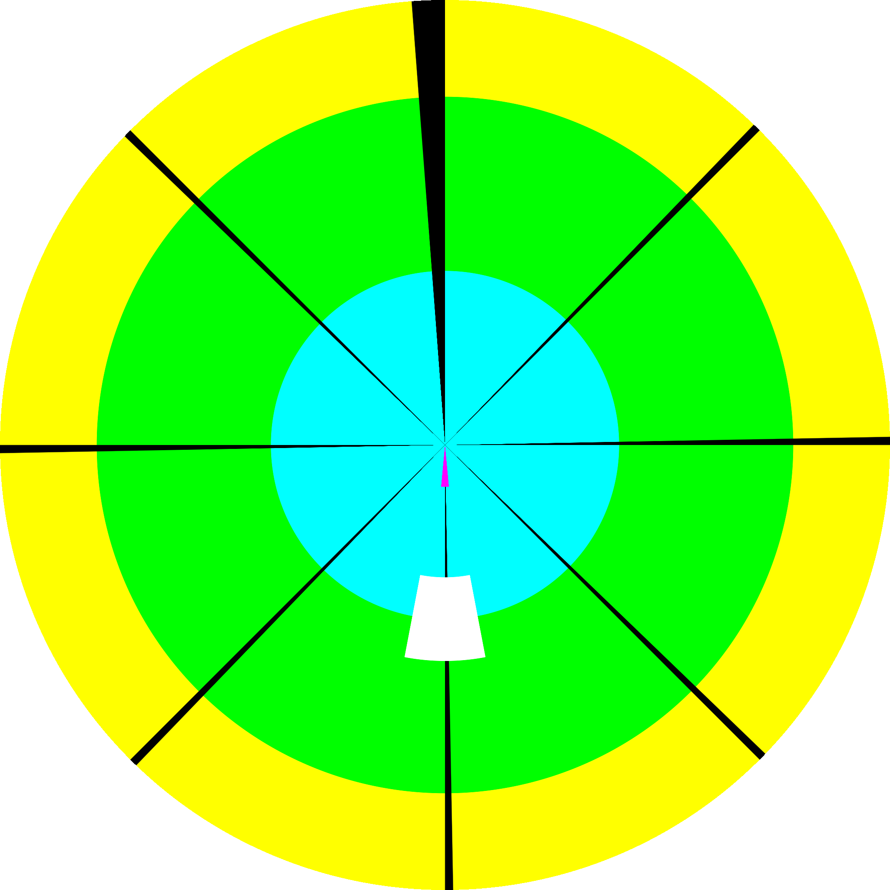
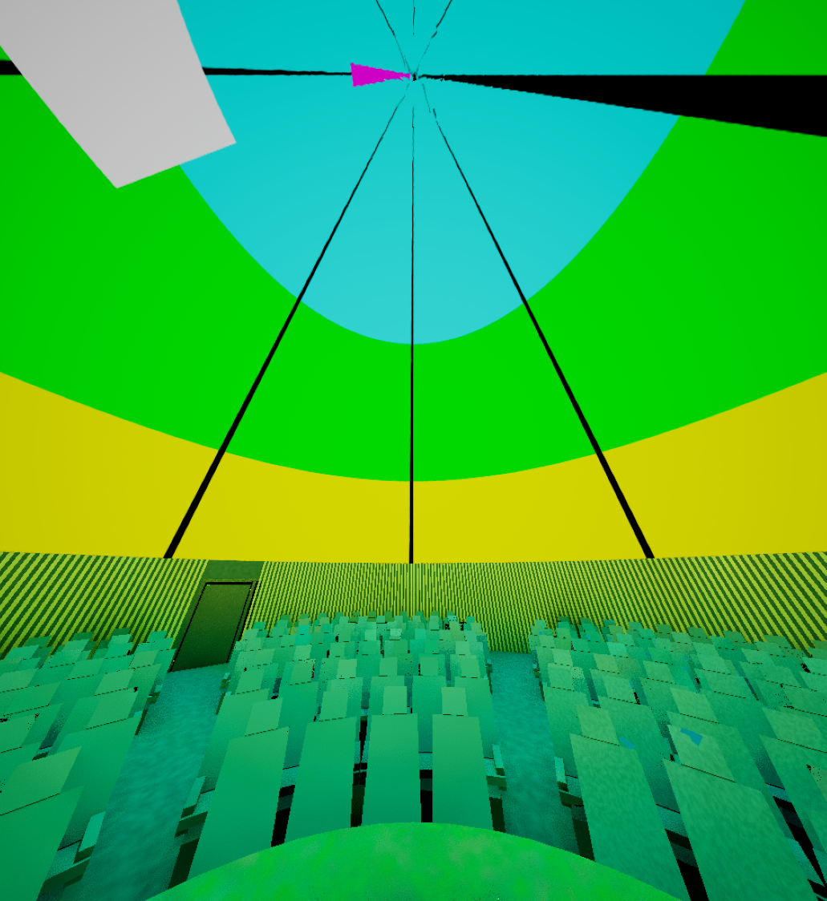

# La señal para la cúpula en TouchDesigner

Este documento describe `/project1/DOMO`, el sistema de señal que construye
`00_TouchDesigner/build_domo.py`: recibe video 360, video 180 (domemaster o
VR180) o video plano, lo lleva a un lienzo equirectangular común, lo convierte
al domemaster del modelo de sala y lo entrega por Spout, NDI o grabación. La
sala de realidad virtual que lo recibe está en [02_Sala_Unreal.md](02_Sala_Unreal.md)
y el puente entre los dos programas en [03_Puente_Spout.md](03_Puente_Spout.md).
Todo lo que se afirma aquí sobre orientaciones y ángulos se midió el 17 de
septiembre de 2026 en TouchDesigner 2025.32460 con el patrón de prueba de la
sección 3.

## 1. Qué es y cómo se abre

El sistema no se arma a mano: lo escribe un script de Python que corre dentro
de TouchDesigner. El repositorio trae el constructor, los shaders y el módulo
de pantallas; el archivo `.toe` es el resultado de correrlo y de guardar.

```
00_TouchDesigner/build_domo.py              el constructor de DOMO
00_TouchDesigner/shaders/costura.frag       fundido de la costura de un 360
00_TouchDesigner/shaders/patron.frag        el patrón de prueba del lienzo
00_TouchDesigner/shaders/pantalla169.frag   una pantalla plana sobre el lienzo (disponible, ya no está en la red)
00_TouchDesigner/video_dome/                el sistema de pantallas (VIDEO_DOME), ver sección 5.3
05_Preview/pruebas/                         capturas del patrón en TouchDesigner y en Unreal
```

Para construirlo, en el Textport, en un Execute DAT o por MCP:

```python
BUILD_DIR = r'C:/ruta/al/repo/00_TouchDesigner'
exec(open(BUILD_DIR + '/build_domo.py', encoding='utf-8').read())
```

`BUILD_DIR` es la carpeta donde viven el script y sus shaders; si no se
define, el constructor usa `project.folder + '/00_TouchDesigner'`. Al terminar
imprime `[DOMO] construido: /project1/DOMO, N operadores`.

El constructor es idempotente. Si `/project1/DOMO` ya existe, guarda el valor
de todos los parámetros personalizados (rutas de video, ángulos, nombres de
sender), destruye el COMP, lo vuelve a crear y reescribe esos valores al final.
El montaje de `VIDEO_DOME` (sus parámetros y las tablas `screens` y `moments`)
se conserva por la misma vía. Por eso se puede editar `build_domo.py` y volver
a correrlo sin perder la configuración de la sesión.

La otra forma de abrirlo es la obvia: un `.toe` guardado después de correr el
constructor ya trae `/project1/DOMO` armado y no necesita el script para
funcionar. El script solo hace falta para reconstruirlo o cambiarlo.

## 2. Estructura

```
DOMO                          COMP raíz, atajo parent.DOMO, páginas Domo, Mapping y Salidas
  IN_360                      video 360 equirectangular (+ costura opcional)
  IN_180                      domemaster fisheye, VR180 mono o VR180 lado a lado
  IN_169                      video plano sobre pantallas en la cúpula (VIDEO_DOME adentro)
  AUDIO                       audio del video, de un archivo o de la entrada; EQ, retardo, limitador
  patron                      el patrón de prueba, cuarta entrada de la mezcla
  mezcla -> equi              la fuente elegida, como lienzo equirectangular 2:1
  giro                        Yaw, como corrimiento horizontal del lienzo
  domo -> mapping -> out_domo el domemaster fisheye; mapping mueve el cénit, escala y rota
  spout_domo / ndi_domo       salidas del domemaster
  grabar                      Movie File Out del domemaster (HAP)
  para_unreal -> giro_unreal -> alfa_unreal -> spout_unreal   el equirectangular que espera la sala VR
```

Cada módulo de entrada es un Base COMP con su parámetro `Activo`, su `out1` y
una caja de comentario (Annotate COMP) que explica qué hace. Solo el módulo
elegido en `DOMO.Fuente` llega a la salida: `mezcla` es un Switch TOP y un
Switch solo cocina la entrada que usa, así que los demás módulos no gastan GPU
aunque estén activos.

## 3. El lienzo equirectangular común

Todos los módulos entregan lo mismo: un lienzo equirectangular 2:1 de
`Ancho × Ancho/2` píxeles (4096 × 2048 por defecto) con esta convención:

- `u = 0.5` es el frente de la sala; `u = 0` y `u = 1` son la parte de atrás,
  donde el lienzo se cierra sobre sí mismo.
- `v = 0.5` es el horizonte y `v = 1` el cénit.
- La mitad superior del lienzo ES la cúpula. La mitad inferior queda bajo el
  horizonte y no se ve en un domo de 180 grados.

Es el mismo formato que espera la cúpula de la sala VR en Unreal, que lo lee
tal cual, sin corrección de su lado: el frente `u = 0.5` cae en +X del nivel.

El patrón de prueba (`shaders/patron.frag`, entrada `patron` de la mezcla) pinta
esa convención para poder verla en cualquier pantalla:

| Color | Dónde | Qué marca |
|---|---|---|
| verde | `v > 0.5` | la cúpula, del horizonte al cénit |
| rojo | `v < 0.5` | bajo el horizonte; no debería verse en un domo 180 |
| negro | columna en `u < 0.02` | la costura del lienzo, azimut 180, detrás del público |
| blanco | cuadro en `u 0.5, v 0.75` | el frente, a 45 grados de elevación |
| azul | marca en `u 0.5, v 0.97` | casi el cénit |


El mismo patrón convertido a domemaster muestra la convención de salida: el
cénit (azul) en el centro del círculo, el frente (cuadro blanco) abajo y la
costura (negro) arriba.


## 4. Por qué ya no se hace con una esfera

El antecedente de este sistema, documentado en `Domo_TouchDesigner/04_Docs/Material_360_y_16-9.md`
(otro repositorio), resolvía lo mismo con geometría: una esfera con el video
pegado por dentro (`Texture Coordinates = equirectangularin`), una cámara en el
centro, un Render TOP en modo `cubemap` y un Projection TOP `cubemap → fisheye`
con FOV 180. El material plano iba sobre una malla de pantalla curva generada
por un Script SOP, con una segunda esfera de fondo desenfocado.

Funcionaba, pero cada cosa costaba un render: seis caras de cubemap por cuadro
para mostrar un video que ya venía equirectangular, una malla que había que
teselar para que la pantalla no se rompiera en el vértice, y modos de render
(`fisheye180`, `dualparaboloid`) que deforman en el vértice y dejan grietas en
la costura. Además la escena 3D y el banco de pantallas convivían en la misma
red con un solo Switch al final.

Aquí no hay geometría ni cámara. Todo son TOPs 2D sobre un lienzo
equirectangular: un 360 ya está en ese formato, un domemaster se convierte con
un Projection TOP, y el video plano se resuelve por píxel con un shader que
recorre el domemaster y pregunta qué pantalla cubre cada dirección (sección
5.3). El paso intermedio entre las dos épocas, `shaders/pantalla169.frag`, ponía
una sola pantalla plana o curva directamente sobre el lienzo equirectangular;
se conserva como shader disponible pero la red ya no lo usa, porque el sistema
de pantallas hace eso mismo con N pantallas, templates y editor.

## 5. Los módulos de entrada

### 5.1 IN_360: video 360 equirectangular

El archivo ya viene en el formato del lienzo (2:1, el frente en el centro), así
que solo se ajusta al tamaño con un Fit TOP. Antes de eso pasa, si se enciende
`Costura`, por el GLSL TOP `costura` con `shaders/costura.frag`, que funde una
franja vertical alrededor de una columna del lienzo: desenfoca en horizontal
con un núcleo triangular y, si hace falta, corrige un salto vertical y de
brillo entre los dos lados. Sirve para la línea que deja un stitching
imperfecto, esté en `u = 0` o en cualquier otro azimut.

Para encontrarla: encender `Costura` y `Costuraguia`, mover `Costurapos` hasta
que la línea roja caiga sobre la costura del video, ajustar ancho y desenfoque,
y apagar la guía.

| Parámetro (página Video360) | Qué hace |
|---|---|
| `Activo` | apagado, el módulo entrega negro y no cocina |
| `Archivo` | archivo 360 equirectangular (2:1) |
| `Play`, `Velocidad` | reproducir y velocidad (0 a 4) |
| `Costura` | enciende el fundido de la costura |
| `Costurapos` | posición de la costura en u (0 a 1) |
| `Costuraancho` | ancho de la franja fundida (fracción del ancho, hasta 0.2) |
| `Costurablur` | radio del desenfoque horizontal (hasta 0.1) |
| `Costuraoffsety` | corrimiento vertical del lado derecho (±0.05) |
| `Costuraganancia` | ganancia del lado derecho (0.5 a 1.5) |
| `Costuraguia` | pinta la costura en rojo para ubicarla |

### 5.2 IN_180: domemaster o VR180

Tres formatos de archivo, elegidos con `Formato`:

- **domemaster** (fisheye 180, cuadrado): el Projection TOP `domemaster_a_equi`
  lo convierte a equirectangular con `fisheye → equirectangular`, fov 180 y
  `rx = -90`, que deja el cénit arriba, en la mitad superior del lienzo.
- **vr180** (media equirectangular, cuadrado): el Fit TOP `al_centro` lo centra
  en el lienzo con bandas negras a los lados. Ocupa el frente, del horizonte al
  cénit y hacia abajo; para llevarlo a la cúpula se sube `Pitch` en DOMO.
- **vr180sbs** (VR180 lado a lado): el Crop TOP `ojo_izquierdo` se queda con la
  mitad izquierda del cuadro y sigue el camino del vr180 mono.

| Parámetro (página Video180) | Qué hace |
|---|---|
| `Activo` | apagado, entrega negro y no cocina |
| `Archivo` | archivo 180 (domemaster o VR180) |
| `Play`, `Velocidad` | reproducir y velocidad |
| `Formato` | `domemaster`, `vr180`, `vr180sbs` |

### 5.3 IN_169: video plano sobre pantallas en la cúpula (VIDEO_DOME)

El video plano no va sobre una sola pantalla. Adentro de `IN_169` se construye
`VIDEO_DOME`, el sistema de pantallas del proyecto Domo_Pantallas, con su
propio constructor `video_dome/build_video_dome.py` (recibe `TEMPLATE_TARGET`,
`VIDEO_DOME_DIR` y `RESET_DEFAULTS = True` desde `build_domo.py`). Su
documentación completa está en `Domo_Pantallas/04_Docs/Video_en_domo.md`
(otro repositorio); esto es lo esencial.

**El mapeo va al revés que un render.** `video_dome/dome_map.frag` recorre los
píxeles del domemaster, calcula la dirección de cada uno en la cúpula (azimut y
elevación, con el frente abajo del cuadro) y pregunta qué pantalla la cubre.
Sin geometría, sin cámara, sin teselado.

**Las pantallas viven en una tabla.** `screens`, una fila por pantalla, se
convierte a CHOP y el shader la lee como seis arrays de `vec4`. Las columnas,
en el orden que espera el shader (`video_dome/screens_module.py`, `COLS`):
`yaw pitch roll mode`, `hfov vfov mirror opacity`, `cropx cropy cropw croph`,
`on feather tile blend`, `rep repspan repmir repofs`, `travel spin edges spare`
y `name`. Cambiar ese orden sin tocar el shader rompe el mapeo en silencio, y
toda celda que no sea `name` tiene que ser un número.

Las formas (`mode`): **plana** (gnomónica, las rectas siguen rectas, hasta unos
100 grados de ancho), **curva** (ángulos iguales, para pantallas muy anchas),
**banda** (rectángulo en azimut y elevación, la única que cierra los 360),
**túnel** (polares alrededor del centro; el video se enrosca y `tile` hace
anillos) y **cilindro** (una pared alrededor del público; la imagen se comprime
sola hacia el cénit y con `travel` la pared se lleva hacia arriba).

Una fila puede repetirse en anillo: `rep = 4` pone la misma pantalla enfrente
de cada cuarto de la sala y todas se mueven como una. `blend` es la costura
entre copias: los grados de solape, que el shader reparte entre las dos para
que no quede una banda oscura. `repmir` espeja las copias alternas, `repofs`
corre el recorte en cada copia (cada sector ve un pedazo distinto del cuadro) y
`edges` decide qué bordes se degradan (los cuatro, solo los costados, o solo
arriba y abajo).

Los templates viven en `screens_module.py` como texto plano: `cine`, `grande`,
`bajo`, `cenital` (un punto de vista); `sala_2`, `sala_4`, `sala_6`,
`sala_4_espejo`, `sala_6_mosaico`, `sala_corona` (anillo de seis cosido más una
cenital, el que mejor funciona), `sala_corona_panorama` (sala llena); `tres`,
`espejo`, `anillo`, `anillo_doble`, `tunel`, `tunel_con_sala`, `cilindro`,
`cilindro_doble`, `cilindro_con_sala`, `fragmentos` (composición). La página
**Montaje** los aplica con `Template` y el pulse `Applytemplate`, que pisa la
tabla entera. Las versiones con nombre (`video_dome/versiones/*.json`:
`corona_cosida`, `planetario_tres`, `sala_cuatro`) guardan todos los
parámetros más la tabla. Los momentos (página **Momentos**) atan un punto de la
película a un montaje y funden entre ellos mientras corre.

`video_dome/web/estudio_pantallas.html` es un estudio en WebGL2, un solo archivo
sin dependencias, que dibuja el domemaster con el mismo mapeo del shader: se
mueven las pantallas con el mouse, se comparan montajes y se copia la tabla
lista para pegar en `screens`. Sirve para diseñar un montaje sin abrir
TouchDesigner.

**La fuente.** El parámetro `Fuente` de `VIDEO_DOME` (página Video) elige entre
un archivo (`Moviefile`), una fuente NDI de la red (`Ndinombre`) o un sender
Spout de la misma máquina (`Spoutnombre`). Así el video plano puede venir de
otro programa, de otro equipo o de un archivo.

**De vuelta al lienzo.** `VIDEO_DOME` entrega en `out_dome` un domemaster con el
frente ABAJO, la misma convención que `domo`. `IN_169` lo lee con un Select TOP
y lo pasa al lienzo equirectangular con la misma receta que `para_unreal`:
Projection TOP `fisheye → equirectangular` con `rx = -90` y el fov que diga
`VIDEO_DOME.Domefov`, seguido de un Transform TOP con `tx = -0.25` y extensión
`repeat` para deshacer el giro de 90 grados del domemaster. Ese lienzo pasa
luego por `domo` como cualquier otra fuente.

| Parámetro (página Video169) | Qué hace |
|---|---|
| `Activo` | apagado, entrega negro y no cocina |
| `Donde` | solo lectura: recuerda que el montaje se edita en `IN_169/VIDEO_DOME` |

Páginas de `VIDEO_DOME`, con sus parámetros tal como los crea `build_video_dome.py`:

| Página | Parámetros |
|---|---|
| Video | `Moviefile`, `Fuente` (archivo / ndi / spout), `Ndinombre`, `Spoutnombre`, `Play`, `Cue`, `Speed`, `Loopvideo`, `Audio`, `Volume` |
| Montaje | `Template`, `Applytemplate`, `Yawglobal`, `Domefov`, `Res`, `Flipx` |
| Pantalla | `Screen` (la fila), `Sname`, `Son`, `Smode`, `Syaw`, `Spitch`, `Sroll`, `Shfov`, `Svfov`, `Sautovfov`, `Smirror`, `Sopacity`, `Sfeather`, `Stile`, `Scropx`, `Scropy`, `Scropw`, `Scroph`, `Sblend`, `Sedges`, `Stravel`, `Sspin`, `Srep`, `Srepspan`, `Srepmir`, `Srepofs`; pulses `Addscreen`, `Dupscreen`, `Delscreen`, `Readscreen` |
| Espacio | `Viewfov`, `Viewpitch`, `Viewyaw`, `Views`, `Animtravel`, `Animspin` |
| Editor | `Openeditor`, `Edit`, `Editwhat` (mover / tamaño / girar), `Editsnap`, `Editstep` |
| Fondo | `Bg` (off / wash / wrap / custom), `Bgblur`, `Bgbright`, `Bgsat`, `Bgzoom`, `Bgtile`, `Bgyaw`, `Bgfollow` |
| Look | `Opacity`, `Vignette`, `K1` |
| Guias | `Guides`, `Guidealpha`, `Guidewidth`, `Guidering`, `Guideray`, `Preview` |
| Versiones | `Versionname`, `Saveversion`, `Version`, `Loadversion`, `Refreshversions` |
| Momentos | `Moments`, `Momentname`, `Momentfade`, `Addmoment`, `Moment`, `Gotomoment`, `Delmoment`, `Refreshmoments`, `Fade` |
| Grabar | `Recfile`, `Record`, `Recres` |

El `Preview` de la página Guias enciende un simulador de domo que es un `.tox`
externo (theinfranet/TouchDesigner-Fulldome-Simulator) y no viene en el
repositorio; si no está, la red se construye sin él.

### 5.4 AUDIO: la cadena de sonido

`Fuente` elige entre el audio del video que está al aire (sigue a
`DOMO.Fuente`: el `video` de IN_360, el de IN_180 o el `movie1` de VIDEO_DOME;
con el patrón al aire vuelve al de IN_360), un archivo aparte
(Audio File In) o la entrada de audio del equipo (Audio Device In). Luego
ganancia (Math CHOP), EQ paramétrico de tres bandas (100 Hz, 1 kHz, 8 kHz),
retardo en milisegundos para cuadrar con la imagen y un limitador (Audio
Dynamics con umbral -1 dB, sin compresor). Sale por el dispositivo de audio por
defecto y por `out1`, que es lo que graban `grabar` y `ndi_domo`.

| Parámetro (página Audio) | Qué hace |
|---|---|
| `Activo` | apaga la salida al dispositivo y las fuentes de archivo y entrada |
| `Fuente` | `video`, `archivo`, `entrada` |
| `Archivo` | archivo de audio |
| `Ganancia` | 0 a 4 |
| `Graves`, `Medios`, `Agudos` | ±12 dB en 100 Hz, 1 kHz y 8 kHz |
| `Retardo` | 0 a 2000 ms |
| `Limitador` | limitador de picos |

## 6. Mezcla, modelo de sala y salidas

`mezcla` (Switch TOP) elige entre IN_360, IN_180, IN_169 y `patron` según
`DOMO.Fuente`; `equi` es el lienzo común. De ahí:

1. **`giro`** (Transform TOP, `tx = Yaw / 360`, unidades en fracción, extensión
   `repeat`) aplica el Yaw como corrimiento horizontal del lienzo. Es un giro
   puro en azimut, independiente del orden de rotaciones del Projection TOP.
   Por eso el Yaw NO va en el Projection TOP.
2. **`domo`** (Projection TOP `equirectangular → fisheye`) hace el domemaster.
   Sin rotación, ese modo deja el centro del fisheye en el horizonte del
   frente; `rx = 90` sube el cénit al centro, `ry = 90` gira el domemaster para
   que el frente quede ABAJO del cuadro (la convención domemaster), y el Pitch
   se aplica como `rx = 90 - Pitch`: un Pitch positivo inclina el contenido del
   frente hacia el cénit. El fov es el del contenido: con `Fovauto` encendido
   (por defecto) es el del modelo de sala, 180 para `domo180` (media esfera,
   planetario), 90 y 45 para los casquetes, `Fovcustom` para `custom`; con
   `Fovauto` apagado es `Fovcontenido`. La resolución es la de `Res`, cuadrada.
3. **`mapping`** (Transform TOP, unidades en fracción, extensión `zero`) es el
   ajuste que en una sala real se hace en vivo sobre el servidor del domo:
   `Centrox` y `Centroy` mueven el cénit, `Escala` agranda o encoge el
   domemaster y `Rotar` lo gira. Lo que queda fuera del cuadro es negro.
4. **`out_domo`** es el domemaster terminado y el visor del COMP.

**El truco del FOV.** `domo` usa el FOV del contenido, pero `para_unreal` (y el
servidor de un domo real, que solo recibe) leen el domemaster con el FOV de la
sala. Con `Fovauto` apagado y `Fovcontenido = 230`, el domemaster mete 230
grados de contenido en el mismo círculo, y la cúpula de 180 muestra también lo
que estaba hasta 25 grados bajo el horizonte: más espacio para lo que se creó.
Es lo mismo que pasa con un servidor de domo en vivo: el domo recibe y desde
TouchDesigner se mueve, se gira y se ajusta. Verificado el 18 de septiembre de
2026 con el patrón: la banda amarilla (`v 0.25–0.5`, bajo el horizonte) aparece
sobre la línea de arranque de la cúpula.




Del domemaster salen `spout_domo` (Syphon Spout Out), `ndi_domo` (NDI Out, con
el audio de `AUDIO/out1`) y `grabar` (Movie File Out en HAP, con sufijo único,
a `Grabarcarpeta/domemaster.mov`, también con el audio). Los tres están apagados
por defecto salvo lo que diga la página Salidas.

La sala VR no quiere el domemaster sino el lienzo equirectangular con la cúpula
en la mitad superior, ya con Yaw, Pitch y el FOV del modelo aplicados. Se
reconstruye desde el domemaster: `para_unreal` (Projection TOP `fisheye →
equirectangular`, `rx = -90`, fov el del modelo de sala, no el del contenido),
`giro_unreal` (Transform
TOP, `tx = -0.25`, `repeat`) que deshace el `ry = 90` del domemaster,
`alfa_unreal` (Reorder TOP, alfa en uno y formato fijado a `rgba8fixed`, porque
el receptor de Unreal solo lee 8 bits por canal; ver la sección 8) y
`spout_unreal`, que lo manda con el nombre que lee el `SpoutDomeReceiver` del
nivel de Unreal. Medido con el patrón:
el cuadro blanco del frente vuelve a `u 0.5, v 0.75`. La mitad inferior del
lienzo queda sin imagen, que es lo que corresponde a un domo de 180.


Parámetros del COMP raíz:

| Página Domo | Qué hace |
|---|---|
| `Fuente` | `v360`, `v180`, `v169`, `patron` |
| `Modelo` | `domo180`, `domo90`, `domo45`, `custom` |
| `Fovcustom` | FOV en grados si el modelo es `custom` (10 a 360) |
| `Yaw` | girar el contenido en azimut (±180) |
| `Pitch` | inclinar el contenido hacia el cénit (±90) |
| `Res` | lado del domemaster: `r1024` (ensayo), `r2048` (tiempo real, por defecto), `r4096` (grabar) |
| `Ancho` | ancho del lienzo equirectangular (4096 por defecto; el alto es la mitad) |
| `Version` | solo lectura, la versión del constructor (1.1, 18 sep 2026) |

| Página Mapping | Qué hace |
|---|---|
| `Fovauto` | encendido por defecto: el FOV del contenido es el del modelo de sala |
| `Fovcontenido` | FOV del contenido en grados (230 por defecto); se usa con `Fovauto` apagado |
| `Centrox`, `Centroy` | mover el cénit, en fracción del domemaster (−0.5 a 0.5) |
| `Escala` | escala del domemaster (0.5 a 2) |
| `Rotar` | rotar el domemaster en grados (±180) |

| Página Salidas | Qué hace |
|---|---|
| `Spoutunreal` | Spout del equirectangular a la sala VR (encendido por defecto) |
| `Spoutunrealnombre` | nombre del sender: `TD_Domo_Lab` |
| `Spoutdomo` | Spout del domemaster (apagado) |
| `Spoutdomonombre` | `TD_Domemaster` |
| `Ndi` | NDI del domemaster (apagado) |
| `Ndinombre` | `TD_Domemaster` |
| `Grabar` | grabar el domemaster en HAP |
| `Grabarcarpeta` | carpeta de grabación, `05_Media` por defecto |

## 7. Cómo calibrar una sala nueva con el patrón

El patrón existe para que la orientación no se discuta de memoria. Con una
sala nueva, sea física o virtual:

1. Poner `Fuente = patron` y elegir el `Modelo` que corresponda a la cúpula
   (media esfera o casquete). Si es un casquete de otro ángulo, `custom` y
   `Fovcustom`.
2. Mirar el domemaster en `out_domo` (o en el proyector): la marca azul tiene
   que estar en el centro, el cuadro blanco abajo, la columna negra arriba. Si
   el frente de la sala no coincide con el cuadro blanco, corregir con `Yaw`
   hasta que quede enfrente del público; con eso la costura negra cae detrás.
3. Si el contenido tiene que subir o bajar (una sala en la que el público mira
   más alto), tocar `Pitch`: positivo lleva el frente hacia el cénit.
4. Si aparece rojo en la cúpula, la sala está leyendo bajo el horizonte: el
   modelo tiene más FOV del que la cúpula cubre, o el lienzo que llega no es el
   de la mitad superior.
5. Si la cúpula real corta la imagen o le sobra borde, ajustar `Centrox`,
   `Centroy`, `Escala` y `Rotar` (página Mapping) mirando el patrón, hasta que
   el círculo del domemaster coincida con la cúpula. Si se quiere que entre más
   contenido del que cubre la sala, apagar `Fovauto` y subir `Fovcontenido`
   (230 sobre 180 está verificado).
6. En la sala VR, con `Spoutunreal` encendido, comprobar las tres vistas: el
   frente (cuadro blanco y, arriba, la marca azul del cénit), el cénit y la
   parte de atrás con la columna negra de la costura.


Lo que se verificó con estas capturas: en la sala VR solo se ve el verde (la
cúpula lee la mitad superior del lienzo), el frente `u 0.5` cae en +X, el cénit
queda en el centro del domemaster y la costura del lienzo va a parar detrás.

## 8. Trampas medidas

- **Yaw en el Projection TOP no es un giro en azimut.** El orden de rotaciones
  del Projection TOP hace que `ry` o `rz` sobre un fisheye produzcan cosas
  distintas según lo que haya en `rx`. Un corrimiento horizontal del lienzo
  equirectangular (`Transform TOP`, `tx = Yaw/360`, `repeat`) es un giro puro y
  no depende de nada más. Por eso el Yaw vive antes de `domo`, en `giro`.
- **`equirectangular → fisheye` sin rotación mira al horizonte.** Hay que poner
  `rx = 90` para que el cénit quede en el centro, y `ry = 90` para que el
  frente quede abajo. Pitch resta de `rx`.
- **Reconstruir el equirectangular desde un domemaster** requiere las dos
  operaciones inversas: `fisheye → equirectangular` con `rx = -90` y el fov del
  modelo, más un corrimiento de `tx = -0.25` para deshacer el `ry = 90`. Sin el
  corrimiento el frente queda a 90 grados. La receta es la misma en
  `para_unreal` y en `IN_169`.
- **El modelo de sala es el FOV del fisheye.** `domo180` es media esfera;
  `domo90` y `domo45` son casquetes; el resto de la esfera no entra en el
  círculo. `para_unreal` usa siempre el fov de la sala, así que la sala VR
  recibe exactamente lo que cubre el modelo; si `domo` trabaja con más grados
  (`Fovauto` apagado), ese contenido extra entra en la cúpula por el borde.
- **Annotate COMP que se autodestruye.** En TD 2025.32460, si el Annotate COMP
  se crea con nombre (`create(annotateCOMP, 'x')`) o se le enciende el flag
  `utility`, desaparece unos frames después. La función `caja()` lo crea sin
  nombre, lo configura y lo renombra al final. El aviso "Invalid path for node
  .../annotate/annotation" en su `back` interno lo trae de fábrica y no afecta.
- **Dos TouchDesigner abiertos no pueden compartir nombre de sender.** Ni de
  Spout ni de NDI: el segundo no publica o pisa al primero. Si hay dos
  instancias (por ejemplo el proyecto viejo y este), cambiar
  `Spoutunrealnombre`, `Spoutdomonombre` o `Ndinombre` en una de ellas, y
  ajustar el receptor de Unreal al nombre que corresponda.
- **El sender de la sala VR se llama `TD_Domo_Lab`.** El `SpoutDomeReceiver`
  del nivel tiene que leer ese nombre; si se cambia en la página Salidas hay
  que cambiarlo también en el actor (ver [03_Puente_Spout.md](03_Puente_Spout.md)).
- **El receptor de Unreal no lee 16-bit float.** `ASpoutDomeReceiver` solo
  acepta texturas de 8 bits por canal. `VIDEO_DOME`, y cualquier cadena que
  herede de él, entrega 16-bit float; con ese formato `SpoutReceiver` devuelve
  falso y la cúpula se queda congelada en el último frame que pudo leer, sin
  aviso en pantalla (solo "no disponible todavia" cada ~5 s en el log de
  Unreal). Por eso `alfa_unreal` fija el formato a `rgba8fixed` justo antes de
  `spout_unreal`. Lo destapó un `constant` rojo de 8 bits, que sí llegaba
  mientras la cadena completa no (medido el 17 de septiembre de 2026).
- **VIDEO_DOME termina en un Null, no en un Out TOP.** `IN_169` lo lee con un
  Select TOP apuntado a `VIDEO_DOME/out_dome`; no está cableado por conector.
- **VIDEO_DOME no conserva solo su montaje** cuando corre `build_domo.py`,
  porque DOMO entero se destruye antes; es `build_domo.py` el que copia sus
  parámetros y sus tablas y los reescribe al final.
- **Resolución.** El domemaster viene en 2048 porque 4096 con todas las capas
  de VIDEO_DOME encendidas llena la memoria de la GPU. Subir `Res` solo para
  grabar.

## 9. Cómo agregar un módulo nuevo

Un módulo es un Base COMP hijo de DOMO que entrega el lienzo equirectangular
por `out1`. El patrón que siguen los tres existentes:

1. Crear el COMP con `D.create(baseCOMP, 'IN_NUEVO')`, ubicarlo con `nodeX` y
   `nodeY` (los módulos van en la columna `x = -600`) y darle una página
   personalizada con al menos el toggle `Activo`. Las utilidades `menu()`,
   `flotante()`, `toggle()` y `texto()` crean parámetros con valor y valor por
   defecto; `appendFile` para rutas.
2. Construir la cadena que produce el lienzo. Lo último que entregue debe estar
   en la convención común (`u 0.5` frente, `v 0.5` horizonte, cúpula arriba) y
   a la resolución del lienzo: llamar a `lienzo(op)` sobre el TOP que fija la
   resolución, que la ata por expresión a `parent.DOMO.par.Ancho`. Si la fuente
   entrega un domemaster con el frente abajo, la receta de vuelta es la de
   IN_169: Projection TOP `fisheye → equirectangular` con `rx = -90` y su fov,
   más un Transform TOP con `tx = -0.25` y `repeat`.
3. Cerrarlo con `negro_y_salida(comp, resultado, x)`: crea un Constant TOP
   negro a la resolución del lienzo, un Switch TOP `activo` gobernado por
   `int(parent().par.Activo)` y el Out TOP `out1`. Apagado, el módulo entrega
   negro y deja de cocinar.
4. Ponerle su `caja(comp, 'nota', titulo, cuerpo, nodos, color)`: el Annotate
   COMP que encierra los nodos y explica el módulo. Pasarle la lista de nodos
   que debe abarcar, incluidos `negro`, `activo` y `out1`.
5. Conectarlo a la mezcla: una entrada más en `mezcla` (`wire(D.op('IN_NUEVO'),
   mez, n)`) y una opción más en el menú `Fuente` de la página Domo, en el
   mismo índice. Si el módulo trae audio de un video, sumar su Movie File In a
   la lista que evalúa `AUDIO/del_video`, que indexa por `Fuente.menuIndex`.
6. Agregar el nuevo COMP a la lista de la caja `nota_modulos` y volver a correr
   el constructor: la configuración de los módulos existentes se conserva sola.
