# La señal para la cúpula en TouchDesigner

Este documento describe `/project1/DOMO`, el sistema de señal que construye
`00_TouchDesigner/build_domo.py`: recibe video 360, video 180 (domemaster o
VR180) o video plano, lo lleva a un lienzo equirectangular común, lo convierte
al domemaster del modelo de sala y lo entrega por Spout, NDI o grabación. La
sala de realidad virtual que lo recibe está en [02_Sala_Unreal.md](02_Sala_Unreal.md)
y el puente entre los dos programas en [03_Puente_Spout.md](03_Puente_Spout.md).
Todo lo que se afirma aquí sobre orientaciones y ángulos se midió el 17 de
septiembre de 2026 en TouchDesigner 2025.32460 con el patrón de prueba de la
sección 3.

## 1. Qué es y cómo se abre

El sistema no se arma a mano: lo escribe un script de Python que corre dentro
de TouchDesigner. El repositorio trae el constructor, los shaders y el módulo
de pantallas; el archivo `.toe` es el resultado de correrlo y de guardar.

```
00_TouchDesigner/build_domo.py              el constructor de DOMO
00_TouchDesigner/shaders/costura.frag       fundido de la costura de un 360
00_TouchDesigner/shaders/orientar.frag      giro esférico del lienzo (Yaw, Pitch, Roll) y altura del horizonte, antes del domemaster
00_TouchDesigner/shaders/domo_mapping.frag  el domemaster y el lienzo de la sala VR, con FOV, Pitch y mapping, en un solo paso
00_TouchDesigner/shaders/patron.frag        el patrón de prueba del lienzo
00_TouchDesigner/shaders/pantalla169.frag   una pantalla plana sobre el lienzo (disponible, ya no está en la red)
00_TouchDesigner/shaders/efectos.frag       las ocho visualizaciones de IN_FX, pintadas sobre la esfera
00_TouchDesigner/modulos/in_fx.py           el módulo IN_FX (efectos generativos), sección 5.5
00_TouchDesigner/modulos/in_3d.py           el módulo IN_3D (objetos 3D con render cubemap), sección 5.6
00_TouchDesigner/modulos/master.py          brillo, contraste, gamma y negro con fundido, sección 6
00_TouchDesigner/modulos/unreal_udp.py      el panel de control del ejecutable de Unreal por UDP, sección 10
00_TouchDesigner/conservar_layout.py       conserva la disposición de la red al regenerar (posiciones, notas, nodos borrados)
00_TouchDesigner/layout_domo.json           la disposición guardada: un nodo por línea, más la lista de omitidos
00_TouchDesigner/video_dome/                el sistema de pantallas (VIDEO_DOME), ver sección 5.3
00_TouchDesigner/video_dome/plantillas_ue.json  la tabla final de las 21 plantillas, para el port de Unreal
05_Preview/pruebas/                         capturas del patrón en TouchDesigner y en Unreal
```

Para construirlo, en el Textport, en un Execute DAT o por MCP:

```python
BUILD_DIR = r'C:/ruta/al/repo/00_TouchDesigner'
exec(open(BUILD_DIR + '/build_domo.py', encoding='utf-8').read())
```

`BUILD_DIR` es la carpeta donde viven el script y sus shaders; si no se
define, el constructor usa `project.folder + '/00_TouchDesigner'`. Al terminar
imprime `[DOMO] construido: /project1/DOMO, N operadores`.

El constructor es idempotente. Si `/project1/DOMO` ya existe, guarda el valor
de todos los parámetros personalizados (rutas de video, ángulos, nombres de
sender), destruye el COMP, lo vuelve a crear y reescribe esos valores al final.
El montaje de `VIDEO_DOME` (sus parámetros y las tablas `screens` y `moments`)
se conserva por la misma vía. Por eso se puede editar `build_domo.py` y volver
a correrlo sin perder la configuración de la sesión.

**La disposición de la red también se conserva** (desde la versión 1.5 del constructor,
`conservar_layout.py`). Regenerar por MCP ya no deshace lo que acomodaste a mano:

- La posición, el tamaño y el color de cada nodo, y la caja de cada nota, vuelven a su sitio. Se leen de la red que
  está viva en TouchDesigner (manda esa) y, si falta algo, de `00_TouchDesigner/layout_domo.json`, que el constructor
  reescribe al terminar con un nodo por línea, así que se lee bien en un diff de git.
- Los nodos que **borraste** a mano no se vuelven a crear. Quedan en la lista `omitidos` del mismo archivo. Solo se
  deduce que borraste uno cuando la red viva se construyó con la misma versión del constructor que dejó el archivo
  (parámetro `Version` de DOMO); con otra versión no se puede saber si falta porque lo borraste o porque el
  constructor todavía no lo creaba. Para recuperar un nodo omitido, quítalo de esa lista y regenera. Hoy hay uno:
  `IN_169/VIDEO_DOME/spout_in`.
- Antes de destruir la red vieja se guarda una copia en `00_TouchDesigner/respaldo/DOMO_AAAAMMDD_HHMMSS.tox` (las
  últimas ocho; la carpeta no va a git). Lo que **agregaste** a mano y el constructor no crea se pierde de la red nueva,
  pero está en esa copia, y el constructor lo lista en el Textport al terminar.
- Los nodos nuevos que trae una versión del constructor entran en la posición que el constructor les da.
- No se conserva lo que no está en esta lista: los valores de parámetros no personalizados que hayas cambiado a mano en
  un nodo generado (por ejemplo, la resolución de un GLSL) se pierden al regenerar; los personalizados sí se guardan,
  como antes.

Si acomodas la red y quieres dejarla en el repositorio sin regenerar, guarda el `.toe`; el archivo de disposición se
actualiza la próxima vez que corra el constructor.

La otra forma de abrirlo es la obvia: un `.toe` guardado después de correr el
constructor ya trae `/project1/DOMO` armado y no necesita el script para
funcionar. El script solo hace falta para reconstruirlo o cambiarlo.

## 2. Estructura

```
DOMO                          COMP raíz, atajo parent.DOMO, páginas Domo, 360, 180, 16:9, FX, 3D, Master, Mapping, Salidas y Unreal
  IN_360                      video 360 equirectangular (+ costura opcional, + giro esférico)
  IN_180                      domemaster fisheye, VR180 mono o VR180 lado a lado (+ giro esférico)
  IN_169                      video plano sobre pantallas en la cúpula (VIDEO_DOME adentro, + Pitch y Roll)
  IN_FX                       ocho visualizaciones generativas en GLSL, reactivas al audio (+ giro esférico)
  IN_3D                       objetos 3D animados alrededor del público, render cubemap (+ giro esférico)
  AUDIO                       sigue a la fuente al aire (solo suena ese video), o un archivo, o la entrada;
                              además saca los niveles (nivel, graves, medios, agudos) para IN_FX e IN_3D
  patron                      el patrón de prueba, cuarta entrada de la mezcla
  mezcla -> equi              la fuente elegida, como lienzo equirectangular 2:1
  master                      brillo, contraste, gamma y negro con fundido (página Master)
  giro                        Yaw, como corrimiento horizontal del lienzo
  domo -> out_domo            el domemaster fisheye (GLSL): FOV, Pitch y mapping antes de recortar
  spout_domo / ndi_domo       salidas del domemaster
  grabar                      Movie File Out del domemaster (HAP)
  para_unreal -> alfa_unreal -> spout_unreal   el equirectangular que espera la sala VR (mismo shader que domo)
  udp_unreal                  panel de control del ejecutable de Unreal (página Unreal)
```

El constructor ejecuta los archivos de `modulos/` en su propio espacio de
nombres con la función `modulo()`, así que los módulos nuevos usan las mismas
utilidades (`mk`, `wire`, `caja`, `lienzo`, `orientador`, `negro_y_salida`) y
se regeneran con el mismo `build_domo.py`. La versión del constructor es la 1.4
(29 de septiembre de 2026).

Cada módulo de entrada es un Base COMP con su parámetro `Activo`, su `out1` y
una caja de comentario (Annotate COMP) que explica qué hace. Solo el módulo
elegido en `DOMO.Fuente` llega a la salida: `mezcla` es un Switch TOP y un
Switch solo cocina la entrada que usa, así que los demás módulos no gastan GPU
aunque estén activos.

## 3. El lienzo equirectangular común

Todos los módulos entregan lo mismo: un lienzo equirectangular 2:1 de
`Ancho × Ancho/2` píxeles (4096 × 2048 por defecto) con esta convención:

- `u = 0.5` es el frente de la sala; `u = 0` y `u = 1` son la parte de atrás,
  donde el lienzo se cierra sobre sí mismo.
- `v = 0.5` es el horizonte y `v = 1` el cénit.
- La mitad superior del lienzo ES la cúpula. La mitad inferior queda bajo el
  horizonte y no se ve en un domo de 180 grados.

Es el mismo formato que espera la cúpula de la sala VR en Unreal, que lo lee
tal cual, sin corrección de su lado: el frente `u = 0.5` cae en +X del nivel.

El patrón de prueba (`shaders/patron.frag`, entrada `patron` de la mezcla) pinta
esa convención para poder verla en cualquier pantalla:

| Color | Dónde | Qué marca |
|---|---|---|
| verde | `v > 0.5` | la cúpula, del horizonte al cénit |
| rojo | `v < 0.5` | bajo el horizonte; no debería verse en un domo 180 |
| negro | columna en `u < 0.02` | la costura del lienzo, azimut 180, detrás del público |
| blanco | cuadro en `u 0.5, v 0.75` | el frente, a 45 grados de elevación |
| azul | marca en `u 0.5, v 0.97` | casi el cénit |

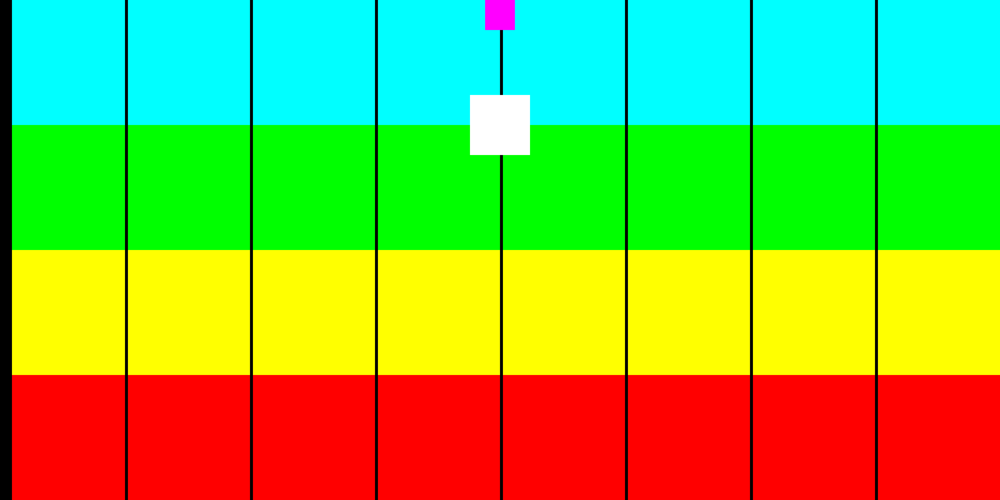

El mismo patrón convertido a domemaster muestra la convención de salida: el
cénit (azul) en el centro del círculo, el frente (cuadro blanco) abajo y la
costura (negro) arriba.


## 4. Por qué ya no se hace con una esfera

El antecedente de este sistema, documentado en `Domo_TouchDesigner/04_Docs/Material_360_y_16-9.md`
(otro repositorio), resolvía lo mismo con geometría: una esfera con el video
pegado por dentro (`Texture Coordinates = equirectangularin`), una cámara en el
centro, un Render TOP en modo `cubemap` y un Projection TOP `cubemap → fisheye`
con FOV 180. El material plano iba sobre una malla de pantalla curva generada
por un Script SOP, con una segunda esfera de fondo desenfocado.

Funcionaba, pero cada cosa costaba un render: seis caras de cubemap por cuadro
para mostrar un video que ya venía equirectangular, una malla que había que
teselar para que la pantalla no se rompiera en el vértice, y modos de render
(`fisheye180`, `dualparaboloid`) que deforman en el vértice y dejan grietas en
la costura. Además la escena 3D y el banco de pantallas convivían en la misma
red con un solo Switch al final.

Aquí no hay geometría ni cámara. Todo son TOPs 2D sobre un lienzo
equirectangular: un 360 ya está en ese formato, un domemaster se convierte con
un Projection TOP, y el video plano se resuelve por píxel con un shader que
recorre el domemaster y pregunta qué pantalla cubre cada dirección (sección
5.3). El paso intermedio entre las dos épocas, `shaders/pantalla169.frag`, ponía
una sola pantalla plana o curva directamente sobre el lienzo equirectangular;
se conserva como shader disponible pero la red ya no lo usa, porque el sistema
de pantallas hace eso mismo con N pantallas, templates y editor.

## 5. Los módulos de entrada

### 5.1 IN_360: video 360 equirectangular

El archivo ya viene en el formato del lienzo (2:1, el frente en el centro), así
que solo se ajusta al tamaño con un Fit TOP. Antes de eso pasa, si se enciende
`Costura`, por el GLSL TOP `costura` con `shaders/costura.frag`, que funde una
franja vertical alrededor de una columna del lienzo: desenfoca en horizontal
con un núcleo triangular y, si hace falta, corrige un salto vertical y de
brillo entre los dos lados. Sirve para la línea que deja un stitching
imperfecto, esté en `u = 0` o en cualquier otro azimut.

Para encontrarla: encender `Costura` y `Costuraguia`, mover `Costurapos` hasta
que la línea roja caiga sobre la costura del video, ajustar ancho y desenfoque,
y apagar la guía.

**Sacar la costura de la cúpula.** Fundirla no siempre alcanza, y la otra
salida es no mostrarla. La costura de un 360 es la columna `u = 0` del lienzo,
es decir, un meridiano que va del nadir al cénit por detrás. Un corrimiento en
`u` (el `Yaw` de siempre) solo la cambia de azimut: sigue subiendo hasta el
cénit y en un domo de 180 grados se ve siempre, desde el borde hasta el centro
del domemaster. Para sacarla hay que girar la esfera entera. Eso hace el GLSL
TOP `orientar` (`shaders/orientar.frag`), justo antes de `negro_y_salida`:
cada píxel de salida calcula su dirección, la devuelve con la rotación inversa
y lee el lienzo de entrada en esa dirección. Es un remapeo equirectangular →
equirectangular, no un corrimiento. `Yaw` gira alrededor del eje vertical,
`Pitch` alrededor del eje izquierda-derecha (positivo lleva el frente hacia el
cénit, igual que el `Pitch` de la página Domo) y `Roll` alrededor del eje del
frente; el orden es Roll, luego Pitch, luego Yaw. Con los tres en cero, el
Switch `orientado` deja pasar el lienzo sin tocarlo y el GLSL no cocina. Lee
con `textureLod` en el nivel 0, porque con mipmaps el salto de `u` de 1 a 0
dejaría una línea gris de un píxel.

Medido el 18 de septiembre de 2026 con el patrón como video del 360 (`Patron`
encendido) y `Vercostura` pintando la costura en rojo, contando los píxeles de
costura que llegan al domemaster de 2048 × 2048:

| Orientación | Píxeles de costura en la cúpula |
|---|---|
| sin girar | 40 669 |
| `Yaw` 90 | 40 669 (solo cambia de azimut) |
| `Pitch` 45, `Yaw` 180 | 13 218 |
| `Pitch` 60 | 6 362 |
| `Pitch` 90 | 0 |
| `Roll` 90, `Pitch` 30 | 0 |

Con `Pitch` 90 el frente del video sube al cénit y la costura queda entera bajo
el horizonte, del horizonte de atrás al de adelante pasando por el nadir. Con
`Roll` 90 y `Pitch` 30 los polos del video quedan a los lados, sobre el
horizonte, y la costura cuelga por detrás, bajo la cúpula. Las dos opciones
cambian lo que es "arriba" en el video; sirven sobre todo para material sin
horizonte marcado (pintura, abstracto, partículas). Para una grabación con
horizonte, lo que se puede hacer es llevarla lo más atrás posible con `Yaw` y,
si hace falta, fundirla con `Costura`.

**Subir el horizonte y meter el piso.** Un domo de 180 grados muestra solo lo
que está sobre el horizonte del lienzo, así que un video pintado o filmado con
el motivo cruzando el horizonte se ve cortado a la mitad. `orientar` tiene, además
del giro, un remapeo de la elevación con el cénit fijo, que se maneja con
`Horizonte` y `Curva` (en la raíz, `Rhorizonte` y `Rcurva`). `Horizonte` es la
elevación a la que queda el horizonte del video dentro de la cúpula: con 20, el
horizonte sube a 20 grados y lo que había debajo se comprime entre ahí y el borde,
de modo que en el borde de la cúpula se ve lo que estaba 26 grados bajo el
horizonte. Negativo hace lo contrario: baja el horizonte y deja fuera la parte
baja del cielo. `Curva` reparte esa compresión: 1 es pareja; mayor que 1 aprieta
el piso contra el borde y deja el cielo más natural; menor que 1 aprieta el cielo.
La fórmula, con `t` la distancia al cénit (0 en el cénit, 1 en el borde) y
`th = (90 − Horizonte) / 90`, es `elevación leída = 90 − 90 · (t / th)^Curva`, y
en el borde entran `90 · (th^−Curva − 1)` grados de piso. La página 360 lo
muestra en el campo de solo lectura `Rpiso`. El remapeo va después del giro:
primero se orienta la esfera y después se comprime la elevación respecto de la
cúpula, así que las dos cosas se combinan sin pisarse.

Medido el 18 de septiembre de 2026 con el patrón (la banda amarilla es la franja
de 0 a 45 grados bajo el horizonte, y no debería verse sin ajuste): con
`Horizonte` 20 aparecen 1 254 842 píxeles amarillos en el domemaster de 2048 y
899 601 en la mitad superior del lienzo que recibe Unreal; con `Horizonte` 20 y
`Curva` 2 entra también la franja roja (más de 45 grados bajo el horizonte), y
`Rpiso` marca 58,8.

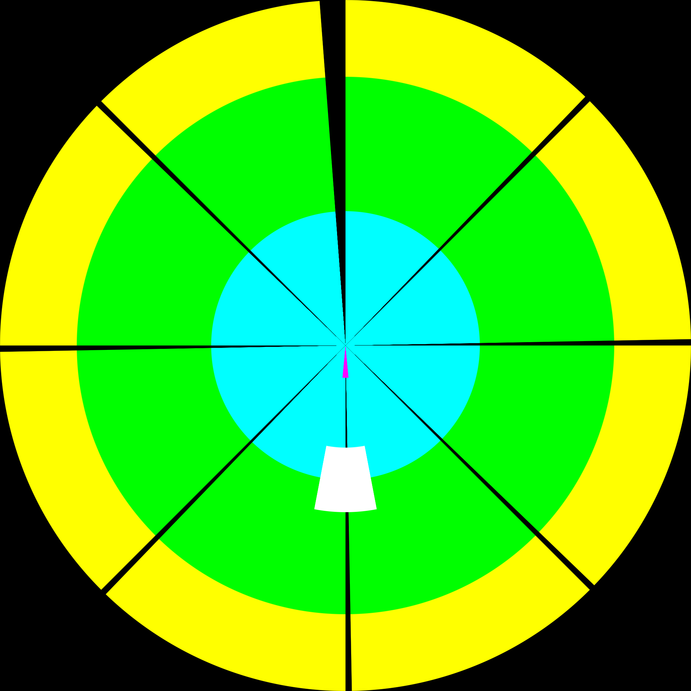
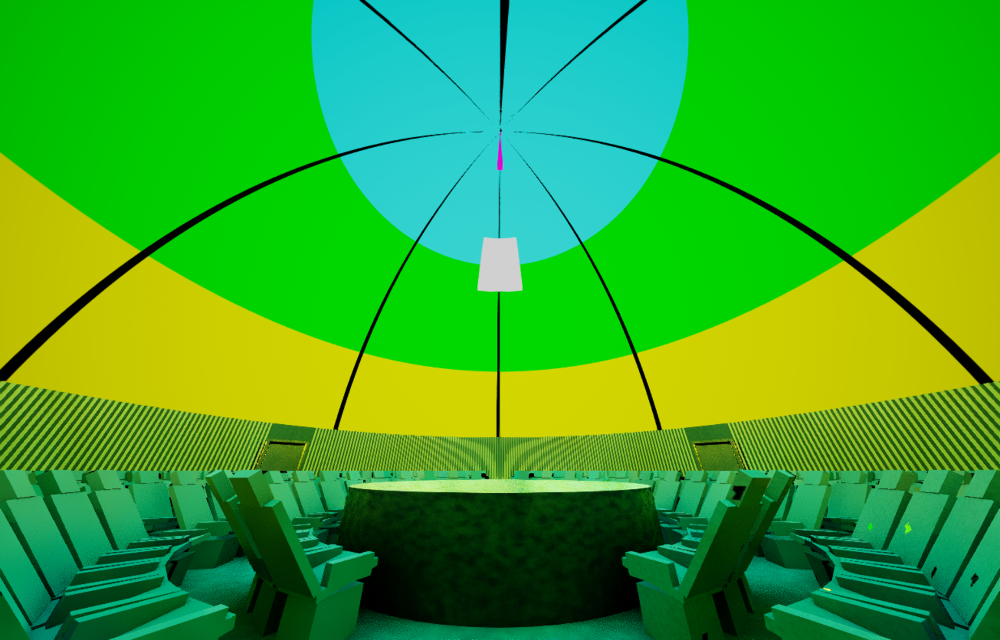

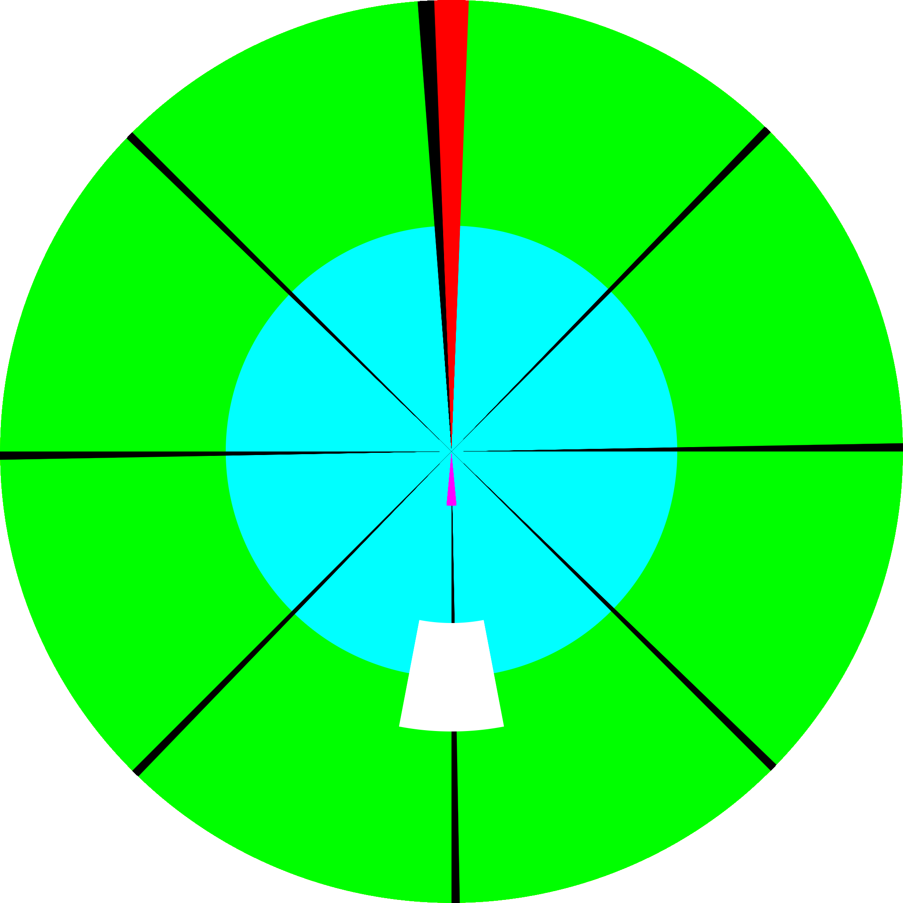
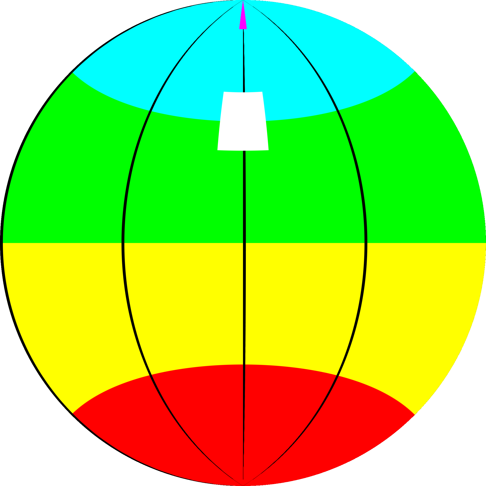
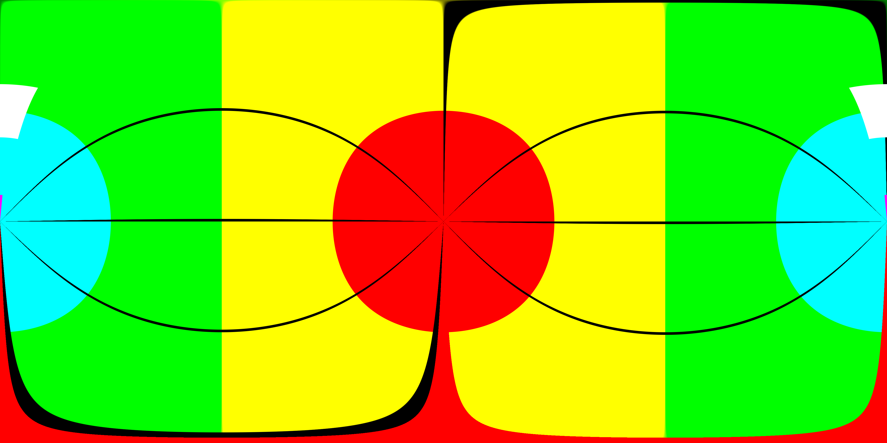

| Parámetro (página Video360) | Qué hace |
|---|---|
| `Activo` | apagado, el módulo entrega negro y no cocina |
| `Archivo` | archivo 360 equirectangular (2:1) |
| `Play`, `Velocidad` | reproducir y velocidad (0 a 4) |
| `Costura` | enciende el fundido de la costura |
| `Costurapos` | posición de la costura en u (0 a 1) |
| `Costuraancho` | ancho de la franja fundida (fracción del ancho, hasta 0.2) |
| `Costurablur` | radio del desenfoque horizontal (hasta 0.1) |
| `Costuraoffsety` | corrimiento vertical del lado derecho (±0.05) |
| `Costuraganancia` | ganancia del lado derecho (0.5 a 1.5) |
| `Costuraguia` | pinta la costura en rojo para ubicarla (dentro del fundido) |
| `Yaw`, `Pitch`, `Roll` | página Orientacion: giro esférico del lienzo, en grados |
| `Horizonte`, `Curva` | página Orientacion: altura del horizonte en la cúpula (grados, cénit fijo) y reparto de la compresión |
| `Patron` | reemplaza el video por el patrón de prueba de DOMO, para apuntar sin video |
| `Vercostura` | pinta de rojo la costura del archivo (`Costurapos`) donde cae después de girar |

Todo esto se maneja desde la **página 360 de la raíz** (ver la sección 6); los
parámetros del módulo quedan en modo Bind contra ella.

### 5.2 IN_180: domemaster o VR180

Tres formatos de archivo, elegidos con `Formato`:

- **domemaster** (fisheye 180, cuadrado): el Projection TOP `domemaster_a_equi`
  lo convierte a equirectangular con `fisheye → equirectangular`, fov 180 y
  `rx = -90`, que deja el cénit arriba, en la mitad superior del lienzo.
- **vr180** (media equirectangular, cuadrado): el Fit TOP `al_centro` lo centra
  en el lienzo con bandas negras a los lados. Ocupa el frente, del horizonte al
  cénit y hacia abajo; para llevarlo a la cúpula se sube `Pitch` en DOMO.
- **vr180sbs** (VR180 lado a lado): el Crop TOP `ojo_izquierdo` se queda con la
  mitad izquierda del cuadro y sigue el camino del vr180 mono.

| Parámetro (página Video180) | Qué hace |
|---|---|
| `Activo` | apagado, entrega negro y no cocina |
| `Archivo` | archivo 180 (domemaster o VR180) |
| `Play`, `Velocidad` | reproducir y velocidad |
| `Formato` | `domemaster`, `vr180`, `vr180sbs` |
| `Yaw`, `Pitch`, `Roll`, `Horizonte`, `Curva` | página Orientacion: el mismo giro esférico y la misma altura del horizonte que el 360, con su propio `orientar` |

Se maneja desde la **página 180 de la raíz**. Para llevar un VR180 a la cúpula,
`Mpitch` en esa página lo inclina solo a él, mientras que el `Pitch` de la
página Domo mueve todas las fuentes.

### 5.3 IN_169: video plano sobre pantallas en la cúpula (VIDEO_DOME)

El video plano no va sobre una sola pantalla. Adentro de `IN_169` se construye
`VIDEO_DOME`, el sistema de pantallas de un proyecto anterior del autor, con su
propio constructor `video_dome/build_video_dome.py` (recibe `TEMPLATE_TARGET`,
`VIDEO_DOME_DIR` y `RESET_DEFAULTS = True` desde `build_domo.py`). Su
documentación completa está en el repositorio de ese proyecto; esto es lo
esencial.

**El mapeo va al revés que un render.** `video_dome/dome_map.frag` recorre los
píxeles del domemaster, calcula la dirección de cada uno en la cúpula (azimut y
elevación, con el frente abajo del cuadro) y pregunta qué pantalla la cubre.
Sin geometría, sin cámara, sin teselado.

**Las pantallas viven en una tabla.** `screens`, una fila por pantalla, se
convierte a CHOP y el shader la lee como seis arrays de `vec4`. Las columnas,
en el orden que espera el shader (`video_dome/screens_module.py`, `COLS`):
`yaw pitch roll mode`, `hfov vfov mirror opacity`, `cropx cropy cropw croph`,
`on feather tile blend`, `rep repspan repmir repofs`, `travel spin edges spare`
y `name`. Cambiar ese orden sin tocar el shader rompe el mapeo en silencio, y
toda celda que no sea `name` tiene que ser un número.

Las formas (`mode`): **plana** (gnomónica, las rectas siguen rectas, hasta unos
100 grados de ancho), **curva** (ángulos iguales, para pantallas muy anchas),
**banda** (rectángulo en azimut y elevación, la única que cierra los 360),
**túnel** (polares alrededor del centro; el video se enrosca y `tile` hace
anillos) y **cilindro** (una pared alrededor del público; la imagen se comprime
sola hacia el cénit y con `travel` la pared se lleva hacia arriba).

Una fila puede repetirse en anillo: `rep = 4` pone la misma pantalla enfrente
de cada cuarto de la sala y todas se mueven como una. `blend` es la costura
entre copias: los grados de solape, que el shader reparte entre las dos para
que no quede una banda oscura. `repmir` espeja las copias alternas, `repofs`
corre el recorte en cada copia (cada sector ve un pedazo distinto del cuadro) y
`edges` decide qué bordes se degradan (los cuatro, solo los costados, o solo
arriba y abajo).

Los templates viven en `screens_module.py` como texto plano: `cine`, `grande`,
`bajo`, `cenital` (un punto de vista); `sala_2`, `sala_4`, `sala_6`,
`sala_4_espejo`, `sala_6_mosaico`, `sala_corona` (anillo de seis cosido más una
cenital, el que mejor funciona), `sala_corona_panorama` (sala llena); `tres`,
`espejo`, `anillo`, `anillo_doble`, `tunel`, `tunel_con_sala`, `cilindro`,
`cilindro_doble`, `cilindro_con_sala`, `fragmentos` (composición). La página
**Montaje** los aplica con `Template` y el pulse `Applytemplate`, que pisa la
tabla entera. Las versiones con nombre (`video_dome/versiones/*.json`:
`corona_cosida`, `planetario_tres`, `sala_cuatro`) guardan todos los
parámetros más la tabla. Los momentos (página **Momentos**) atan un punto de la
película a un montaje y funden entre ellos mientras corre.

**Se maneja desde la página 16:9 de DOMO.** Lo que importa del video plano está
en la raíz, al mismo nivel que los selectores de 360 y 180, y no hace falta
entrar a `IN_169/VIDEO_DOME` para el trabajo de todos los días. La página tiene
seis bloques:

| Bloque | Parámetros de DOMO | Van a |
|---|---|---|
| Fuente | `Vactivo`, `Vfuente` (archivo / ndi / spout), `Vmoviefile`, `Vndinombre`, `Vspoutnombre`, `Vplay` | `IN_169.Activo` y `Fuente`, `Moviefile`, `Ndinombre`, `Spoutnombre`, `Play` de VIDEO_DOME |
| Montaje | `Vtemplate` | `Template` |
| Domo interno | `Vyawglobal`, `Vdpitch`, `Vdroll`, `Vdomefov`, `Vflipx` | `Yawglobal`, `IN_169.Pitch` y `IN_169.Roll`, `Domefov`, `Flipx` |
| Ajuste de todo el montaje | `Vgancho`, `Vgalto`, `Vgelev`, `Vgsep`, `Vgcopias`, `Vgsolape`, `Vgborde`, `Vgopacidad`, `Vgbrillo` | página Ajuste de VIDEO_DOME (ver arriba) |
| Pantalla elegida | `Vscreen`, `Vsmode` (forma: plana, curva, banda, túnel, cilindro), `Vsyaw`, `Vspitch`, `Vshfov`, `Vsautovfov`, `Vsvfov`, `Vsrep`, `Vsrepspan`, `Vsblend` | `Screen`, `Smode`, `Syaw`, `Spitch`, `Shfov`, `Sautovfov`, `Svfov`, `Srep`, `Srepspan`, `Sblend` |
| Pantalla elegida: detalle | `Vsrepmir`, `Vsrepofs`, `Vson`, `Vsroll`, `Vsmirror`, `Vsopacity`, `Vsbrillo`, `Vsfeather`, `Vsedges`, `Vstile` | `Srepmir`, `Srepofs`, `Son`, `Sroll`, `Smirror`, `Sopacity`, `Sbrillo` (columna `spare`), `Sfeather`, `Sedges`, `Stile` |
| Recorte del cuadro | `Vscropx`, `Vscropy`, `Vscropw`, `Vscroph` | `Scropx`, `Scropy`, `Scropw`, `Scroph` |
| Animación | `Vstravel`, `Vsspin`, `Vanimtravel`, `Vanimspin` | `Stravel`, `Sspin`, `Animtravel`, `Animspin` |
| Look | `Vopacity` | `Opacity` |
| Fondo | `Vbg`, `Vbgblur`, `Vbgbright`, `Vbgsat`, `Vbgzoom`, `Vbgtile`, `Vbgyaw`, `Vbgfollow` | `Bg`, `Bgblur`, `Bgbright`, `Bgsat`, `Bgzoom`, `Bgtile`, `Bgyaw`, `Bgfollow` |
| Guías | `Vguides`, `Vguidealpha`, `Vviewfov`, `Vviewpitch`, `Vviewyaw`, `Vviews`, `Vpreview` | `Guides`, `Guidealpha`, `Viewfov`, `Viewpitch`, `Viewyaw`, `Views`, `Preview` |

**El domo interno, desde afuera.** VIDEO_DOME dibuja su propio domemaster, con
su propia orientación, y esa vista ahora se sigue y se ajusta desde la página
16:9 sin entrar al COMP. `Vyawglobal` gira todo el montaje en azimut (el
shader `dome_map` lo recibe en `uView.w`, y el fondo lo sigue con
`Vbgfollow`). `Vdpitch` y `Vdroll` inclinan y ruedan el domo interno entero:
`dome_map` no tiene inclinación propia, así que se aplican en `IN_169` con el
mismo `orientar` del 360, sobre el lienzo que sale de VIDEO_DOME y antes de
`domo`. `Vdomefov` es el FOV con el que VIDEO_DOME dibuja (180 es media
esfera); con `Fovauto` apagado y `Fovcontenido` en 230 en la página Mapping,
subirlo a 230 hace que las pantallas bajo el horizonte también lleguen.
`orientar` corta a negro lo que queda por debajo de `90 − Domefov/2` de
elevación, porque ahí el Projection TOP estiraba el borde del círculo en rayas.
`Vguides` pinta sobre la salida la rejilla de VIDEO_DOME: anillos de
elevación, radios de azimut, el contorno de cada pantalla y los círculos de
mirada del público (`Vviewfov` es el campo de una mirada, `Vviewpitch` su
elevación, `Vviewyaw` su azimut y `Vviews` cuántos puntos de vista se reparten
en la vuelta). Como la rejilla va dentro del domemaster de VIDEO_DOME, gira y
se inclina con él: es la manera de ver dónde quedó el domo interno respecto de
la sala. Probado el 18 de septiembre de 2026: con `Vdpitch` 20 y la rejilla
encendida, el círculo del domo interno se ve inclinado en `out_domo`; mover
`Viewpitch` dentro de VIDEO_DOME actualiza `Vviewpitch` arriba, y los valores
sobreviven a una reconstrucción.

Los parámetros de abajo están en modo **Bind** contra los de arriba
(`parent.DOMO.par.Vtemplate`, etc.), y el bind funciona en los dos sentidos:
mover un valor en la página 16:9 lo mueve en VIDEO_DOME, y cuando VIDEO_DOME
escribe sus propios parámetros (al aplicar un template o al elegir otra fila con
`Vscreen`) la página 16:9 se pone al día sola. El watcher de VIDEO_DOME ve el
cambio de `Template` aunque llegue por el bind, así que **elegir un template en
`Vtemplate` lo aplica de inmediato**, sin el pulse `Applytemplate`. Hay que
tenerlo presente: un template pisa la tabla `screens` entera, y las ediciones de
pantalla que no se hayan guardado como versión se pierden.

Los parámetros de pantalla editan una sola fila, la que dice `Vscreen`. En un
template de varias filas (por ejemplo `sala_corona`: la corona de seis copias y
la cenital) se elige la fila y se ajustan su azimut, su elevación, su ancho, su
forma, cuántas copias hace en anillo y el arco que ocupan, que es lo que
controla la separación entre copias. Lo fino (recortes, espejo, opacidad,
animación, momentos, versiones, el editor con el mouse, las guías) sigue en las
páginas de VIDEO_DOME. La caja `nota_169` en la red de DOMO resume todo esto.

Reconstruir DOMO conserva la página 16:9 y el montaje. El constructor restaura
primero VIDEO_DOME, copia sus valores hacia arriba y solo entonces pone los
binds, para que al enlazar no cambie nada. Como el watcher de VIDEO_DOME
reacciona unos frames después de un cambio, restaurar `Template` alcanzaba a
reaplicar el template sobre la tabla recién restaurada y se perdían las
ediciones de pantalla; por eso el constructor vuelve a escribir la tabla
`screens` con un `run()` diferido (15 frames) y relee la fila elegida. Probado
el 18 de septiembre de 2026: una elevación editada a mano sobrevive a dos
reconstrucciones seguidas, y después `Vtemplate` sigue aplicando templates.
Las capturas `05_Preview/pruebas/td_169_sala_corona.png` y
`td_169_anillo_doble.png` son `out_domo` con cada template elegido desde la
página 16:9 y una imagen de prueba 16:9 como archivo.

#### Plantillas revisadas y ajuste en vivo (29 de septiembre de 2026)

Se renderizaron las 21 plantillas con una carta de prueba 16:9 asimétrica
(rejilla, colores, "ARRIBA", "1" a la izquierda, "2" a la derecha) en un
VIDEO_DOME de prueba con el mismo `dome_map.frag`, y se miró cada domemaster.
Sirvió para encontrar tres fallas del shader y varias plantillas mal
dimensionadas. La tabla final de todas las plantillas, con todos sus campos,
está en `video_dome/plantillas_ue.json` para sincronizar el port de Unreal.

**Fallas del shader, corregidas en `dome_map.frag`** (el layout de uniforms no
cambió; `dome_guides.frag` sigue la misma geometría):

1. **El cilindro desaparecía.** En banda y cilindro el desplazamiento (`travel`)
   se restaba sin dar la vuelta: con `Animtravel` en 0,05, a los 20 segundos
   la imagen ya estaba fuera del marco y no volvía nunca. Por eso `cilindro`,
   `cilindro_doble` y `cilindro_con_sala` se veían vacíos o como un anillo suelto
   cerca del cénit. Ahora el marco se comprueba sin desplazar y la imagen corre
   adentro con `fract()`; el borde suave usa la coordenada del marco, así que
   los bordes se quedan quietos mientras la imagen sube.
2. **El túnel era un ojo con una costura.** Las polares se armaban con
   `atan(x, z)` y `asin(y)` por separado, que no miden lo mismo: a 170 grados
   salía una forma de ojo con puntas a los costados y un corte duro donde el
   ángulo salta. Ahora la distancia es angular (`acos(z)`), el túnel es redondo,
   y el ángulo va espejado (0 → 1 → 0): la imagen da la vuelta dos veces,
   simétrica, sin costura.
3. **Brillo por pantalla.** La columna `spare` (antes reservada, siempre 0) es
   ahora el brillo extra de la pantalla: `col.rgb *= 1 + spare`. Las tablas
   viejas se ven igual.

**Plantillas cambiadas** (valores en `screens_module.py`):

| Plantilla | Antes | Ahora | Por qué |
|---|---|---|---|
| `cine` | plana 70 × 39 a 45° | plana 80 × 45 a 40°, borde 0,06 | se leía como una estampilla |
| `grande` | plana 95 × 53 a 48° | curva 120 × 68 a 42°, borde 0,08 | la plana estira las esquinas pasados ~100° |
| `bajo` | plana 80 × 45 a 28° | plana 90 × 51 a 30°, borde 0,06 | más presencia |
| `cenital` | plana 90 × 51 a 70° | curva 100 × 56 a 68°, borde 0,08 | más grande, sin esquinas estiradas |
| `sala_6` | 54 × 30, costura 6 | 58 × 33, costura 8 | quedaban cuñas negras entre copias |
| `sala_6_mosaico` | `cropx` −0,01, 54 × 54 plana | `cropx` 0,004, recorte de alto 0,15–0,85, curva 58 × 50 | el `cropx` negativo daba la vuelta a 0,99 y la primera copia mostraba el borde del cuadro estirado |
| `sala_corona_panorama` | `cropx` −0,012 | `cropx` 0,004, recorte de alto 0,1–0,9 | la misma muesca |
| `tres` | tres planas 34 × 19 | tres bandas 70 × 30 a 40°, laterales espejadas | eran diminutas y en plana se cruzaban en V |
| `espejo` | dos filas planas 60 × 34 | una fila banda 93 × 40 con dos copias espejadas y costura 6 | la V desaparece y la costura del frente se cose |
| `cilindro_doble` | paredes 6–56° y 40–80° encimadas | 6–48° y 50–80° | se pisaban |
| `fragmentos` | planas 42 × 42 | bandas 45,6 × 56 | cada tercio salía estirado 1,7 veces |

La banda aprieta el ancho por `cos(elevación)`; para que un 16:9 conserve su
aspecto en banda, el ancho es `alto × 1,78 / cos(elevación)`. Las plantillas
que ya se veían bien (`sala_2`, `sala_4`, `sala_corona`, `anillo`) no se
tocaron; `anillo_doble`, `tunel`, `tunel_con_sala`, `cilindro` y
`cilindro_con_sala` mejoran solo por el arreglo del shader. `sala_6_mosaico` y
`sala_corona_panorama` siguen pensadas para material panorámico: con un 16:9
cada sexto del cuadro sale estirado, menos que antes.

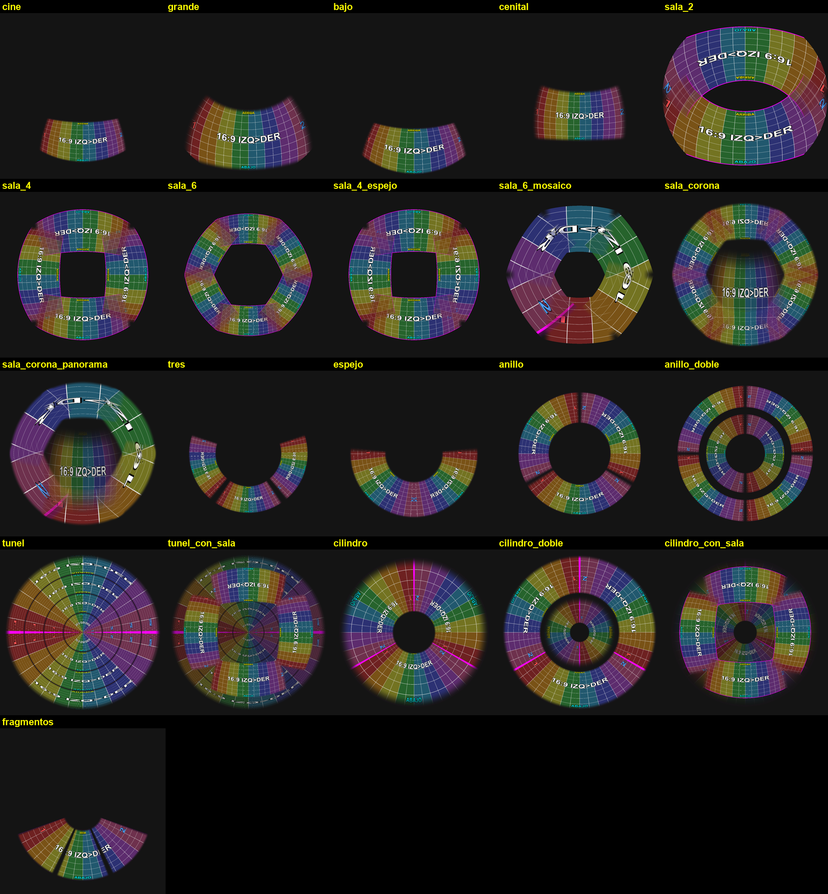

**Ajuste de todo el montaje sin tocar la tabla.** VIDEO_DOME tiene una página
nueva, **Ajuste**, y un Script DAT, `screens_vivo`, entre la tabla `screens` y
el DAT to CHOP. `screens` sigue siendo la fuente de verdad (la editan los
parámetros de pantalla, los templates y las versiones); `screens_vivo` le
aplica los factores de Ajuste antes de mandarla al shader. Con todo en su valor
por defecto la tabla pasa igual, así que se puede probar en vivo otra
separación o un anillo más alto y volver con un clic, y lo que ve Unreal por
`domo.Plantilla` sigue siendo la plantilla limpia. La capa B de los momentos
tiene su gemelo `screens_b_vivo`.

| Parámetro (Ajuste) | En DOMO | Qué hace | Rango del slider |
|---|---|---|---|
| `Gancho` | `Vgancho` | multiplica el ancho de todas las pantallas (lo que ya da la vuelta, 360, no se toca) | 0,5 a 1,5 |
| `Galto` | `Vgalto` | multiplica el alto | 0,5 a 1,5 |
| `Gelev` | `Vgelev` | suma grados de elevación a todas (menos al túnel, que va centrado) | −25 a 25 |
| `Gsep` | `Vgsep` | separación: abre el azimut de las filas sueltas (`tres`, `fragmentos`) y el arco de los abanicos | 0,5 a 1,5 |
| `Gcopias` | `Vgcopias` | fuerza el número de copias de los anillos; el ancho se reparte para que el anillo siga igual de lleno, y una plana de más de 110° pasa a curva. 0 = las del template | 0 a 8 |
| `Gsolape` | `Vgsolape` | grados que se suman a la costura entre copias | −8 a 16 |
| `Gborde` | `Vgborde` | multiplica el borde suave | 0 a 3 |
| `Gopacidad` | `Vgopacidad` | multiplica la opacidad | 0 a 1 |
| `Gbrillo` | `Vgbrillo` | multiplica el brillo de todas | 0 a 2 |
| `Greset` | (solo en VIDEO_DOME) | vuelve todo a 1 y 0 | pulso |

Además, todos los parámetros de pantalla tienen topes duros (no se puede
escribir un ancho de 0 ni una opacidad de 3) y su valor por defecto es el de
fábrica, así que *Reset to Default* vuelve a algo que funciona. En TouchDesigner
los flotantes no tienen paso propio: el paso lo da el rango del slider.

`video_dome/web/estudio_pantallas.html` es un estudio en WebGL2, un solo archivo
sin dependencias, que dibuja el domemaster con el mismo mapeo del shader: se
mueven las pantallas con el mouse, se comparan montajes y se copia la tabla
lista para pegar en `screens`. Sirve para diseñar un montaje sin abrir
TouchDesigner.

**La fuente.** El parámetro `Fuente` de `VIDEO_DOME` (página Video, o `Vfuente`
en la página 16:9 de DOMO) elige entre
un archivo (`Moviefile`), una fuente NDI de la red (`Ndinombre`) o un sender
Spout de la misma máquina (`Spoutnombre`). Así el video plano puede venir de
otro programa, de otro equipo o de un archivo.

**De vuelta al lienzo.** `VIDEO_DOME` entrega en `out_dome` un domemaster con el
frente ABAJO, la misma convención que `domo`. `IN_169` lo lee con un Select TOP
y lo pasa al lienzo equirectangular con la misma receta que `para_unreal`:
Projection TOP `fisheye → equirectangular` con `rx = -90` y el fov que diga
`VIDEO_DOME.Domefov`, seguido de un Transform TOP con `tx = -0.25` y extensión
`repeat` para deshacer el giro de 90 grados del domemaster. Ese lienzo pasa
luego por `domo` como cualquier otra fuente.

| Parámetro (página Video169) | Qué hace |
|---|---|
| `Activo` | apagado, entrega negro y no cocina; en modo Bind contra `DOMO.Vactivo` |
| `Donde` | solo lectura: recuerda que lo principal se edita en la página 16:9 de DOMO y el resto en `IN_169/VIDEO_DOME` |

Páginas de `VIDEO_DOME`, con sus parámetros tal como los crea `build_video_dome.py`
(los que aparecen en la página 16:9 de DOMO quedan en modo Bind):

| Página | Parámetros |
|---|---|
| Video | `Moviefile`, `Fuente` (archivo / ndi / spout), `Ndinombre`, `Spoutnombre`, `Play`, `Cue`, `Speed`, `Loopvideo`, `Audio`, `Volume` |
| Montaje | `Template`, `Applytemplate`, `Yawglobal`, `Domefov`, `Res`, `Flipx` |
| Pantalla | `Screen` (la fila), `Sname`, `Son`, `Smode`, `Syaw`, `Spitch`, `Sroll`, `Shfov`, `Svfov`, `Sautovfov`, `Smirror`, `Sopacity`, `Sfeather`, `Stile`, `Scropx`, `Scropy`, `Scropw`, `Scroph`, `Sblend`, `Sedges`, `Stravel`, `Sspin`, `Sbrillo`, `Srep`, `Srepspan`, `Srepmir`, `Srepofs`; pulses `Addscreen`, `Dupscreen`, `Delscreen`, `Readscreen` |
| Ajuste | `Gancho`, `Galto`, `Gelev`, `Gsep`, `Gcopias`, `Gsolape`, `Gborde`, `Gopacidad`, `Gbrillo`, `Greset` |
| Espacio | `Viewfov`, `Viewpitch`, `Viewyaw`, `Views`, `Animtravel`, `Animspin` |
| Editor | `Openeditor`, `Edit`, `Editwhat` (mover / tamaño / girar), `Editsnap`, `Editstep` |
| Fondo | `Bg` (off / wash / wrap / custom), `Bgblur`, `Bgbright`, `Bgsat`, `Bgzoom`, `Bgtile`, `Bgyaw`, `Bgfollow` |
| Look | `Opacity`, `Vignette`, `K1` |
| Guias | `Guides`, `Guidealpha`, `Guidewidth`, `Guidering`, `Guideray`, `Preview` |
| Versiones | `Versionname`, `Saveversion`, `Version`, `Loadversion`, `Refreshversions` |
| Momentos | `Moments`, `Momentname`, `Momentfade`, `Addmoment`, `Moment`, `Gotomoment`, `Delmoment`, `Refreshmoments`, `Fade` |
| Grabar | `Recfile`, `Record`, `Recres` |

El `Preview` de la página Guias enciende un simulador de domo que es un `.tox`
externo (theinfranet/TouchDesigner-Fulldome-Simulator) y no viene en el
repositorio; si no está, la red se construye sin él.

### 5.4 AUDIO: la cadena de sonido

Por defecto (`Fuente = video`) el sonido **sigue a la fuente al aire** y solo
suena el video que está en `DOMO.Fuente`. Hay un Audio Movie CHOP por módulo,
atado a su Movie File In para que el audio vaya sincronizado con ese video
aunque cambie la velocidad: `de_360` (`IN_360/video`), `de_180` (`IN_180/video`)
y `de_169`, que es un Select CHOP de `VIDEO_DOME/audio_gain` (el Audio Movie de
`movie1` por `Volume` y `Audio` de VIDEO_DOME). El Switch CHOP `al_aire` elige
uno de los tres o `silencio` (un Constant CHOP en cero); como un Switch solo
cocina la entrada que usa, los módulos que no están al aire no decodifican
audio. Da silencio con el patrón al aire, con el módulo al aire apagado
(`Activo`) o con el 16:9 recibiendo por NDI o Spout, porque en ese caso
`movie1` no es lo que se ve.

Antes sonaban dos cosas a la vez: `AUDIO` y el `audio_out` propio de
VIDEO_DOME, que tocaba la película del 16:9 aunque la fuente al aire fuera el
patrón o el 360. El constructor ahora deja ese `audio_out` apagado (su
`active` en constante `False`); `audio_movie` y `audio_gain` siguen vivos para
alimentar a `de_169`. Probado el 18 de septiembre de 2026 recorriendo las
cuatro fuentes: solo el CHOP del módulo al aire cocina en cada cuadro, `salida`
solo tiene señal con el 16:9 al aire (el 360 de prueba no traía audio), y con
el patrón es silencio.

La otra opción de `Fuente` sigue igual: un archivo aparte
(Audio File In) o la entrada de audio del equipo (Audio Device In). Luego
ganancia (Math CHOP), EQ paramétrico de tres bandas (100 Hz, 1 kHz, 8 kHz),
retardo en milisegundos para cuadrar con la imagen y un limitador (Audio
Dynamics con umbral -1 dB, sin compresor). Sale por el dispositivo de audio por
defecto y por `out1`, que es lo que graban `grabar` y `ndi_domo`.

| Parámetro (página Audio) | Qué hace |
|---|---|
| `Activo` | apaga la salida al dispositivo y las fuentes de archivo y entrada |
| `Fuente` | `video` (sigue a la fuente al aire), `archivo`, `entrada` |
| `Archivo` | archivo de audio |
| `Ganancia` | 0 a 4 |
| `Graves`, `Medios`, `Agudos` | ±12 dB en 100 Hz, 1 kHz y 8 kHz |
| `Retardo` | 0 a 2000 ms |
| `Limitador` | limitador de picos |
| `Sensibilidad` | ganancia de los niveles para los visuales (4 por defecto) |
| `Suavizado` | caída de los niveles: 0 seca, 0,95 lenta (0,85 por defecto) |

**Niveles para los visuales.** Tres Audio Filter CHOP (pasa bajos 160 Hz,
pasa banda 1 kHz, pasa altos 4 kHz) salen de la cadena ya limitada, y el Script
CHOP `niveles` calcula el RMS de la cadena y de cada banda, lo multiplica por
`Sensibilidad` (las bandas altas llevan más ganancia porque su RMS es menor) y
entrega cuatro canales de una muestra, `nivel`, `graves`, `medios` y `agudos`,
con ataque inmediato y caída suave. IN_FX e IN_3D los leen con un Select CHOP.
Lo que suena es lo que se ve: con el 360, el 180 o el 16:9 al aire es el audio
de su video (medido con la película al aire: nivel 0,08, graves 0,10, medios
0,12). Con FX o 3D al aire, `Fuente = video` da silencio, así que para que
reaccionen hay que poner `Fuente` en `archivo` (una pista) o `entrada` (la
mezcla de la sala).

### 5.5 IN_FX: visualizaciones generativas

`modulos/in_fx.py` y `shaders/efectos.frag`. Un GLSL TOP, `efectos`, escribe
directamente el lienzo equirectangular 2:1: cada píxel calcula su dirección en
la esfera y el efecto se evalúa sobre esa dirección, no sobre `(u, v)`. Así no
hay costura detrás del público ni un pellizco en el cénit, que es lo que más se
mira en un domo. Se eligió equirectangular y no una salida 16:9 hacia
VIDEO_DOME porque un efecto generativo no tiene cuadro, tiene espacio: pintado
sobre la esfera llena la cúpula entera y pasa por la misma orientación (Yaw,
Pitch, Roll, Horizonte, Curva) y el mismo domemaster que un 360. Si hiciera
falta un efecto dentro de una pantalla, el TOP `efectos` se puede usar como
fondo `custom` de VIDEO_DOME.

| Efecto | Qué es |
|---|---|
| `tunel` | un tubo cuyo eje es la vertical: el público vuela hacia el cénit, con líneas de neón y niebla al fondo |
| `ondas` | anillos que bajan del cénit y dos focos que pasean; la interferencia dibuja la figura |
| `estrellas` | campo de estrellas en coordenadas log-polares alrededor del cénit: acercarse es correr el radio, así el vuelo no termina |
| `caleidoscopio` | ruido fractal plegado en espejo en 4 a 12 sectores alrededor del cénit |
| `plasma` | suma de senos sobre la dirección, clásico |
| `flujo` | ruido deformado por ruido sobre la esfera; se lee como tinta en agua |
| `rejilla` | techo y piso en perspectiva, estilo synthwave, con un sol al frente |
| `aurora` | cinco cortinas que ondulan en azimut con rayos verticales y cielo estrellado |

Cadena: `velocidad` (Constant CHOP) → `reloj` (Speed CHOP, integra el tiempo:
cambiar la velocidad no da un salto, y el audio lo empuja con `Empuje`) →
`efectos` → `lienzo` (Fit TOP al ancho de DOMO) → `orientar` → `activo` →
`out1`. `audio` lee `AUDIO/niveles`.

| Parámetro (página Efectos; en DOMO, página FX) | Qué hace | Por defecto |
|---|---|---|
| `Activo` (`Factivo`) | apagado, negro y no cocina | encendido |
| `Efecto` (`Fefecto`) | uno de los ocho | `tunel` |
| `Velocidad` (`Fvelocidad`) | multiplica el reloj (0 a 3) | 1 |
| `Giro` (`Fgiro`) | giro continuo en azimut, grados por segundo (±30) | 0 |
| `Escala` (`Fescala`) | tamaño del patrón: más es más fino (0,25 a 3) | 1 |
| `Detalle` (`Fdetalle`) | octavas del ruido, grosor de líneas, sectores del caleidoscopio (0 a 1) | 0,5 |
| `Intensidad` (`Fintensidad`) | brillo del efecto (0 a 2) | 1 |
| `Color1`, `Color2` (`Fcolor1`, `Fcolor2`) | los dos colores con que se arma todo | celeste y magenta |
| `Reactividad` (`Freactividad`) | cuánto pesan los niveles de audio (0 = nada) | 0,5 |
| `Empuje` (`Fempuje`) | cuánto aceleran los graves el reloj | 0,5 |
| `Resfx` (`Fresfx`) | resolución propia del efecto: 1024 × 512, 2048 × 1024 o 4096 × 2048 | 2048 |
| `Yaw`, `Pitch`, `Roll`, `Horizonte`, `Curva` (`Fyaw`...) | página Orientacion, el mismo `orientar` del 360 | 0 y 1 |

Verificado el 29 de septiembre de 2026: los ocho efectos renderizados y
convertidos a domemaster sin costura atrás ni pellizco en el cénit; `aurora`
llega a Unreal por `para_unreal` con las cortinas en la mitad superior del
lienzo.


### 5.6 IN_3D: objetos 3D alrededor del público

`modulos/in_3d.py`. La cámara está en el centro de la sala y el Render TOP
`render` dibuja un **cubemap** (seis caras, todas las direcciones);
`cubo_a_equi` (Projection TOP `cubemap → equirectangular`) lo pasa al lienzo y
`al_frente` (Transform TOP, `tx = −0.25`, `repeat`) deja el frente de la escena
en `u = 0.5`. Esa corrección se midió con dos esferas marcadoras: el Projection
TOP deja el frente de la escena (−Z) en `u = 0.75` y la derecha (+X) en
`u = 1.0`; la derecha queda un cuarto de vuelta después del frente, como en el
lienzo, así que no hay espejo. Se usa cubemap y no el modo fisheye del Render
TOP porque el fisheye deforma en el vértice (los polígonos grandes se rompen si
no se teselan) y porque el Line MAT no funciona con fisheye.

La escena usa la convención de TouchDesigner: Y arriba, el frente de la sala
en −Z, X a la derecha. Todo sale de SOPs primitivos: un toro sobre el público
(centrado en el eje del cénit, a 7,5 m de altura, cabeceando), cinco anillos
concéntricos que giran en sentidos opuestos, esferas en órbita y cajas en
espiral hasta el cénit. Anillos, esferas y cajas se instancian desde tres
Script CHOP (`inst_anillos`, `inst_esferas`, `inst_cajas`) con un solo archivo
de callbacks, `instancias_py`, en numpy. Los graves inflan esferas y cajas; el
nivel estira los anillos. No hay `fbxCOMP` ni `fileinSOP`: crearlos desde el
MCP colgó el servidor de TouchDesigner.

| Parámetro (páginas Objetos3D y Camara; en DOMO, página 3D) | Qué hace | Por defecto |
|---|---|---|
| `Activo` (`Tactivo`) | apagado, negro y no cocina | encendido |
| `Velocidad` (`Tvelocidad`) | velocidad de la animación (0 a 3) | 1 |
| `Toro`, `Anillos`, `Esferas`, `Cajas`, `Modelo` | qué grupos se dibujan | todos menos `Modelo` |
| `Ncajas`, `Nesferas` | cantidad de instancias | 160 y 18 |
| `Tamano`, `Distancia` | escala de los objetos y de sus distancias al público | 1 y 1 |
| `Color1`, `Color2` | color A (toro y anillos) y B (esferas, cajas, modelo) | celeste y rosa |
| `Emision` | brillo propio del material (0 = solo la luz) | 0,35 |
| `Alambre` | wireframe | apagado |
| `Reactividad` | cuánto pesan los niveles de audio | 0,5 |
| `Orbitaradio`, `Orbitavel`, `Orbitaalto` | la cámara orbita el centro: radio en metros, grados por segundo, altura | 1,5 m, 8°/s, 0 |
| `Mirarcentro` | la cámara gira para mirar siempre al centro (el frente de la sala gira con ella) | apagado |
| `Cubo` | resolución de cada cara: 512, 1024 o 2048 | 1024 |
| `Fondo` | color de fondo | negro |
| `Yaw`, `Pitch`, `Roll`, `Horizonte`, `Curva` | página Orientacion | 0 y 1 |


**Enchufar un modelo propio.** `IN_3D/modelo` es una geometría vacía (un Add
SOP sin puntos) que ya está en la lista del render, con el material B, la
escala de `Tamano` y un giro lento, apagada por el parámetro `Modelo`. Para
usarla: entrar a `modelo`, reemplazar `aqui_el_modelo` por un File In SOP
(`.obj`, `.fbx`, `.bgeo`) o arrastrar el archivo a esa red, activar display y
render en ese SOP y encender `Modelo` (o `Tmodelo` en DOMO). Hacerlo a mano en
la interfaz, no por MCP. Un FBX con varias piezas va mejor como un FBX COMP
dentro de `IN_3D`, agregado al parámetro Geometry de `render`. El modelo se ve
desde adentro: conviene ponerlo entre 5 y 15 metros del centro (`ty` de
`modelo` y `Distancia`).

## 6. Mezcla, modelo de sala y salidas

`mezcla` (Switch TOP) elige entre IN_360, IN_180, IN_169, `patron`, IN_FX e
IN_3D según `DOMO.Fuente` (en ese orden, que es el de las entradas); `equi` es
el lienzo común. Después viene el **master** (página Master,
`modulos/master.py`): un Level TOP entre `equi` y `giro`, así que toca todas
las fuentes y todas las salidas por igual (domemaster, Spout, NDI, grabación y
el lienzo de Unreal). `Brillo`, `Contraste` y `Gamma`, y `Negro`, que no corta
sino que funde en `Fundido` segundos: `negro_rampa` es un Speed CHOP que sube o
baja a `1/Fundido` por segundo entre 0 y 1, así el fundido dura exactamente eso
y se puede revertir a mitad de camino. `Negroactual` muestra dónde va. Con todo
en neutro, `master_on` deja pasar `equi` y el Level TOP no cocina.
`Negrounreal` manda además `domo.Negro` al ejecutable. Verificado: con `Negro`
encendido el máximo de `out_domo` es 0,0; con `Brillo` 0,5 la imagen baja a la
mitad. De ahí:

1. **`giro`** (Transform TOP, `tx = Yaw / 360`, unidades en fracción, extensión
   `repeat`) aplica el Yaw como corrimiento horizontal del lienzo. Es un giro
   puro en azimut, independiente del orden de rotaciones del Projection TOP.
   Por eso el Yaw NO va en el Projection TOP.
2. **`domo`** (GLSL TOP con `shaders/domo_mapping.frag`) hace el domemaster
   en un solo paso: el cénit al centro, el frente ABAJO del cuadro (la
   convención domemaster), el `Pitch` de la página Domo (positivo inclina el
   contenido del frente hacia el cénit), el FOV del contenido y el mapping.
   Cada píxel de salida deshace el mapping, calcula su dirección con el FOV del
   contenido y va a buscarla al lienzo completo. El FOV del contenido es el del
   modelo de sala con `Fovauto` encendido (por defecto): 180 para `domo180`
   (media esfera, planetario) y también 180 para `domo90` y `domo45`, que son
   pantallas de media esfera inclinadas, y `Fovcustom` para `custom`; con
   `Fovauto` apagado es `Fovcontenido`. La resolución es la de `Res`, cuadrada.
   Fuera del círculo de la sala queda negro.
3. **El mapping** (página Mapping) es el ajuste que en una sala real se hace en
   vivo sobre el servidor del domo: `Centrox` y `Centroy` corren el cénit,
   `Escala` agranda o encoge la imagen y `Rotar` la gira (positivo, en sentido
   antihorario). Como se aplica antes de recortar al círculo de la sala, lo que
   aparece en el borde al encoger o al correr el cénit es contenido del video
   (el piso), no negro.
4. **`out_domo`** es el domemaster terminado y el visor del COMP.

**Por qué antes no se podía ver el piso.** Hasta la versión 1.2 del constructor,
`domo` era un Projection TOP `equirectangular → fisheye` seguido de un Transform
TOP `mapping`. El Projection TOP solo dibujaba los grados del FOV del contenido y
dejaba negro todo lo demás, así que el mapping movía un círculo ya recortado:
`Escala` menor que 1 encogía la imagen y dejaba un anillo negro, `Centroy`
dejaba una media luna negra, y el piso del video no aparecía nunca. `Fovcontenido`
tampoco hacía nada mientras `Fovauto` estuviera encendido, que es lo que viene
por defecto. Lo único que metía algo de piso era el `Pitch` (de la página Domo o
del 360), que inclina la esfera y por lo tanto sube el piso de un lado a costa
del otro. Además, `Rotar` deformaba el círculo en una elipse, porque el Transform
TOP no conservaba el aspecto al girar. Desde la versión 1.3 el shader
`domo_mapping` resuelve las cuatro cosas en un solo paso, y el 360 suma
`Horizonte` y `Curva` (sección 5.1), que son la forma pareja de meter el piso
en toda la vuelta sin inclinar nada.

Medido el 18 de septiembre de 2026 con el patrón, contando la banda amarilla
(de 0 a 45 grados bajo el horizonte) en el domemaster y en la mitad superior del
lienzo de Unreal:

| Ajuste | Amarillo en el domemaster | Amarillo en Unreal | Grados de piso en el borde |
|---|---|---|---|
| nada | 0 | 0 | 0 |
| `Rhorizonte` 20 | 1 254 842 | 899 601 | 25,7 (`Rpiso`) |
| `Rhorizonte` 30, `Rcurva` 0,6 | 1 766 292 | 1 351 383 | 24,8 |
| `Escala` 0,8 | 1 144 214 | 812 415 | 22,5 (`Pisoborde`) |
| `Fovauto` apagado, `Fovcontenido` 230 | 1 231 924 | 879 786 | 25 |
| `Centroy` 0,1 | 407 330 | 282 192 | solo adelante |
| `Rpitch` −30 | 593 155 | 435 645 | solo adelante |

Con `Escala` 0,8 el negro del domemaster es el mismo que sin ajuste (el de fuera
del círculo): ya no aparece un anillo. Con todo en cero, el nuevo `domo` y el
anterior dan la misma imagen (diferencia media de 0,0006 por canal) y en
`para_unreal` el cuadro blanco del frente cae en `u 0.500, v 0.750`, igual que
antes.

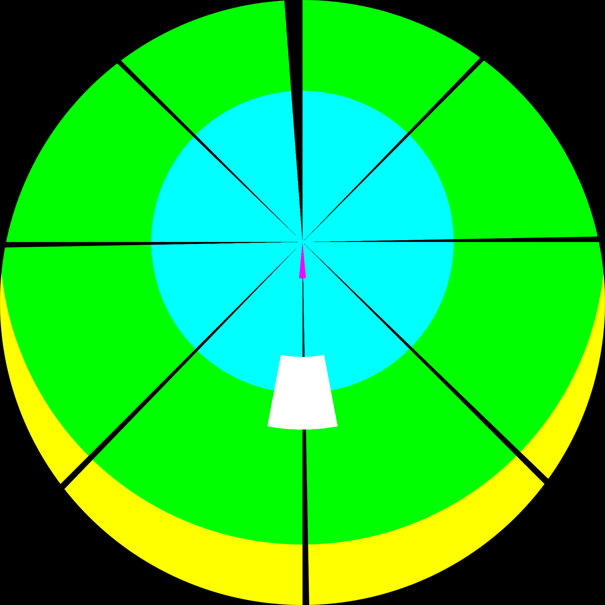

**El truco del FOV.** `domo` usa el FOV del contenido, pero la sala (y el
servidor de un domo real, que solo recibe) leen el domemaster con el FOV de la
sala. Con `Fovauto` apagado y `Fovcontenido = 230`, el domemaster mete 230
grados de contenido en el mismo círculo, y la cúpula de 180 muestra también lo
que estaba hasta 25 grados bajo el horizonte: más espacio para lo que se creó.
Es lo mismo que pasa con un servidor de domo en vivo: el domo recibe y desde
TouchDesigner se mueve, se gira y se ajusta. Verificado el 18 de septiembre de
2026 con el patrón: la banda amarilla (`v 0.25–0.5`, bajo el horizonte) aparece
sobre la línea de arranque de la cúpula.

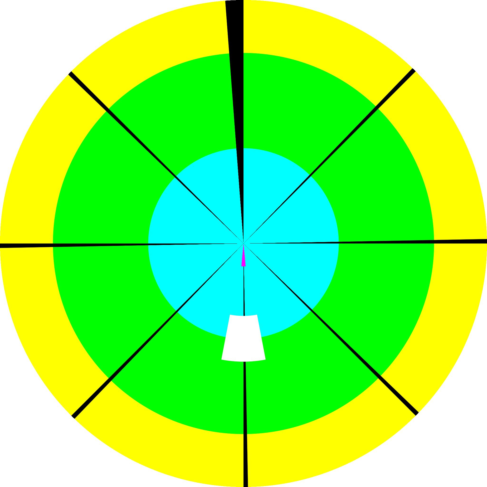
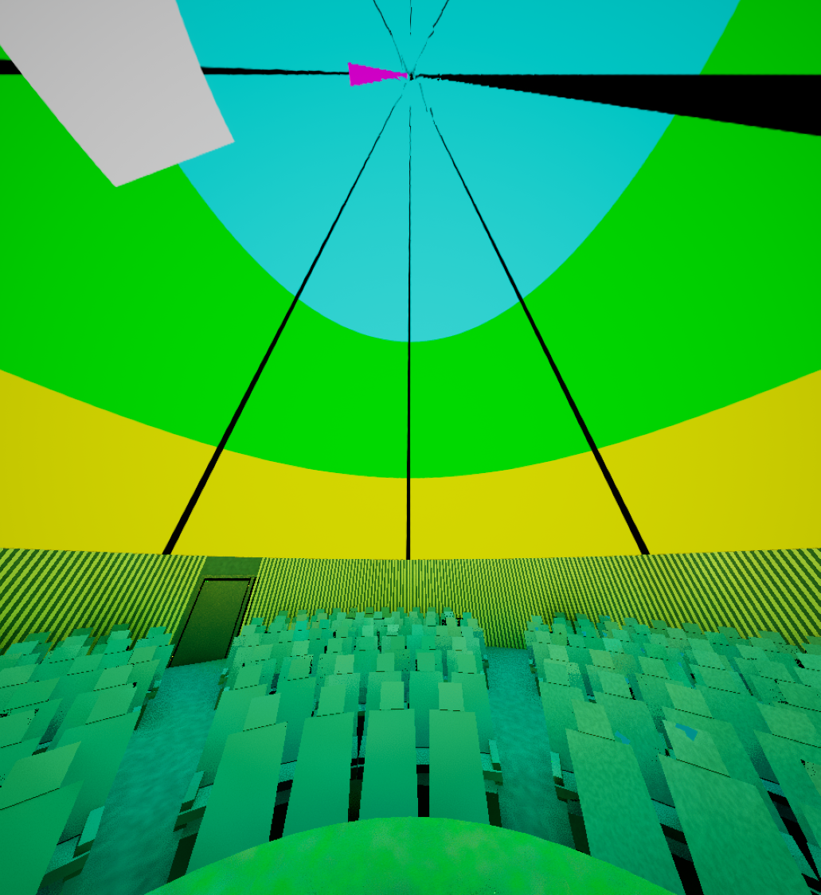

Del domemaster salen `spout_domo` (Syphon Spout Out), `ndi_domo` (NDI Out, con
el audio de `AUDIO/out1`) y `grabar` (Movie File Out en HAP, con sufijo único,
a `Grabarcarpeta/domemaster.mov`, también con el audio). Los tres están apagados
por defecto salvo lo que diga la página Salidas.

La sala VR no quiere el domemaster sino el lienzo equirectangular con la cúpula
en la mitad superior, ya con Yaw, Pitch, FOV y mapping aplicados. `para_unreal`
es el mismo shader que `domo` en su segundo modo: cada píxel del lienzo de la
sala calcula su punto en el domemaster con el FOV de la sala (no el del
contenido) y sigue desde ahí el mismo camino hasta el lienzo de entrada. Así
Unreal ve exactamente lo que vería el domo, y sin pasar por el domemaster
intermedio de 2048, que antes se volvía a estirar a 4096 (hasta la versión 1.2
eran un Projection TOP `fisheye → equirectangular` con `rx = -90` y el Transform
`giro_unreal` con `tx = -0.25`). Después vienen `alfa_unreal` (Reorder TOP, alfa
en uno y formato fijado a `rgba8fixed`, porque el receptor de Unreal solo lee 8
bits por canal; ver la sección 8) y `spout_unreal`, que lo manda con el nombre
que lee el `SpoutDomeReceiver` del nivel de Unreal. Medido con el patrón: el
cuadro blanco del frente cae en `u 0.5, v 0.75`. La mitad inferior del lienzo
queda sin imagen, que es lo que corresponde a un domo de 180.

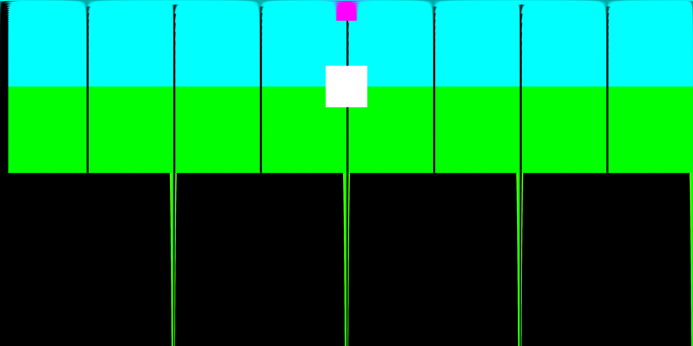

Parámetros del COMP raíz:

| Página Domo | Qué hace |
|---|---|
| `Fuente` | `v360`, `v180`, `v169`, `patron`, `fx`, `3d` |
| `Modelo` | `domo180` (planetario), `domo90` (sala de pie con barandas, pantalla de 180 inclinada 45°), `domo45` (tipo Maloka, pantalla de 180 inclinada 27°), `custom`; los tres primeros usan FOV 180 |
| `Fovcustom` | FOV en grados si el modelo es `custom` (10 a 360) |
| `Yaw` | girar el contenido en azimut (±180) |
| `Pitch` | inclinar el contenido hacia el cénit (±90) |
| `Res` | lado del domemaster: `r1024` (ensayo), `r2048` (tiempo real, por defecto), `r4096` (grabar) |
| `Ancho` | ancho del lienzo equirectangular (4096 por defecto; el alto es la mitad) |
| `Version` | solo lectura, la versión del constructor (1.3, 18 sep 2026) |

| Página 360 | Van a (modo Bind en IN_360) |
|---|---|
| `Ractivo`, `Rarchivo`, `Rplay`, `Rvelocidad` | `Activo`, `Archivo`, `Play`, `Velocidad` |
| `Ryaw`, `Rpitch`, `Rroll` | `Yaw`, `Pitch`, `Roll`: el giro esférico del lienzo (sección 5.1) |
| `Rhorizonte`, `Rcurva` | `Horizonte`, `Curva`: subir el horizonte con el cénit fijo y meter el piso (sección 5.1) |
| `Rpiso` | solo lectura, en la raíz: grados de piso que llegan al borde de la cúpula |
| `Rpatron`, `Rvercostura`, `Rcosturapos`, `Rcostura` | `Patron`, `Vercostura`, `Costurapos`, `Costura` |

| Página 180 | Van a (modo Bind en IN_180) |
|---|---|
| `Mactivo`, `Marchivo`, `Mplay`, `Mformato` | `Activo`, `Archivo`, `Play`, `Formato` |
| `Myaw`, `Mpitch`, `Mroll` | `Yaw`, `Pitch`, `Roll` |
| `Mhorizonte`, `Mcurva` | `Horizonte`, `Curva` |

La página 16:9 está en la sección 5.3. El `Yaw` y el `Pitch` de la página Domo
siguen existiendo y se aplican después, a todas las fuentes por igual.

| Página Mapping | Qué hace |
|---|---|
| `Fovauto` | encendido por defecto: el FOV del contenido es el del modelo de sala |
| `Fovcontenido` | FOV del contenido en grados (230 por defecto); solo cuenta con `Fovauto` apagado |
| `Centrox`, `Centroy` | correr el cénit, en fracción del domemaster; `Centroy` positivo lo lleva hacia atrás y mete piso adelante |
| `Escala` | menor que 1 mete más grados en el círculo (el piso entra parejo por el borde); mayor que 1 acerca |
| `Rotar` | girar el domemaster en grados (positivo, antihorario) |
| `Pisoborde` | solo lectura: grados de piso que llegan al borde con el cénit centrado |

| Página Master | Qué hace | Por defecto |
|---|---|---|
| `Brillo` | multiplica la imagen (0 a 2, tope 4) | 1 |
| `Contraste` | contraste (0,5 a 2) | 1 |
| `Gamma` | gamma (0,5 a 2) | 1 |
| `Negro` | fundido a negro | apagado |
| `Fundido` | duración del fundido en segundos (0 a 10) | 2 |
| `Negrounreal` | manda también `domo.Negro 0/1` al ejecutable | apagado |
| `Negroactual` | solo lectura: 0 imagen, 1 negro | |

| Página Salidas | Qué hace |
|---|---|
| `Spoutunreal` | Spout del equirectangular a la sala VR (encendido por defecto) |
| `Spoutunrealnombre` | nombre del sender: `TD_Domo_Lab` |
| `Spoutdomo` | Spout del domemaster (apagado) |
| `Spoutdomonombre` | `TD_Domemaster` |
| `Ndi` | NDI del domemaster (apagado) |
| `Ndinombre` | `TD_Domemaster` |
| `Grabar` | grabar el domemaster en HAP |
| `Grabarcarpeta` | carpeta de grabación, `05_Media` por defecto |

## 7. Cómo calibrar una sala nueva con el patrón

El patrón existe para que la orientación no se discuta de memoria. Con una
sala nueva, sea física o virtual:

1. Poner `Fuente = patron` y elegir el `Modelo` que corresponda a la cúpula
   (media esfera o casquete). Si es un casquete de otro ángulo, `custom` y
   `Fovcustom`.
2. Mirar el domemaster en `out_domo` (o en el proyector): la marca azul tiene
   que estar en el centro, el cuadro blanco abajo, la columna negra arriba. Si
   el frente de la sala no coincide con el cuadro blanco, corregir con `Yaw`
   hasta que quede enfrente del público; con eso la costura negra cae detrás.
3. Si el contenido tiene que subir o bajar (una sala en la que el público mira
   más alto), tocar `Pitch`: positivo lleva el frente hacia el cénit.
4. Si aparece rojo en la cúpula, la sala está leyendo bajo el horizonte: el
   modelo tiene más FOV del que la cúpula cubre, o el lienzo que llega no es el
   de la mitad superior.
5. Si la cúpula real corta la imagen o le sobra borde, ajustar `Centrox`,
   `Centroy`, `Escala` y `Rotar` (página Mapping) mirando el patrón, hasta que
   el círculo del domemaster coincida con la cúpula. Si se quiere que entre más
   contenido del que cubre la sala, bajar `Escala`, o apagar `Fovauto` y subir
   `Fovcontenido` (230 sobre 180 está verificado). Para un 360 con el motivo
   cruzando el horizonte, lo más limpio es `Rhorizonte` en la página 360: el
   amarillo del patrón tiene que aparecer como un anillo parejo en el borde.
6. En la sala VR, con `Spoutunreal` encendido, comprobar las tres vistas: el
   frente (cuadro blanco y, arriba, la marca azul del cénit), el cénit y la
   parte de atrás con la columna negra de la costura.


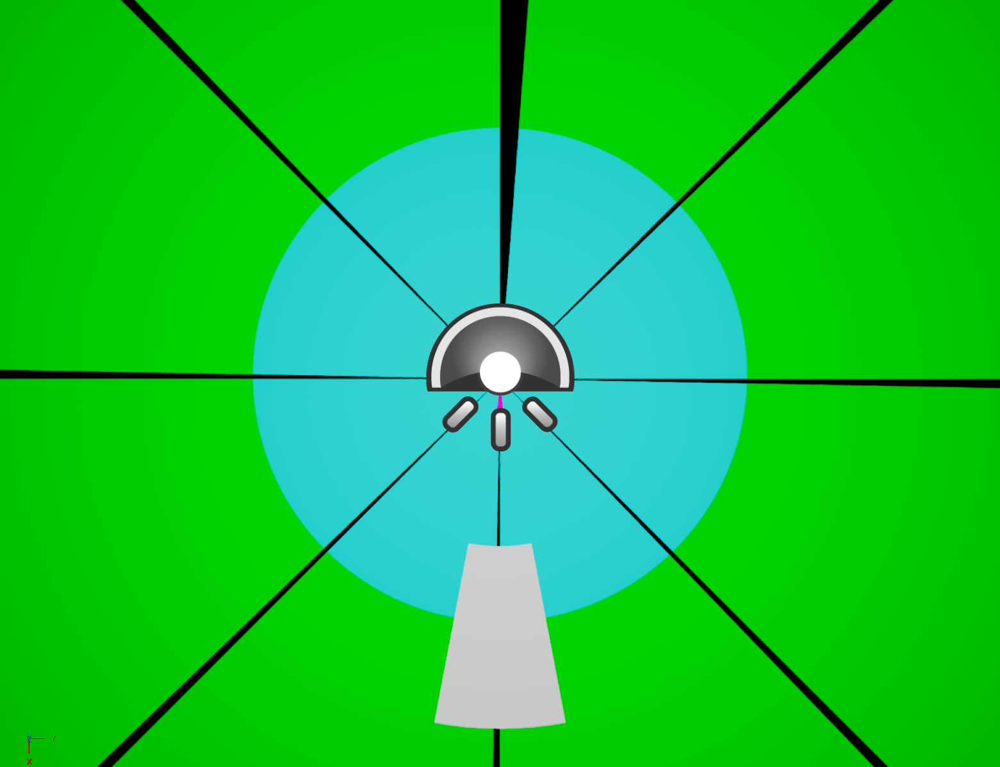
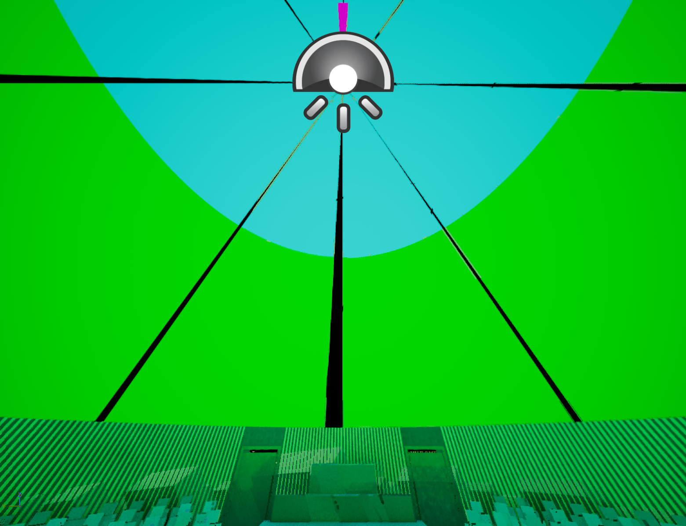

Lo que se verificó con estas capturas: en la sala VR solo se ve el verde (la
cúpula lee la mitad superior del lienzo), el frente `u 0.5` cae en +X, el cénit
queda en el centro del domemaster y la costura del lienzo va a parar detrás.

### Un caso real: 3gracias

`loop entrando acuarela test.mp4` (4096 × 2048, 24 cuadros por segundo, 18,6
segundos) es pintura a mano cuadro a cuadro en formato 360. La figura principal
está al frente y ocupa del cénit hasta casi el nadir, así que sin ajuste la
cúpula la corta a la cintura: es exactamente el caso que no se podía resolver
antes de la versión 1.3. Con `Rhorizonte` 35, `Rcurva` 1 y `Rpitch` −8 (un poco
de inclinación para bajar el frente) entra la figura entera; `Rpiso` marca 57
grados de piso en el borde. `Costura` queda apagada: el papel no casa en `u = 0`
y el fundido emborrona la figura de atrás, mientras que sin fundir queda solo una
línea fina detrás del público.


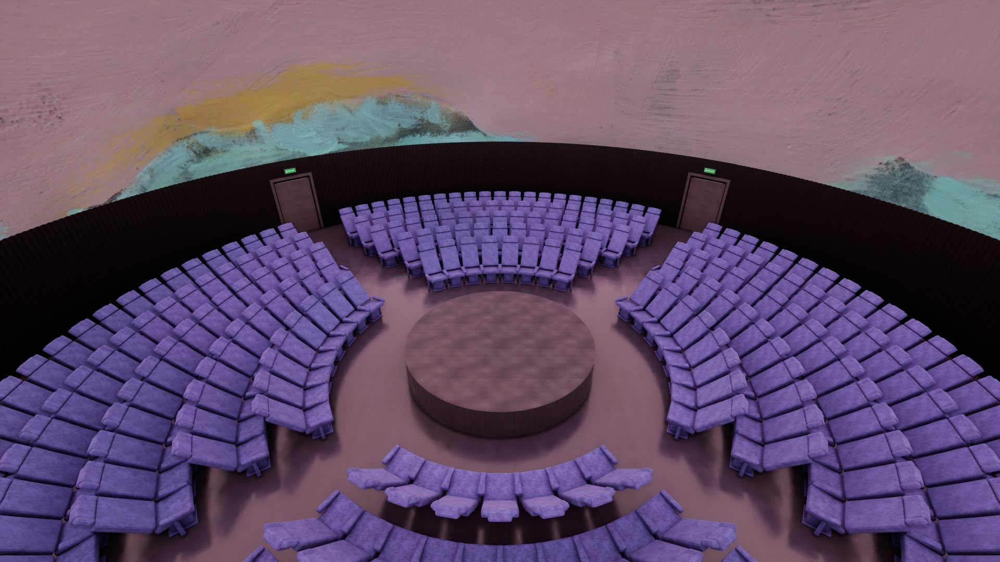

Las dos capturas de la sala VR de arriba son del 29 de septiembre de 2026 y salen del ejecutable, no de esta
red (ver [02_Sala_Unreal.md](02_Sala_Unreal.md), sección 14). Las de TouchDesigner son del 18 de septiembre de 2026 y usan otro video del
mismo trabajo, `test roto pintura.mp4`, con los ajustes de David: `Rhorizonte`
26,1, `Rcurva` 0,8, `Rpitch` 0 (`Rpiso` marca 28 grados de piso en el borde).
Van en el cuadro 30, fijo (`playmode` en *specify index* mientras se captura):
el papel beige con la figura azul sobre la cabeza y las figuras rojas y
amarillas al frente. `3gracias_domemaster.png` es `out_domo` a 4096 (`Res` en
`r4096`) y `3gracias_equirect.png` es `para_unreal`, el lienzo que recibe
Unreal, con la cúpula en la mitad superior. Una nota de composición: con estos ajustes la figura azul queda
casi toda sobre la cabeza del público y las figuras del frente salen chicas;
subir `Rhorizonte` unos grados más las agrandaría, a costa de meter más piso
del video en el borde.

## 8. Trampas medidas

- **Yaw en el Projection TOP no es un giro en azimut.** El orden de rotaciones
  del Projection TOP hace que `ry` o `rz` sobre un fisheye produzcan cosas
  distintas según lo que haya en `rx`. Un corrimiento horizontal del lienzo
  equirectangular (`Transform TOP`, `tx = Yaw/360`, `repeat`) es un giro puro y
  no depende de nada más. Por eso el Yaw vive antes de `domo`, en `giro`.
- **`equirectangular → fisheye` sin rotación mira al horizonte.** Hay que poner
  `rx = 90` para que el cénit quede en el centro, y `ry = 90` para que el
  frente quede abajo. Pitch resta de `rx`.
- **Reconstruir el equirectangular desde un domemaster** requiere las dos
  operaciones inversas: `fisheye → equirectangular` con `rx = -90` y el fov del
  modelo, más un corrimiento de `tx = -0.25` para deshacer el `ry = 90`. Sin el
  corrimiento el frente queda a 90 grados. La receta es la misma en
  `para_unreal` y en `IN_169`.
- **El modelo de sala es el FOV del fisheye.** `domo180` es media esfera;
  `domo90` y `domo45` también son pantallas de media esfera (180°), solo que
  inclinadas 45° y 27°; la inclinación está en la geometría de la sala, así que
  los tres usan FOV 180 y no hace falta tocar `Pitch` (ver
  `05_Modelos_de_sala.md`). Con `custom`, lo que pase de `Fovcustom` no entra
  en el círculo. `para_unreal` usa siempre el fov de la sala, así que la sala VR
  recibe exactamente lo que cubre el modelo; si `domo` trabaja con más grados
  (`Fovauto` apagado), ese contenido extra entra en la cúpula por el borde.
- **Annotate COMP que se autodestruye.** En TD 2025.32460, si el Annotate COMP
  se crea con nombre (`create(annotateCOMP, 'x')`) o se le enciende el flag
  `utility`, desaparece unos frames después. La función `caja()` lo crea sin
  nombre, lo configura y lo renombra al final. El aviso "Invalid path for node
  .../annotate/annotation" en su `back` interno lo trae de fábrica y no afecta.
- **Dos TouchDesigner abiertos no pueden compartir nombre de sender.** Ni de
  Spout ni de NDI: el segundo no publica o pisa al primero. Si hay dos
  instancias (por ejemplo el proyecto viejo y este), cambiar
  `Spoutunrealnombre`, `Spoutdomonombre` o `Ndinombre` en una de ellas, y
  ajustar el receptor de Unreal al nombre que corresponda.
- **El sender de la sala VR se llama `TD_Domo_Lab`.** El `SpoutDomeReceiver`
  del nivel tiene que leer ese nombre; si se cambia en la página Salidas hay
  que cambiarlo también en el actor (ver [03_Puente_Spout.md](03_Puente_Spout.md)).
- **El receptor de Unreal no lee 16-bit float.** `ASpoutDomeReceiver` solo
  acepta texturas de 8 bits por canal. `VIDEO_DOME`, y cualquier cadena que
  herede de él, entrega 16-bit float; con ese formato `SpoutReceiver` devuelve
  falso y la cúpula se queda congelada en el último frame que pudo leer, sin
  aviso en pantalla (solo "no disponible todavia" cada ~5 s en el log de
  Unreal). Por eso `alfa_unreal` fija el formato a `rgba8fixed` justo antes de
  `spout_unreal`. Lo destapó un `constant` rojo de 8 bits, que sí llegaba
  mientras la cadena completa no (medido el 17 de septiembre de 2026).
- **VIDEO_DOME termina en un Null, no en un Out TOP.** `IN_169` lo lee con un
  Select TOP apuntado a `VIDEO_DOME/out_dome`; no está cableado por conector.
- **VIDEO_DOME no conserva solo su montaje** cuando corre `build_domo.py`,
  porque DOMO entero se destruye antes; es `build_domo.py` el que copia sus
  parámetros y sus tablas y los reescribe al final. La tabla `screens` se
  escribe dos veces: en el momento y de nuevo unos frames después, porque el
  watcher reaplica el template restaurado con retraso (ver 5.3).
- **Los Annotate COMP de VIDEO_DOME se perdían.** `build_video_dome.py` los
  creaba con nombre y con `utility` encendido, y desaparecían solos. Ahora se
  crean sin nombre, sin `utility`, y se renombran al final, como en `caja()`.
- **El mapping tiene que ir antes del recorte.** Un Transform TOP detrás de un
  Projection TOP mueve una imagen que ya perdió todo lo que pasaba del FOV: encoger
  o correr el cénit muestra negro, nunca el piso. Por eso desde la versión 1.3 el
  mapping vive dentro del shader `domo_mapping`, que lee el lienzo completo.
  `Fovcontenido` solo cuenta con `Fovauto` apagado.
- **Un TouchDesigner minimizado no atiende el MCP.** Con la ventana minimizada,
  el servidor de ejecución del MCP deja de contestar ("exec_server unreachable:
  timed out") aunque el proceso esté vivo. Se arregla restaurando la ventana.
- **Unreal en segundo plano no refresca la cúpula en el editor.** El receptor
  tickea en el editor solo con el viewport en tiempo real y el editor al frente.
  Para capturar sin tocar el foco sirve Simulate (`StartPIE` con `bSimulate`),
  que tickea el mundo; `CaptureViewport` con `captureTransform` funciona igual.
- **La costura de un 360 no se saca con Yaw.** Es un meridiano de polo a polo:
  en azimut solo se mueve, y siempre llega al cénit. Hace falta un giro
  esférico (`Rpitch`, `Rroll`; sección 5.1).
- **VIDEO_DOME tenía su propia salida de audio.** Su `audio_out` sonaba
  siempre, esté o no el 16:9 al aire. Dentro de DOMO queda apagado y el único
  sonido sale de `AUDIO/salida` (sección 5.4).
- **Qué lado manda al reconstruir.** Un parámetro en modo Bind no se guarda
  como constante, así que el módulo renace con su valor por defecto. Para los
  de VIDEO_DOME manda abajo (el constructor guarda y restaura VIDEO_DOME
  aparte); para los de IN_360, IN_180 e IN_169 manda la página de la raíz, y
  solo la primera vez se sube el valor del módulo. Los parámetros de solo
  lectura (`Version`, `Donde`) ya no se restauran, para que muestren la
  versión del constructor que corrió.
- **Los slots nuevos de un GLSL TOP nacen en 1, no en 0.** Al subir `vec` a 3,
  `vec2valuex..w` valen 1. En el VIDEO_DOME de prueba eso metía `travel = 1` y
  corría la pared del cilindro entera: parecía que la plantilla estaba mal.
  Escribir siempre los cuatro componentes.
- **Pulsos sin Parameter Execute.** Un Parameter CHOP incluye los pulsos como
  un 1 de un cuadro y un CHOP Execute los recibe en `onOffToOn` (probado con
  `par.pulse()` y con un Momentary). Es lo que usa el panel Unreal, y no crea
  la dependencia cíclica que colgaba el MCP.
- **`scriptOp.store()` dentro de `onCook` hace un ciclo.** Guardar en el propio
  operador mientras cocina da "Cook dependency loop detected". El estado va en
  una variable del módulo de callbacks.
- **Un Script CHOP con entradas de audio es time slice.** Para sacar una sola
  muestra hay que poner `scriptOp.isTimeSlice = False` antes de `numSamples`.
- **En un parámetro del propio COMP, `op('x')` no busca adentro.** Una
  expresión en un parámetro de DOMO que mire a un hijo va con `me.op('x')`.
- **En un parámetro OP de un COMP el nombre pelado es un hermano.** El material
  de una geometría dentro de IN_3D es `mat_a`, no `../mat_a`: con `../` TD lo
  busca en DOMO y dibuja con el material por defecto, blanco, sin error.
- **El Script CHOP y el Script DAT nacen con su propio DAT de callbacks.** Si se
  apunta `callbacks` a otro, el que trae de fábrica sobra y el constructor lo
  borra.
- **Resolución.** El domemaster viene en 2048 porque 4096 con todas las capas
  de VIDEO_DOME encendidas llena la memoria de la GPU. Subir `Res` solo para
  grabar.

## 9. Cómo agregar un módulo nuevo

Desde la versión 1.4 lo más limpio es un archivo en `modulos/` que
`build_domo.py` ejecuta con `modulo('nombre.py')`, como `in_fx.py` e
`in_3d.py`; el patrón es el mismo de abajo.

Un módulo es un Base COMP hijo de DOMO que entrega el lienzo equirectangular
por `out1`. El patrón que siguen los tres existentes:

1. Crear el COMP con `D.create(baseCOMP, 'IN_NUEVO')`, ubicarlo con `nodeX` y
   `nodeY` (los módulos van en la columna `x = -600`) y darle una página
   personalizada con al menos el toggle `Activo`. Las utilidades `menu()`,
   `flotante()`, `toggle()` y `texto()` crean parámetros con valor y valor por
   defecto; `appendFile` para rutas.
2. Construir la cadena que produce el lienzo. Lo último que entregue debe estar
   en la convención común (`u 0.5` frente, `v 0.5` horizonte, cúpula arriba) y
   a la resolución del lienzo: llamar a `lienzo(op)` sobre el TOP que fija la
   resolución, que la ata por expresión a `parent.DOMO.par.Ancho`. Si la fuente
   entrega un domemaster con el frente abajo, la receta de vuelta es la de
   IN_169: Projection TOP `fisheye → equirectangular` con `rx = -90` y su fov,
   más un Transform TOP con `tx = -0.25` y `repeat`.
3. Cerrarlo con `negro_y_salida(comp, resultado, x)`: crea un Constant TOP
   negro a la resolución del lienzo, un Switch TOP `activo` gobernado por
   `int(parent().par.Activo)` y el Out TOP `out1`. Apagado, el módulo entrega
   negro y deja de cocinar.
4. Ponerle su `caja(comp, 'nota', titulo, cuerpo, nodos, color)`: el Annotate
   COMP que encierra los nodos y explica el módulo. Pasarle la lista de nodos
   que debe abarcar, incluidos `negro`, `activo` y `out1`.
5. Conectarlo a la mezcla: una entrada más en `mezcla` (`wire(D.op('IN_NUEVO'),
   mez, n)`) y una opción más en el menú `Fuente` de la página Domo, en el
   mismo índice. Si el módulo trae audio de un video, sumarle un Audio Movie
   CHOP en `AUDIO`, conectarlo a `al_aire` en ese índice (el silencio va
   último) y agregar el caso a la expresión de `al_aire.index`.
6. Agregar el nuevo COMP a la lista de la caja `nota_modulos` y volver a correr
   el constructor: la configuración de los módulos existentes se conserva sola.

## 10. Panel Unreal: el ejecutable desde TouchDesigner

El ejecutable de la sala VR (`ADomeMediaController`) escucha en
`127.0.0.1:7000` líneas de texto que empiezan con `domo.`, las mismas que su
consola. La página **Unreal** de DOMO las manda con un UDP Out DAT,
`udp_unreal`, sin salir de TouchDesigner (`modulos/unreal_udp.py`).

No hay Parameter Execute DAT, a propósito: uno mirando los parámetros de su
propio COMP colgó el MCP. `unreal_pars` (Parameter CHOP) lee los parámetros
`U*`, `Vtemplate` y `Negro`, y `unreal_exec` (CHOP Execute) reacciona: los
pulsos llegan por `onOffToOn` y los menús y toggles por `onValueChange`. Todo lo
enviado queda en la tabla `unreal_log` (las últimas 60 líneas) y en el campo de
solo lectura `Uultimo`. Desde Python se puede mandar cualquier línea con
`op('/project1/DOMO/unreal_exec').module.mandar('domo.Estado')`.

| Parámetro | Manda |
|---|---|
| `Uactivo`, `Uhost`, `Upuerto` | encender el envío, IP y puerto (127.0.0.1:7000) |
| `Ucue` + `Uircue` | `domo.Cue N` (desde 1) |
| `Uanterior`, `Usiguiente` | `domo.Anterior`, `domo.Siguiente` (y mueven `Ucue`) |
| `Upausa` | `domo.Pausa` |
| `Uluces` | al cambiar: `domo.Luces auto`, `domo.Luces 0`, `domo.Luces 1` |
| `Unegro` | al cambiar: `domo.Negro 1` o `0` |
| `Umodo` | al cambiar: `domo.Modo caminar`, `volar` o `fantasma` |
| `Ufuente` | al cambiar: `domo.Fuente Spout` o `Media` |
| `Uplantilla` + `Uenviarplantilla` | `domo.Plantilla id` (las 21 plantillas de VIDEO_DOME) |
| `Useguir` | cada vez que cambia `Vtemplate`, manda `domo.Plantilla` con esa plantilla |
| `Uabrir` + `Uabrirenviar` | `domo.Abrir ruta` (ruta completa con barras normales) |
| `Uparam`, `Uvalor` + `Uparamenviar` | `domo.Param Nombre Valor` (por ejemplo `Resplandor 0.5`) |
| `Ucomando` + `Uenviar` | la línea libre; si no empieza con `domo.` se le agrega |

Probado el 29 de septiembre de 2026 contra un receptor UDP de prueba en el
puerto 7001: llegaron `domo.Siguiente`, `domo.Luces 0`, `domo.Modo volar`,
`domo.Plantilla sala_4`, `domo.Param Resplandor 0.5`,
`domo.Abrir C:/ruta/video.mp4`, `domo.Estado`, `domo.Plantilla sala_corona`
(por `Useguir`) y `domo.Negro 1` (por el master con `Negrounreal`). No se probó
contra el ejecutable abierto.

## 11. Rendimiento medido

29 de septiembre de 2026, RTX 3090, TouchDesigner 2025.32460, con la salida a
Unreal encendida: 60 fps (el tope de la timeline) con `Res` en 4096 y al aire
el 16:9 (plantilla `anillo`), IN_FX (`tunel`, y también `flujo` y `aurora` con
`Resfx` en 4096 y `Detalle` 1), IN_3D (`Cubo` 2048 y 600 cajas) o el patrón.
Ninguna combinación bajó de 59,9 fps. Con la GPU compartida con Unreal abierto
no se midió.
