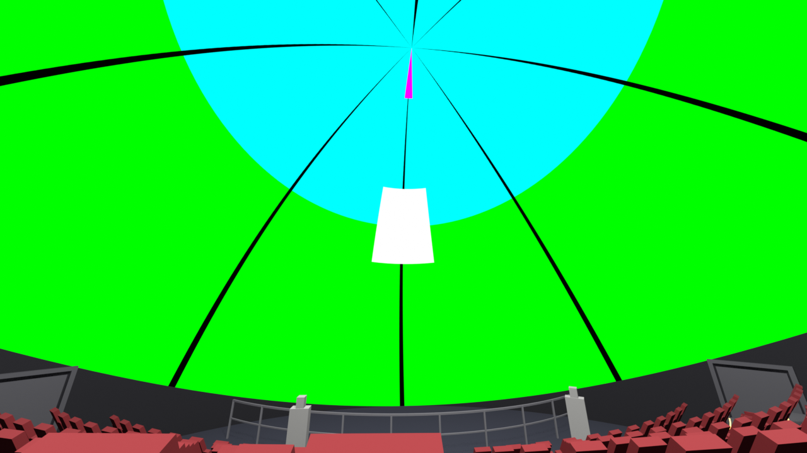
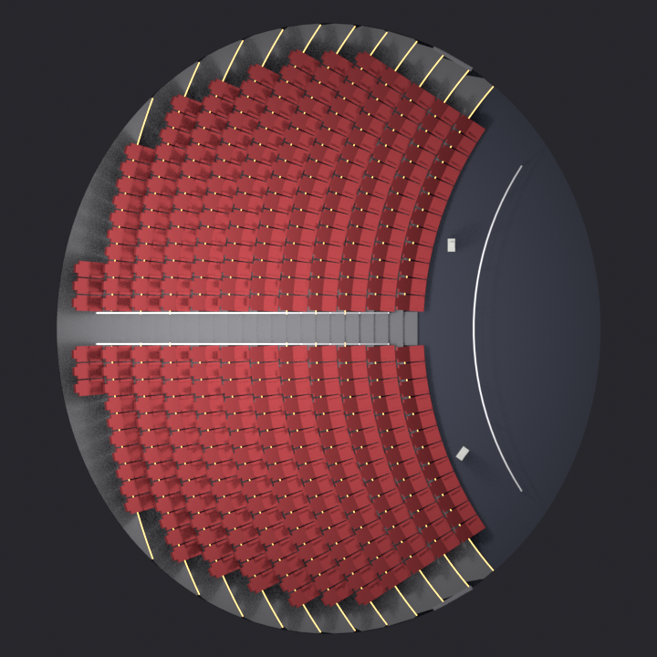
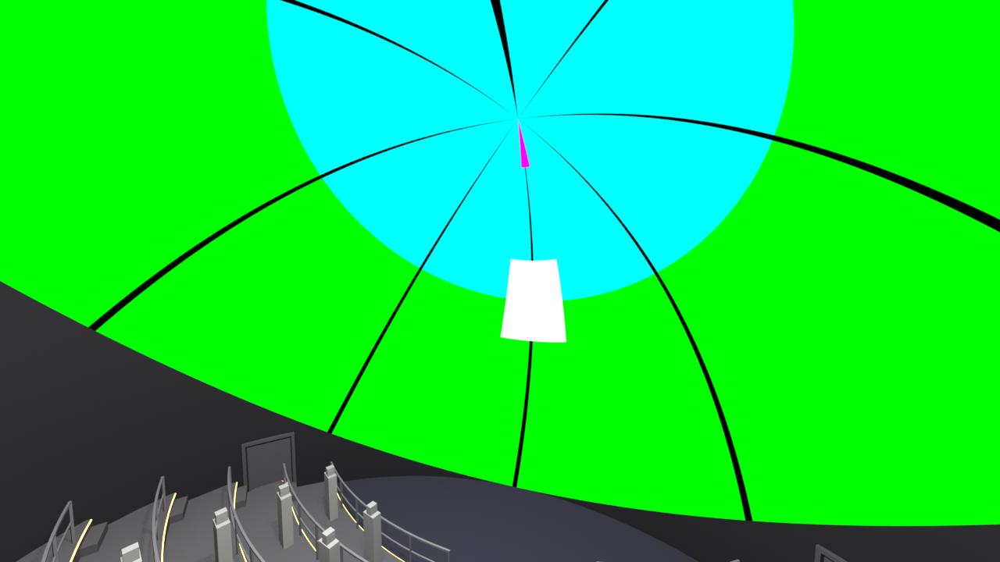
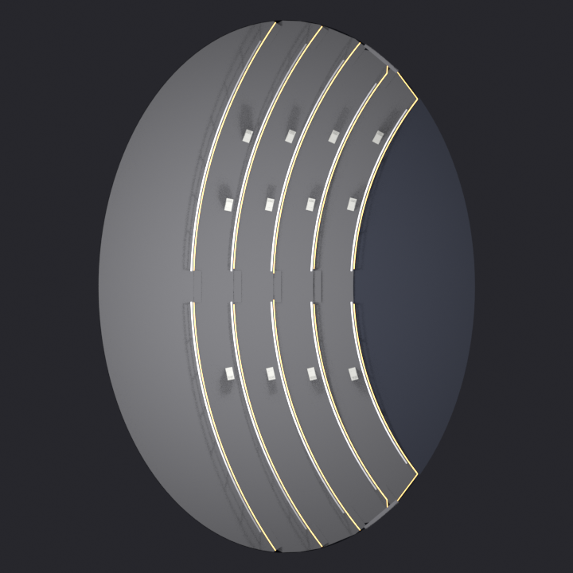

# Modelos de sala: domo 180, sala 45 y sala 90

La sala VR existe en tres variantes. Cada una tiene su FBX en `02_Export/` y su
nivel en `03_Unreal/DomoVR/Content/Maps/`. Las tres salen del mismo generador
(`01_Blender/generar_sala_domo.py`) y del mismo importador
(`03_Unreal/importar_sala.py`), y se eligen con `--fov` en Blender y con `-Fov`
en el `.ps1` de Unreal. La geometría de base del planetario está en
[02_Sala_Unreal.md](02_Sala_Unreal.md) y la señal que llega a la cúpula en
[04_Senal_TouchDesigner.md](04_Senal_TouchDesigner.md).

## 1. Qué es cada modelo

| Modelo | Tipo de sala | Pantalla | Público | Referencia |
|---|---|---|---|---|
| **180** | planetario clásico | media esfera horizontal de 23 m | 360 butacas muy reclinadas en 6 cuñas concéntricas, mirando al cénit | Planetario de Bogotá |
| **45** | cine domo inclinado | media esfera de 22 m inclinada 27° hacia el frente | 314 butacas reclinadas en gradería tipo estadio, mirando al frente | Cine Domo de Maloka (Bogotá), formato IMAX Dome |
| **90** | domo frontal de pie | media esfera de 20 m inclinada 45° hacia el frente | de pie, en 5 plataformas escalonadas con barandas, mirando al frente | domos de museo y de parque temático |

**Los números 45 y 90 ya no son el FOV.** Hasta el 18 de septiembre de 2026,
`--fov 45` y `--fov 90` generaban casquetes horizontales (la misma sala del
planetario con una cúpula recortada que cubría de 67,5° o de 45° de elevación
al cénit). Desde esa fecha generan dos salas frontales rediseñadas, y los
números se conservan como claves del modelo para no renombrar niveles,
carpetas y archivos (`DomoVR_45`, `/Game/Sala/Domo_90`, `sala_domo_45.fbx`).
Las dos pantallas frontales son medias esferas de 180°. Cualquier otro `--fov`
(por ejemplo 120) sigue generando el casquete horizontal de antes.

En las tres, el frente del público es **+X**.

## 2. Sala 45: cine domo tipo Maloka


El Cine Domo de Maloka es una pantalla curva semiesférica de 180°, de 22 m de
diámetro y 16 m de alto, con 314 butacas (`06_Modelos/domos_colombia.json`).
Fue el primer teatro de formato gigante de Suramérica (tecnología Iwerks), y
responde al esquema de los IMAX Dome (antes Omnimax): la cúpula no es
horizontal como en un planetario, sino que está echada hacia adelante, y el
público se sienta en una gradería empinada, toda mirando en la misma
dirección, con la pantalla llenando el campo visual por delante y por encima.

**Pantalla.** Media esfera de 11 m de radio, inclinada hacia +X. El catálogo
no trae la inclinación de Maloka (está en la lista de pendientes), así que se
deduce de sus dos medidas: si el borde delantero de la pantalla toca el piso y
lo más alto de la cúpula queda a 16 m, entonces `11 · (1 + sin θ) = 16`, de
donde θ = 27,0°. Es un valor típico de las salas IMAX Dome (entre 25° y 30°) y
coincide con los 27° del Planetario de Medellín.

| Medida | Valor |
|---|---|
| Radio / diámetro de la pantalla | 11,00 m / 22,00 m |
| Inclinación | 27,0° hacia el frente (+X) |
| Centro de la esfera | (0, 0, 5,00 m) |
| Borde delantero de la pantalla | a nivel del piso, en x = +9,80 m |
| Borde trasero de la pantalla | a 10,00 m de altura, en x = −9,80 m |
| Punto más alto | 16,00 m |
| Planta (proyección del borde) | elipse de 19,60 m (frente-fondo) × 22,00 m |
| Butacas | 314, en 12 filas curvas con pasillo central de 1,2 m |
| Paso entre filas / contrahuella | 1,05 m / 0,42 m (grada tipo estadio) |
| Primera fila / última fila | x = +3,20 m a nivel 0 / x = −8,35 m a 4,62 m de altura |
| Butaca | 0,56 m de ancho, respaldo 0,85 m echado 30°, asiento 8° |
| Ojo de la cámara | fila 7, primera butaca a la derecha del pasillo, 1,20 m sobre el piso de la grada |
| Triángulos | 54 012 |

| Fila | x (m) | Piso (m) | Butacas |
|---|---|---|---|
| 1 | 3,20 | 0,00 | 24 |
| 2 | 2,15 | 0,42 | 26 |
| 3 | 1,10 | 0,84 | 28 |
| 4 | 0,05 | 1,26 | 30 |
| 5 | −1,00 | 1,68 | 32 |
| 6 | −2,05 | 2,10 | 32 |
| 7 | −3,10 | 2,52 | 32 |
| 8 | −4,15 | 2,94 | 30 |
| 9 | −5,20 | 3,36 | 28 |
| 10 | −6,25 | 3,78 | 26 |
| 11 | −7,30 | 4,20 | 20 |
| 12 | −8,35 | 4,62 | 6 |

Las filas son arcos con centro 16 m delante del centro del domo, así que se
curvan suavemente hacia la pantalla. El número de butacas por fila no está
escrito a mano: el generador llena cada arco con butacas de 0,60 m de paso
hasta el muro (dejando 1 m de pasillo lateral) y agrega filas hacia atrás
hasta llegar exactamente a 314. La última fila, contra la pared de fondo, queda
con 6.

Además de las butacas: medio escalón por fila en el pasillo central (se sube
de grada en dos pasos), pasamanos a 0,90 m a ambos lados del pasillo, una
baranda de 1,05 m que separa el pasillo delantero de la pantalla, tiras LED
ámbar en la nariz de cada grada y dos puertas en los costados, a la altura del
pasillo delantero.





## 3. Sala 90: domo frontal de pie



Es el esquema de los domos de museo y de parque temático en los que el público
no se sienta: entra, se para frente a la pantalla y mira de frente, apoyado en
una baranda. La pantalla está mucho más echada que en un cine domo (45°), de
modo que su centro queda delante del público y no sobre su cabeza, y el piso se
organiza en plataformas escalonadas para que las filas de atrás vean por encima
de las de adelante.

| Medida | Valor |
|---|---|
| Radio / diámetro de la pantalla | 10,00 m / 20,00 m |
| Inclinación | 45° hacia el frente (+X) |
| Centro de la esfera | (0, 0, 7,07 m) |
| Borde delantero de la pantalla | a nivel del piso, en x = +7,07 m |
| Borde trasero de la pantalla | a 14,14 m de altura, en x = −7,07 m |
| Punto más alto | 17,07 m |
| Planta | elipse de 14,14 m (frente-fondo) × 20,00 m |
| Plataformas | 5, de 1,50 m de fondo (dos filas de gente de pie), contrahuella 0,45 m |
| Barandas | en el borde delantero de cada plataforma: pasamanos a 1,05 m, riel medio a 0,55 m, postes cada ~1,5 m |
| Ojo de la cámara | plataforma 3, 0,5 m detrás de su baranda, 1,60 m sobre el piso de la plataforma |
| Aforo de pie | unas 370 personas (estimado a 0,5 m² por persona, holgado) |
| Triángulos | 27 424 |

| Plataforma | Borde delantero x (m) | Piso (m) | Largo del borde (m) |
|---|---|---|---|
| 1 | 2,50 | 0,20 | 15,8 |
| 2 | 1,00 | 0,65 | 17,9 |
| 3 | −0,50 | 1,10 | 19,8 |
| 4 | −2,00 | 1,55 | 21,0 |
| 5 | −3,50 | 2,00 | 21,1 (llega hasta la pared de fondo) |

Cada baranda tiene tres aberturas: una central de 1,2 m y una contra cada
muro de 0,9 m, con un medio escalón en cada una para subir de plataforma. Las
tiras LED van en la nariz de cada plataforma. Delante de la primera plataforma
queda una franja de piso libre, a nivel 0, a la que dan las dos puertas.

Desde el ojo de pie, el cuadro blanco del frente del patrón queda unos 20° por
encima de la horizontal: la pantalla se mira de frente, sin levantar la cabeza.




## 4. Cómo se construye una sala frontal

Todo se deriva de tres números por sala (radio, inclinación y altura del borde
delantero), definidos en `SALAS_FRONTALES` dentro del generador:

- **La pantalla** se construye como la media esfera del planetario, en su
  propio marco (polo en +Z, frente en +X) y con su UV, y **después** se inclina
  alrededor del eje Y para que el polo se eche hacia +X. El centro de la esfera
  queda a `z_borde_frente + radio · sin(inclinación)`, de modo que el punto más
  bajo del borde (el delantero) toca el piso.
- **La planta** es la proyección del borde de la pantalla sobre el piso: una
  elipse de semiejes `radio · cos(inclinación)` en X y `radio` en Y.
- **El muro** (`SM_Muro`) baja vertical desde cada punto del borde hasta el
  piso. Comparte los 128 vértices del borde con la pantalla, así que la sala
  cierra sin rendijas. En el frente mide casi cero; atrás es la pared alta
  donde iría la cabina de proyección (10 m en la sala 45, 14 m en la 90).
- **Gradas y plataformas** son franjas en arco, con centro de curvatura
  delante de la pantalla, recortadas contra la elipse. Son sólidos cerrados
  desde el piso, así que no quedan huecos debajo.

Mallas del FBX (todas con nombres `SM_*`, una capa UV):

| Malla | Sala 45 | Sala 90 | Material |
|---|---|---|---|
| `SM_Domo` | sí | sí | `MI_Domo` (compartido, el que alimenta Spout) |
| `SM_Muro`, `SM_Piso` | sí | sí | `M_Muro`, `M_Piso` |
| `SM_Graderia` / `SM_Plataformas` | gradería | plataformas | `M_Grada` |
| `SM_Butacas_01`, `SM_Butacas_02` | a cada lado del pasillo | no | `M_Butaca` |
| `SM_Barandas` | pasamanos y baranda frontal | barandas de plataforma | `M_Baranda` |
| `SM_LucesPaso` | sí | sí | `M_LedPaso` (emisivo) |
| `SM_Puerta_01`, `SM_Puerta_02` | sí | sí | `M_Puerta` |

Los materiales de las salas frontales son colores de trabajo pensados para que
cada pieza se distinga en Unreal aunque la única luz sea la de la cúpula: piso
oscuro azulado, grada gris medio, barandas de metal claro, butacas rojo tela,
muro casi negro (como la pared de un domo real, que no debe reflejar la
proyección) y LED ámbar emisivo. No llevan texturas horneadas.

En los renders aparecen también unos maniquíes de 1,75 m (objeto
`REF_Personas`) para leer la escala. Están en el `.blend` pero no se exportan
al FBX.

El generador escribe junto al FBX un JSON (`02_Export/sala_domo_45.json`,
`sala_domo_90.json`) con las medidas de la pantalla, la lista de mallas, el
material de cada una, los colores, la posición del ojo, la tabla de filas o
plataformas y el resultado de la verificación del FBX. El importador de Unreal
arma el nivel a partir de ese archivo.

## 5. La UV de la cúpula

TouchDesigner manda por Spout (`TD_Domo_Lab`) un lienzo equirectangular 2:1 con
la cúpula en la mitad superior: `u = 0,5` es el frente, `u = 0/1` la parte de
atrás, `v = 0,5` el horizonte y `v = 1` el cénit. La cúpula de los tres modelos
lleva **una sola capa UV** (canal 0) con esta fórmula, escrita a mano en
`uv_equirectangular()`:

```
U = azimut / 360 + 0,5        (módulo 1; costura detrás, en −X)
V = 0,5 + elevación / 180     (elevación desde el centro de la esfera)
```

En el domo 180 la elevación se mide desde el horizonte real. En las salas
frontales se mide en el **marco propio de la pantalla**: la UV se escribe antes
de inclinarla y viaja con la malla. El "horizonte" de la UV (`v = 0,5`) es el
borde de la pantalla y el "cénit" (`v = 1`) es su polo, que en la sala 45 está
27° delante de la vertical y en la 90, 45°. Es exactamente lo que recibe un domo
inclinado real: un domemaster de 180° con el cénit en el polo de la pantalla y
el frente abajo. El frente (`u = 0,5`) sigue en +X.

Con el patrón de prueba de TouchDesigner (verde `v 0,5–0,75`, cian `v 0,75–1`,
cuadro blanco en `u 0,5, v 0,75`, marca magenta cerca del cénit, meridianos
negros cada 45°), los renders muestran en las dos salas frontales el verde
abajo y a los lados, el cian arriba, centrado en el polo de la pantalla, y el
cuadro blanco al frente: a 18° sobre la horizontal en la sala 45 y a la altura
del centro de la esfera (7 m) en la 90. No aparece rojo ni amarillo.

`verificar_export_frontal()` relee el FBX exportado y comprueba, en cada
corrida: una sola capa UV, V de 0,500 a 1,000, el borde delantero
(`u 0,5, v 0,5`) en +X y a nivel del piso, y el cuadro blanco
(`u 0,5, v 0,75`) en +X. Si algo falla, el script termina con error. Última
medición:

| | Sala 45 | Sala 90 |
|---|---|---|
| Capas UV | `UVMap` (una) | `UVMap` (una) |
| V del canal 0 | 0,500 a 1,000 | 0,500 a 1,000 |
| Borde delantero `u 0,5 v 0,5` | (9,79; 0; 0,00) m | (7,07; 0; 0,01) m |
| Cuadro blanco `u 0,5 v 0,75` | (10,46; 0; 8,39) m | (9,99; 0; 7,08) m |

La historia de esta fórmula: hasta el 17 de septiembre de 2026 el generador
escribía `V = elevación / 90` en una segunda capa (`UVMap.001`) que Unreal no
leía; Unreal muestreaba la capa por defecto de `primitive_uv_sphere_add`, que
resultó ser exactamente la fórmula de arriba. Desde entonces la cúpula se
construye a mano con `bmesh`, con una sola capa y la fórmula explícita. La
cúpula del domo 180 que genera el código de hoy es idéntica, vértice a vértice
y UV a UV, a la de `sala_domo.blend`.

**En TouchDesigner**, las dos salas frontales se alimentan con
`Modelo = domo180`: la pantalla es de 180° y la inclinación ya está en la
geometría, así que no hace falta `Pitch`. Las opciones `domo45` y `domo90` del
COMP `DOMO` siguen existiendo, pero describen los casquetes de antes (fisheye
de 45° y 90°) y no corresponden a estas salas.

## 6. Cómo regenerar

Blender, sin interfaz (`C:\Program Files\Blender Foundation\Blender 5.2\blender.exe`):

```
blender.exe -b -P 01_Blender\generar_sala_domo.py                 # domo 180, hornea texturas (~10 min)
blender.exe -b -P 01_Blender\generar_sala_domo.py -- --fov 45     # sala 45 (~20 s)
blender.exe -b -P 01_Blender\generar_sala_domo.py -- --fov 90     # sala 90 (~20 s)
```

Cada corrida de una sala frontal deja el `.blend`, el FBX, el GLB, el JSON y
tres renders: `vista_planta_cenital_N.png`, `vista_general_perspectiva_N.png`
y `vista_desde_butaca_45.png` o `vista_de_pie_90.png`. La cúpula de los renders
lleva el patrón de prueba (una imagen generada en el script con las mismas
reglas que `00_TouchDesigner/shaders/patron.frag`), que se aplica después de
exportar para que el FBX no arrastre la imagen.

Unreal, headless y con el editor cerrado:

```
03_Unreal\importar_sala.ps1 -Fov 45
03_Unreal\importar_sala.ps1 -Fov 45 -ScriptName conectar_spout.py
03_Unreal\importar_sala.ps1 -Fov 90
03_Unreal\importar_sala.ps1 -Fov 90 -ScriptName conectar_spout.py
```

Con `DOMO_FOV = 45` o `90`, el importador:

1. Lee el JSON de la sala (si no existe, se detiene y pide correr Blender).
2. Vacía `/Game/Sala/Domo_45` (o `_90`), para que no queden las mallas del
   casquete anterior, e importa el FBX ahí, sin materiales y sin colisión
   convexa automática. A cada malla le pone colisión compleja
   (`Use Complex Collision As Simple`), para que se pueda caminar por gradas y
   plataformas sin quedar encerrado en el casco convexo de la cúpula.
3. Crea los materiales de la sala en `/Game/Sala/Domo_45/Materials`
   (recreados en cada corrida desde el JSON) y le pone a la cúpula el `MI_Domo`
   compartido de `/Game/Sala/Materials`.
4. Limpia el nivel `/Game/Maps/DomoVR_45`, coloca las mallas, el Post Process
   Volume, el SkyLight de captura (en estas salas sin negro en el hemisferio
   inferior, porque la pantalla baja hasta el piso), un **PlayerStart** y una
   **CameraActor** `Camara_Ojo` en el ojo del espectador, mirando al frente. El
   PlayerStart sigue la convención del 180: su ubicación es la altura de ojo.
5. Guarda solo la carpeta del modelo y su propio mapa. `DomoVR.umap` no se
   toca.

El paso de coordenadas de Blender a Unreal invierte el eje Y (Unreal es de mano
izquierda). El importador no lo supone: lo mide con la puerta 1, que en
Blender está en +Y, y lo registra en el log. Medido el 18 de septiembre de
2026: signo −1. Con eso, el ojo quedó en (−363, −92, 372) cm en la sala 45 y en
(−93, −145, 270) cm en la 90.

`conectar_spout.py` vuelve a correr la importación completa (importa el módulo
`importar_sala`) y después coloca el `SpoutDomeReceiver` del nivel apuntando a
`MI_Domo` y a `Domo_Actor`. Cada pasada de las dos salas tardó unos pocos
minutos con el editor cerrado, y el commandlet terminó con código 0.

## 7. Cómo agregar una sala nueva

Una sala frontal nueva es una entrada más en `SALAS_FRONTALES` (radio,
inclinación o altura de pantalla, tipo `butacas` o `de_pie`, parámetros de
gradería o plataformas, fila o plataforma del ojo) y su clave numérica en la
comprobación `ES_SALA_FRONTAL` del importador. Para un domo real del catálogo
`06_Modelos/domos_colombia.json`:

- `diametro_m / 2` es el radio.
- `inclinacion_deg`, si el catálogo la trae (Medellín, 27°), va directo; si no,
  se puede deducir de la altura de la pantalla como se hizo con Maloka.
- `aforo` es `total_butacas`. El generador se detiene con un mensaje claro si
  la gradería llega a la pared del fondo sin completar el aforo; en ese caso
  hay que bajar el paso entre filas, estrechar el pasillo o subir el radio.

Para un casquete horizontal de otro ángulo sigue valiendo `--fov N`, que genera
la sala del planetario con la cúpula recortada.

## 8. Qué falta

- **Verificación visual en Unreal** de los niveles `DomoVR_45` y `DomoVR_90`
  con TouchDesigner en `domo180` y el patrón. La geometría, la UV y la
  posición del ojo están verificadas en el FBX y en el log de importación, y
  los renders de Blender muestran el patrón bien orientado; falta abrir el
  editor y mirar.
- **Datos de Maloka sin confirmar**: la inclinación (27° es deducida), el tipo
  de butaca, el paso entre filas y la posición de la cabina. La gradería es la
  típica de una sala IMAX Dome, no un levantamiento de la sala real.
- **Cabina de proyección**: la pared de fondo de las dos salas está lista para
  recibirla, pero no se modeló.
- **Menú de TouchDesigner**: `domo45` y `domo90` siguen describiendo los
  casquetes viejos. Habría que renombrarlos o agregar una nota en el COMP
  para que no se usen con estas salas.
- **Radio y aforo del domo 180** siguen siendo constantes del generador (ver la
  sección anterior para las salas frontales).
