<div align="center">

# domo-lab

**Test a dome video from the seat, in virtual reality, before you step into the real dome.**

[Español](README.md) · **English** · [Português](README.pt-BR.md)

[](LICENSE)
[](LICENSE-CONTENT)
[](https://www.unrealengine.com/)
[](https://derivative.ca/)
[](https://www.blender.org/)
[](04_Docs/06_Unreal_standalone.md)
[](#quick-start)
[](04_Docs/07_GPUs_AMD_e_Intel.md)

[What's new](#whats-new) · [Gallery](#gallery) · [What it does](#what-it-does) · [Quick start](#quick-start) · [Standalone player](#the-standalone-player-no-touchdesigner) · [TouchDesigner](#touchdesigner) · [Graphics cards](#graphics-cards) · [Roadmap](#roadmap) · [Documentation](#documentation)

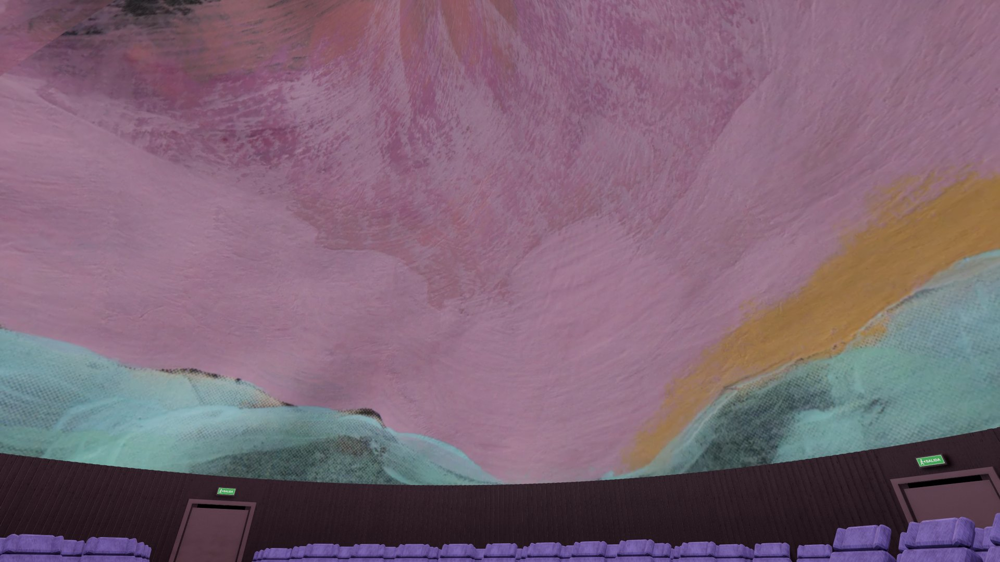

*3gracias by David Vega: a hand-painted, frame-by-frame film, mounted in a new format for domes and seen
from a seat in the virtual room (capture of the standalone player).*

</div>

> **About languages.** The project was written in Spanish. This README is fully translated into English and
> Portuguese. The technical documents in [`04_Docs/`](04_Docs/) and the [CHANGELOG](CHANGELOG.md) are still Spanish
> only; a browser translation works well on them, and translating them is on the [roadmap](#roadmap).

## What's new

Latest changes, newest first. The full log is in the [CHANGELOG](CHANGELOG.md) (Spanish).

| Date | What |
|---|---|
| 29 Sep 2026 | **TouchDesigner:** fixed 16:9 layouts (cylinder, tunnel and crop), `IN_FX` effects, `IN_3D` objects, an image master and a **UDP control panel for Unreal**. The player's templates are now generated from TouchDesigner's. |
| 29 Sep 2026 | **Room and rendering:** black walls, a less reflective floor, a **blurred background** behind the 16:9 screens, **render profiles** that adapt to the display and the graphics card, and an `ajustes.json` file that remembers the settings. |
| 29 Sep 2026 | **GPU video decoding:** the player decodes with Electra (D3D12 Video and NVDEC) without leaving DirectX 12. A 4096 × 4096 HEVC video went from 6.5 to 1.5 CPU cores. |
| 29 Sep 2026 | **AMD and Intel:** research, decisions and a verification plan in [07_GPUs_AMD_e_Intel.md](04_Docs/07_GPUs_AMD_e_Intel.md). |
| 28 Sep 2026 | **Room 180 rebuilt** from photos of the Bogotá Planetarium: four seating groups, four aisles to the exits, a closed control booth. |

## Gallery

<table>
<tr>
<td width="50%">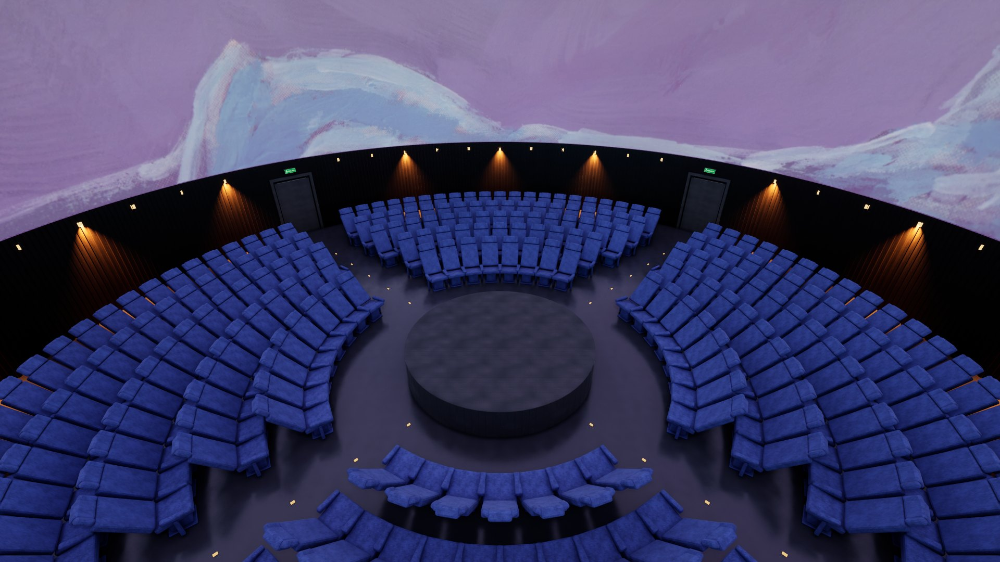<br><sub><b>Room 180</b>, lights on: 265 seats, a 3 m stage and a black wall with lights high up.</sub></td>
<td width="50%">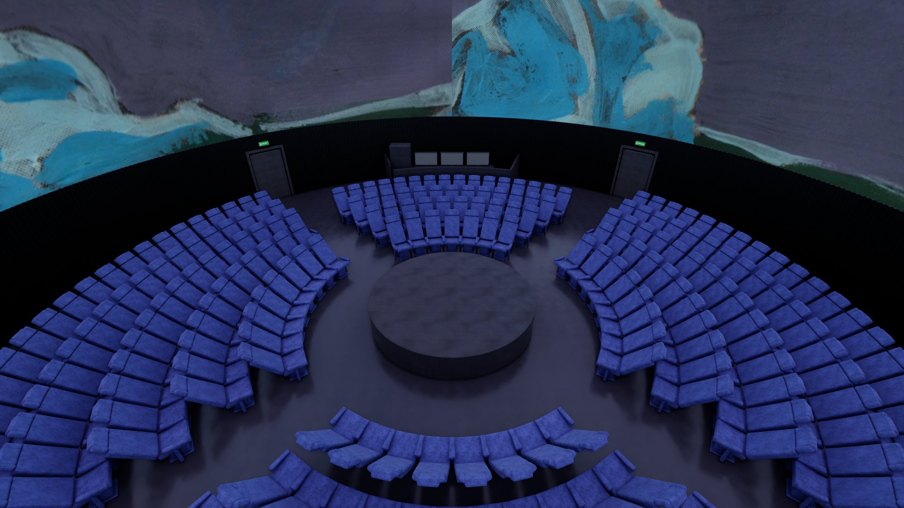<br><sub><b>With signal</b>: the dome lights the room and the room lights switch off on their own.</sub></td>
</tr>
<tr>
<td width="50%">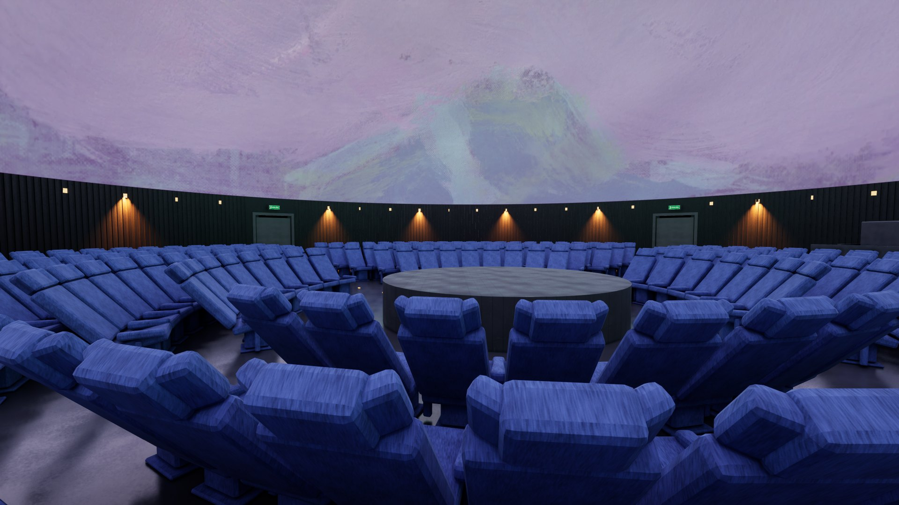<br><sub><b>Aisles</b> that end at the four emergency exits.</sub></td>
<td width="50%">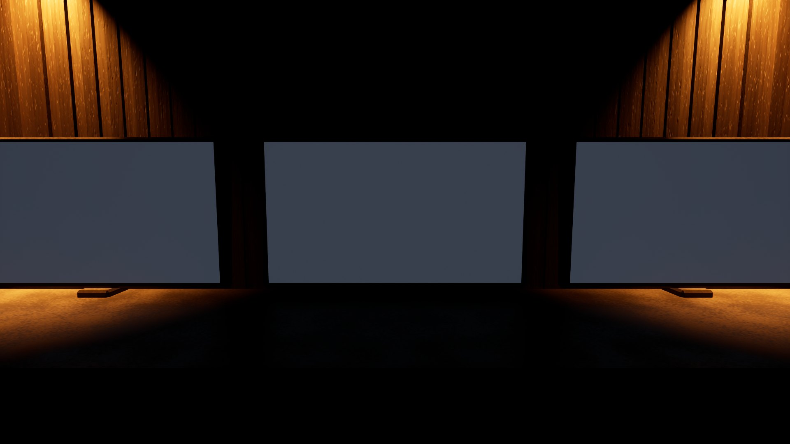<br><sub><b>Control booth</b>: closed, behind the rear seating group; the operator cannot see the audience.</sub></td>
</tr>
<tr>
<td width="50%">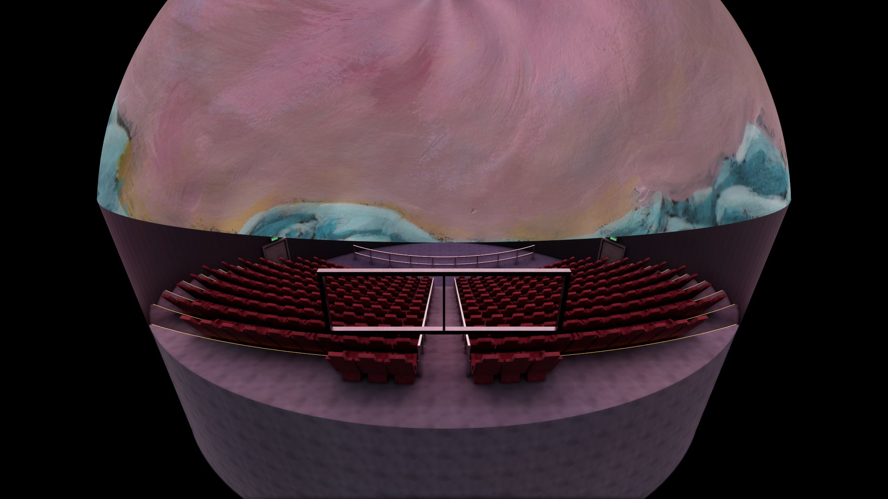<br><sub><b>Room 45</b>, Maloka style: seated audience facing a tilted half sphere.</sub></td>
<td width="50%">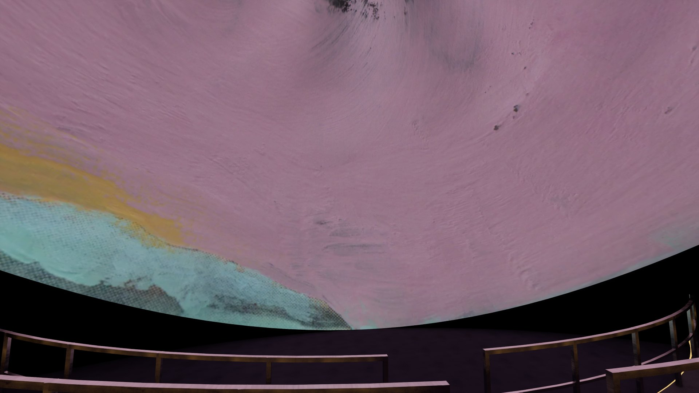<br><sub><b>Room 90</b>, standing with railings, as in museums.</sub></td>
</tr>
</table>

<details>
<summary><b>More: the TouchDesigner signal and the test pattern</b></summary>

| | |
|---|---|
| 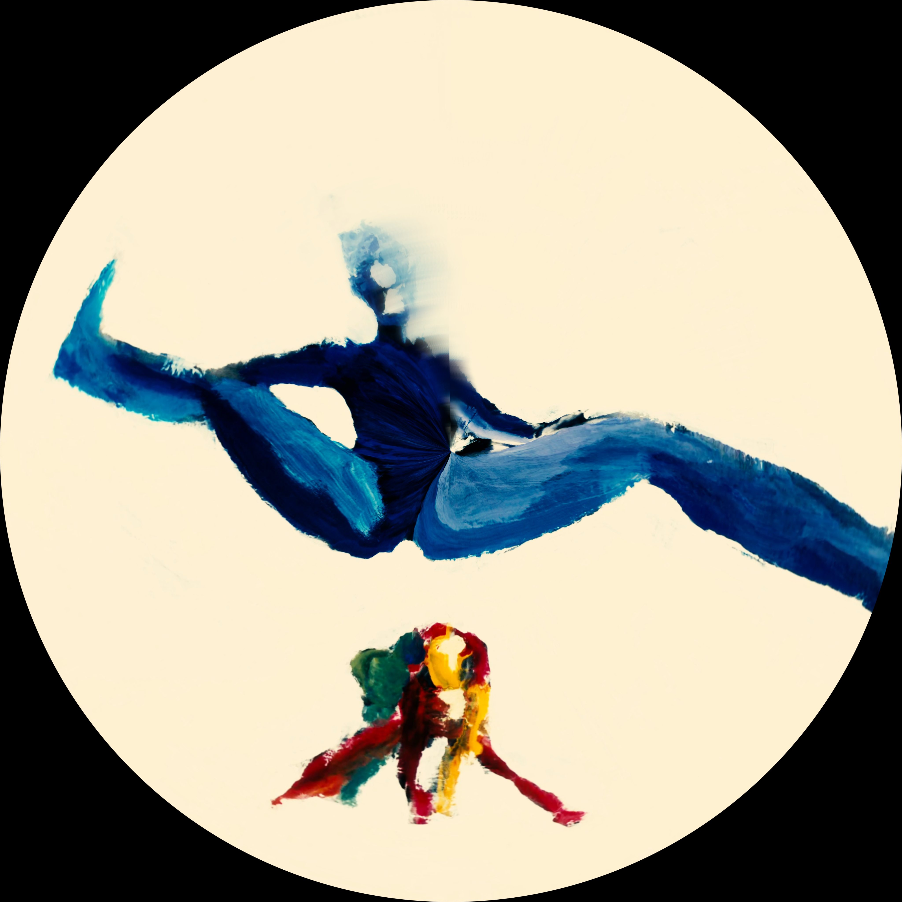 | 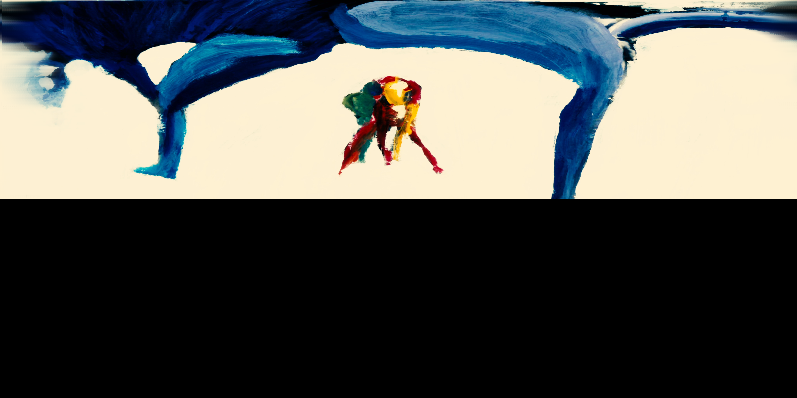 |
| Domemaster of *3gracias*: what goes to the projector | The equirectangular canvas the VR room receives |
| 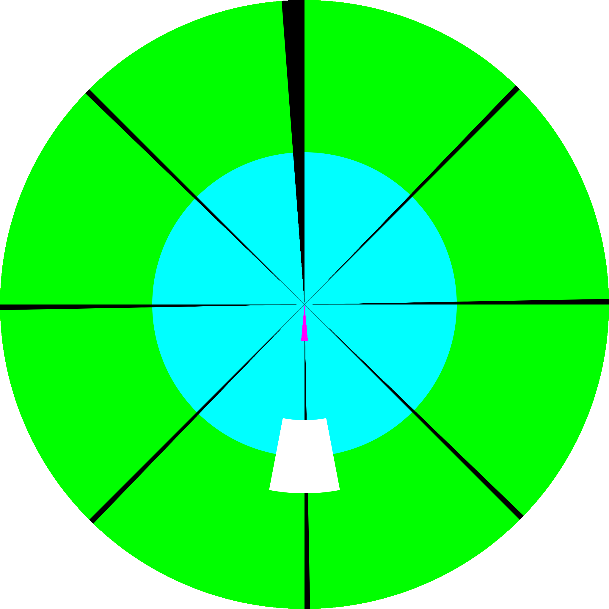 | 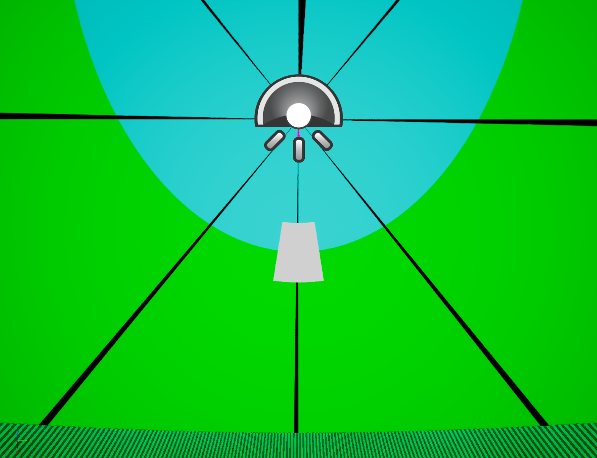 |
| The test pattern used to measure everything | The same pattern on the virtual dome |

</details>

## What it does

- **TouchDesigner** takes **360, 180 (domemaster or VR180) or flat 16:9** video and turns it into a dome signal: a
  fisheye domemaster for the projector and an equirectangular canvas for the virtual room.
- **Unreal Engine 5.8** receives that signal through **Spout** and projects it in a **virtual-reality planetarium
  room**, so you can watch the content from a seat, with a headset or on a screen.
- **A Windows executable that does not need TouchDesigner** plays the videos of a list straight onto the dome, with
  an on-screen menu, a player that walks or flies, 16:9 screen layouts editable live, UDP control and GPU video
  decoding.
- **Three room models** (180 horizontal, 45 Maloka style with seated audience, 90 standing with railings) and the
  **data sheets of Colombia's domes**, so the process can be repeated for another room by changing data, not code.

Everything is regenerated by script: the room comes out of Blender, the Unreal level from an importer that keeps
your edits, and the TouchDesigner network from a builder. Every claim about orientations and angles was measured
with a test pattern, and the captures are in the repository.

## Architecture

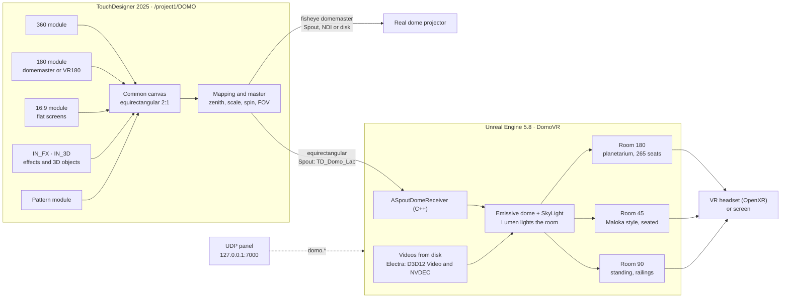
```mermaid
flowchart LR
    subgraph TD["TouchDesigner 2025 · /project1/DOMO"]
        M360["360 module"]
        M180["180 module<br/>domemaster or VR180"]
        M169["16:9 module<br/>flat screens"]
        FX["IN_FX · IN_3D<br/>effects and 3D objects"]
        PAT["Pattern module"]
        EQ["Common canvas<br/>equirectangular 2:1"]
        MAP["Mapping and master<br/>zenith, scale, spin, FOV"]
        M360 --> EQ
        M180 --> EQ
        M169 --> EQ
        FX --> EQ
        PAT --> EQ
        EQ --> MAP
    end
    MAP -->|"fisheye domemaster<br/>Spout, NDI or disk"| PROY["Real dome projector"]
    MAP -->|"equirectangular<br/>Spout: TD_Domo_Lab"| RX["ASpoutDomeReceiver (C++)"]
    subgraph UE["Unreal Engine 5.8 · DomoVR"]
        RX --> DOMO["Emissive dome + SkyLight<br/>Lumen lights the room"]
        VID["Videos from disk<br/>Electra: D3D12 Video and NVDEC"] --> DOMO
        DOMO --> S180["Room 180<br/>planetarium, 265 seats"]
        DOMO --> S45["Room 45<br/>Maloka style, seated"]
        DOMO --> S90["Room 90<br/>standing, railings"]
    end
    UDP["UDP panel<br/>127.0.0.1:7000"] -.->|"domo.*"| UE
    S180 --> VR["VR headset (OpenXR)<br/>or screen"]
    S45 --> VR
    S90 --> VR
```

## Quick start

**Requirements:** Windows 10 or 11, a DirectX 12 graphics card, TouchDesigner 2025 (the Non-Commercial license is
enough), Unreal Engine 5.8 with Visual Studio (the project builds a C++ module) and Blender 5.2 only if you want to
regenerate the room.

<details open>
<summary><b>A. With TouchDesigner: the live signal</b></summary>

1. Open `00_TouchDesigner/domo_lab.toe`. In `/project1/DOMO`, page *Domo*, leave `Fuente` (source) on the test
   pattern to calibrate, or pick a module (360, 180, 16:9, `IN_FX` or `IN_3D`) and set its file on its page. Only the
   audio of the video that is on air is heard.
2. Open the room with `03_Unreal/abrir_proyecto.ps1`. In the editor, the levels show whatever arrives through Spout
   under the name `TD_Domo_Lab`. If the dome stays black, go through the checklist in
   [03_Puente_Spout.md](04_Docs/03_Puente_Spout.md).
3. For VR, OpenXR is enabled: with SteamVR or Virtual Desktop running, *Play → VR Preview*.

</details>

<details>
<summary><b>B. Without TouchDesigner: the standalone player</b></summary>

1. Close the editor and run `03_Unreal/empaquetar.ps1`. It leaves the program at `03_Unreal/Build/Windows/DomoVR.exe`.
2. Put your videos and the list (`playlist.json`) in `Content/Movies/`, next to the executable.
3. Open `DomoVR.exe` and press **F2** for the menu. **F3** switches between the Spout signal and the videos.
4. H.264 and HEVC videos up to 4096 × 4096 are decoded on the GPU. See
   [06_Unreal_standalone.md](04_Docs/06_Unreal_standalone.md) (Spanish).

</details>

<details>
<summary><b>C. Another room, or regenerating the model</b></summary>

```powershell
# Blender, headless (room 180 bakes textures: about 10 minutes; 45 and 90, about 20 seconds)
blender.exe -b -P 01_Blender\generar_sala_domo.py
blender.exe -b -P 01_Blender\generar_sala_domo.py -- --fov 45
blender.exe -b -P 01_Blender\generar_sala_domo.py -- --fov 90
```

Then the importer updates the Unreal level **without deleting your edits** (`03_Unreal/importar_sala.ps1`).
Details in [05_Modelos_de_sala.md](04_Docs/05_Modelos_de_sala.md) (Spanish).

</details>

## The standalone player (no TouchDesigner)

`DomoVR.exe` is the room packaged as a stand-alone program. It carries everything needed to rehearse a show on a
single machine.

<table>
<tr>
<td width="58%" valign="top">

| Feature | How it works |
|---|---|
| **On-screen menu** | F2 or M: source, videos, format, lights, viewpoints, quality and room |
| **Playlist** | `playlist.json` with cues; format 360, domemaster, VR180 or 16:9 |
| **16:9 layouts** | 21 templates (crown, 2- and 4-screen rooms, ring, cylinder, tunnel…) editable live |
| **Blurred background** | three modes behind the screens: none, wash and wrap-around |
| **Player** | walks, flies or goes through walls; remappable keys (`controles.json`) |
| **UDP control** | `127.0.0.1:7000`, `domo.*` lines from TouchDesigner, Resolume, QLab or a script |
| **Render profiles** | automatic, VR headset, monitor, projector or dome, and light |
| **Saved settings** | `ajustes.json` remembers profile, walls, floor, veil, lights and decoder |
| **GPU video** | Electra with D3D12 Video and NVDEC; staged fallback all the way to the CPU |
| **Optimize video** | lightweight H.264 copy with ffmpeg (NVENC, AMF or Quick Sync depending on the card) |

</td>
<td width="42%" valign="top">

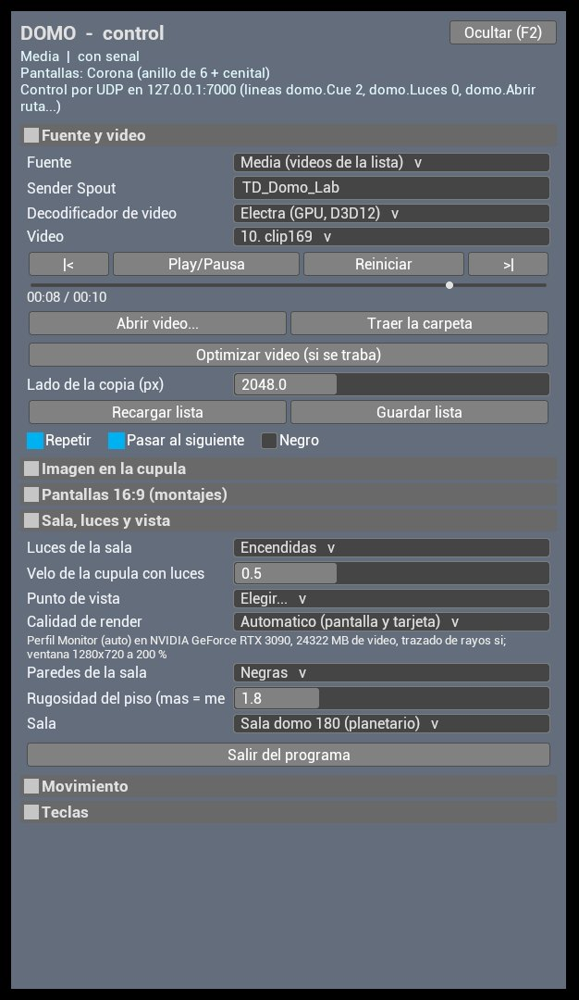
<sub>The menu (F2): render quality, walls, floor, decoder and layouts.</sub>

</td>
</tr>
</table>

### 16:9 layouts

A flat video is split into screens that surround the audience. The templates are the same in TouchDesigner and in
Unreal: they come from `00_TouchDesigner/video_dome/plantillas_ue.json`, and `03_Unreal/generar_plantillas.py`
carries them into the player, so the numbers never drift apart.

<div align="center">

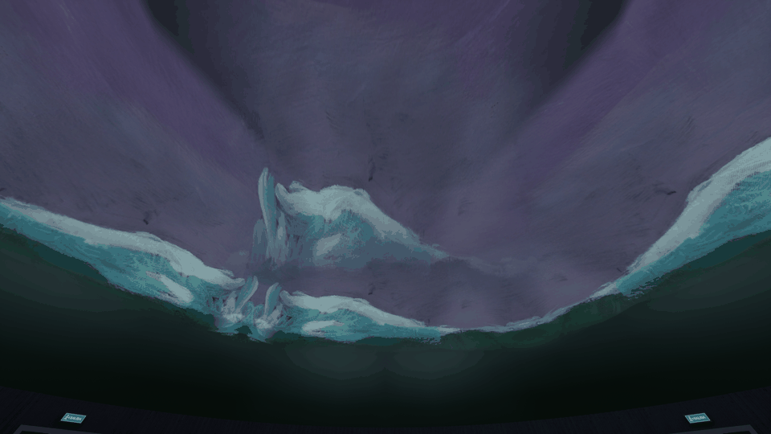

<sub>Six of the 21 templates, seen from the room: crown, four-screen room, ring, cylinder, tunnel and cinema.</sub>

</div>

<details>
<summary><b>Most used console and UDP commands</b></summary>

| Command | What it does |
|---|---|
| `domo.Abrir FullPath` | adds the video to the list and puts it on the dome |
| `domo.Cue N`, `domo.Siguiente`, `domo.Anterior` | changes cue |
| `domo.Plantilla id` | 16:9 layout (`cine`, `sala_2`, `sala_4`, `sala_corona`, `tunel`, `anillo`, `cilindro`…) |
| `domo.Param Name Value` | any parameter: Yaw, Pitch, Horizonte, Brillo, `S_Fondo_Desenfoque`… |
| `domo.Perfil auto\|vr\|monitor\|proyector\|ligero` | render profile |
| `domo.Paredes 0\|1` | black walls or the original wood |
| `domo.Reproductor auto\|electra\|protron\|wmf` | video decoder |
| `domo.Luces 0\|1\|auto` | room lights; `auto` makes them follow the signal |
| `domo.Optimizar` | lightweight H.264 copy of the current video |
| `domo.Guardar` | writes the list and the settings |

The full list is in [06_Unreal_standalone.md](04_Docs/06_Unreal_standalone.md) (Spanish). Command names are Spanish.

</details>

## TouchDesigner

The signal system lives in `/project1/DOMO`. Every input module delivers the same equirectangular canvas; from it
come the domemaster for the projector and the equirectangular for the virtual room.

| Module | Purpose |
|---|---|
| **360, 180 and 16:9** | video of each format; the 16:9 module ships the screen templates and 34 ranged values to tune them |
| **IN_FX** | eight audio-reactive GLSL effects |
| **IN_3D** | animated 3D objects with an orbiting camera, no model import needed (there is a slot for your own) |
| **Master** | brightness, contrast, gamma and black for the whole output |
| **UDP panel** | sends `domo.*` commands to the Unreal player |
| **Pattern** | canvas of bands and marks to check orientations |

<details>
<summary><b>IN_FX and IN_3D images</b></summary>

| | |
|---|---|
| 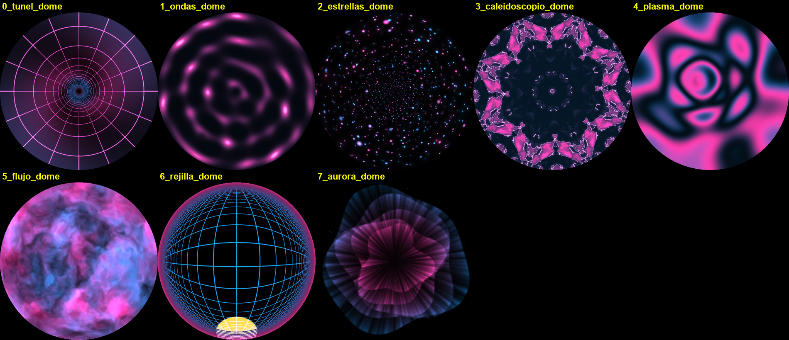 | 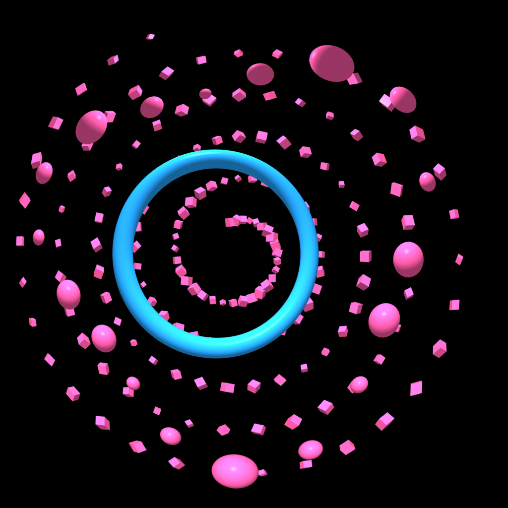 |
| Audio-reactive effects | Animated 3D objects |

</details>

## The abyss: Unreal as the source (experimental)

> **Experimental.** This is a proof of concept, not a stable part of the simulator. The seabed is simple (procedural meshes, no caustics), the scene is meant to leave through the dome rather than be edited in Unreal, and it is still being developed separately. Use it only to try the Unreal → NDI → TouchDesigner path.

The reverse direction: instead of receiving video, Unreal **generates the dome** and sends it over **NDI**. A real-time scene
(a deep seabed with particles and glow, creatures that cross today's Colombia with the Cretaceous sea of Villa de Leyva, and
plastic waste they talk to) is rendered as a domemaster by a camera that travels through the space. Measured: 2048 × 2048 at a
steady 30 fps over NDI on the RTX 3090, in the editor and in the packaged player. TouchDesigner receives it with the `IN_UE` module (off by default).

<div align="center">

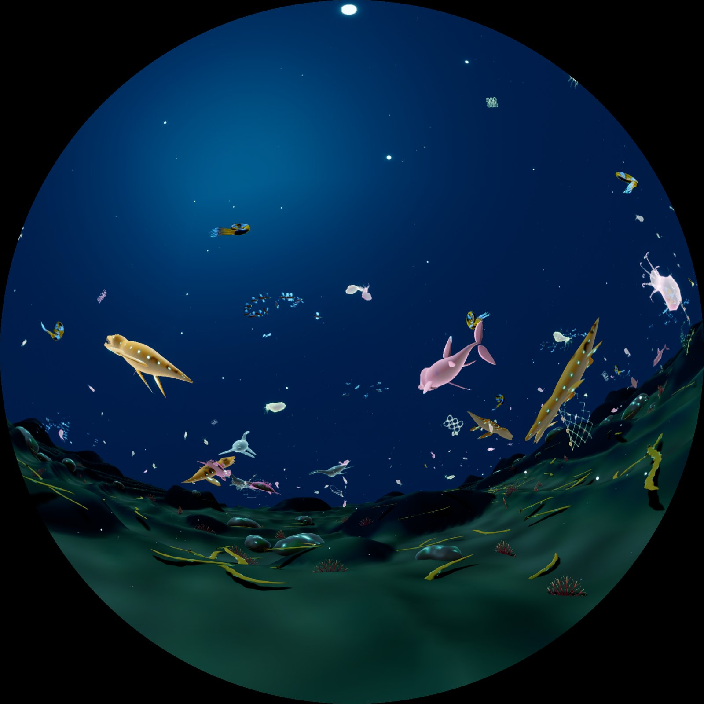
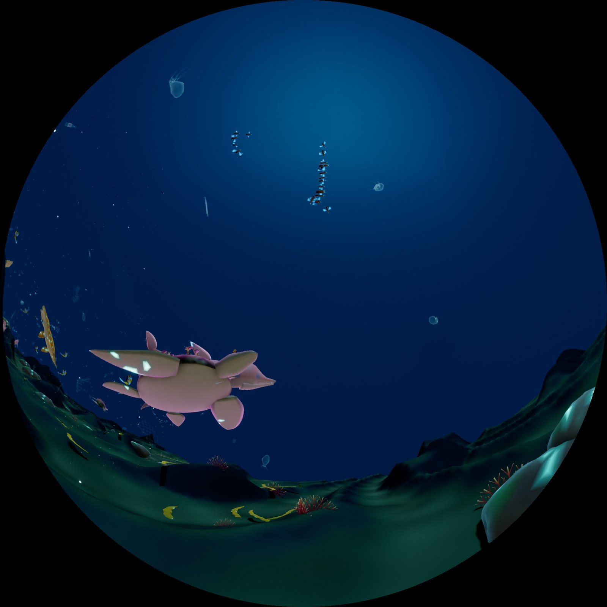

<sub>The domemaster that leaves Unreal over NDI: the dialogue with the waste, and a turtle crossing in front of the camera.</sub>

</div>

Details, parameters and pitfalls in [09_Abismo_Unreal_a_NDI.md](04_Docs/09_Abismo_Unreal_a_NDI.md) (Spanish); the creatures in
[08_Criaturas_abismo.md](04_Docs/08_Criaturas_abismo.md) (Spanish).

## Graphics cards

The player uses DirectX 12 and does not depend on the vendor. **It has only been tested on NVIDIA**; for AMD and
Intel the decisions and a verification plan are written down, and what is still pending stays in plain sight.

| Topic | NVIDIA | AMD | Intel |
|---|---|---|---|
| Rendering (Lumen, Nanite, TSR) | ✅ verified (RTX 3090) | 🟡 expected | 🟡 expected |
| H.264 and HEVC on the GPU | ✅ NVDEC and D3D12 Video | 🟡 D3D12 Video and Media Foundation | 🟡 D3D12 Video and Media Foundation |
| Optimize video (ffmpeg) | ✅ `h264_nvenc` | 🟡 `h264_amf` | 🟡 `h264_qsv` |
| Automatic render profile | ✅ | 🟡 detects the vendor | 🟡 detects the vendor |

✅ verified on the card · 🟡 implemented or decided, not yet verified on that card. If you own an AMD or Intel card,
you can help by following the *Sin verificar* (unverified) section of
[07_GPUs_AMD_e_Intel.md](04_Docs/07_GPUs_AMD_e_Intel.md) (Spanish).

## What was measured and is worth knowing

- The common canvas is equirectangular 2:1: `u` 0.5 is the front, `v` 0.5 the horizon, `v` 1 the zenith. Unreal's
  dome reads only the upper half, and the front lies at +X, opposite the control area.
- In the Projection TOP, azimuth spin is not done with the rotations: it is a horizontal shift of the canvas. Tilt
  goes as `rx = 90 − Pitch`.
- The seam of a 360 video is a pole-to-pole meridian: spinning in azimuth only moves it and it always climbs to the
  zenith. To get it out of the dome the sphere itself has to be rotated (page *360*: `Rpitch` 90, or `Rroll` 90 with
  `Rpitch` 30).
- Unreal's Spout receiver only reads 8-bit textures. With 16-bit float it keeps the last frame it could read and does
  not warn you.
- Unreal in the background throttles the editor; to see the live signal it has to be in front.
- In the engine, Electra's D3D12 Video decoder is switched off on Windows; the controller turns it on at start-up. On
  NVIDIA, NVDEC decodes, and it has priority.
- From TouchDesigner you move the zenith, scale, rotate and choose how many degrees of content fit on the dome (230
  on a 180 dome, verified with the pattern), without touching Unreal.

The full list, with dates, is in section 5 of [01_Proceso_y_matematica.md](04_Docs/01_Proceso_y_matematica.md).

## The process in four steps

1. **Real room → model.** `01_Blender/generar_sala_domo.py` builds the room (a 23 m dome like the Bogotá
   Planetarium's, 265 reclined seats in 4 groups separated by 4 aisles that end at the 4 emergency exits, a 3 m
   stage, a closed control booth behind the rear group and lights high on the wall) and exports FBX files and a JSON
   manifest to `02_Export/`.
2. **Model → Unreal.** `03_Unreal/importar_sala.py` builds the `DomoVR` level: PBR materials with script-generated
   textures, Nanite, Lumen with hardware ray tracing, TSR, and an emissive dome marked as sky plus a real-time
   SkyLight so the dome lights the room. Running it again **updates the level without deleting your edits**.
3. **TouchDesigner → Spout.** `00_TouchDesigner/build_domo.py` builds `/project1/DOMO` and delivers the domemaster
   with the room's FOV (180, 90, 45) over Spout, NDI or to disk, and the equirectangular the VR room expects (sender
   `TD_Domo_Lab`).
4. **Verification with a pattern.** The `patron` module sends a canvas of bands and marks; with it we checked where
   every part of the canvas lands on the virtual dome. Captures are in `05_Preview/pruebas/`.

## Roadmap

What already works is in the [CHANGELOG](CHANGELOG.md). This is what comes next; **nothing is promised for a date**.

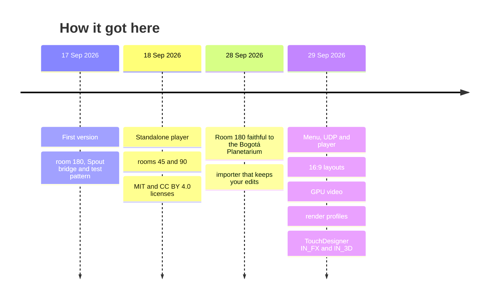
```mermaid
timeline
    title How it got here
    17 Sep 2026 : First version : room 180, Spout bridge and test pattern
    18 Sep 2026 : Standalone player : rooms 45 and 90 : MIT and CC BY 4.0 licenses
    28 Sep 2026 : Room 180 faithful to the Bogotá Planetarium : importer that keeps your edits
    29 Sep 2026 : Menu, UDP and player : 16:9 layouts : GPU video : render profiles : TouchDesigner IN_FX and IN_3D
```

| Now | Next | Later |
|---|---|---|
| **Close the live chain** | **More show control** | **More reach** |
| Receive the abyss inside TouchDesigner (an `IN_UE` module) and give `VIDEO_DOME` a Spout In again without errors | Abyss audio over NDI and UDP control | The abyss as the dome texture of the virtual room |
| Test TouchDesigner's UDP panel against the running player | Cross-fade between cues and a second player to mix two videos | More Colombian rooms, measured on site |
| Port the screen-shader fixes to `estudio_pantallas.html` | Remote Control in the build (`-RCWebControlEnable`) as a second way to control it | A room built from a `domos_colombia.json` entry, without editing code |
| Test the player in a headset (SteamVR, Virtual Desktop) | Feathered 360 seam inside the dome material | HAP codec for when disk is cheaper than GPU |
| Verify video and rendering on AMD and Intel | Dome texture in 16 bits or HDR (8 bits today, same as Spout) | A downloadable package (a *release*) with the build and test videos |
| Measure frames per second with Unreal and TouchDesigner open together | Plug your own 3D model into `IN_3D` | Documentation translated into English and Portuguese (only this README is today) |

**Done in September 2026**

- [x] Room 180 faithful to the Bogotá Planetarium, rooms 45 and 90, importer that keeps your edits.
- [x] Player without TouchDesigner: menu, playlist, UDP control, walking player and remappable keys.
- [x] 16:9 layouts (21 templates) editable live, with a blurred background and per-screen brightness.
- [x] GPU video decoding on DirectX 12 with CPU fallback.
- [x] Black walls, a less reflective floor, render profiles and saved settings.
- [x] TouchDesigner: fixed layouts, `IN_FX`, `IN_3D`, master and UDP panel.
- [x] AMD and Intel research.
- [x] **The abyss:** Unreal generates a real-time dome and sends it over NDI (scene, creatures and a dialogue with the waste).
- [x] README in Spanish, English and Portuguese.

Proposals are opened as an *issue* or a *pull request*; see [Contributing](#contributing).

## Documentation

| I want to… | Open |
|---|---|
| understand the whole process and the maths | [01_Proceso_y_matematica.md](04_Docs/01_Proceso_y_matematica.md) |
| send a video to the dome from TouchDesigner | [04_Senal_TouchDesigner.md](04_Docs/04_Senal_TouchDesigner.md) |
| open or regenerate the room in Unreal | [02_Sala_Unreal.md](04_Docs/02_Sala_Unreal.md) |
| connect TouchDesigner to Unreal (Spout) | [03_Puente_Spout.md](04_Docs/03_Puente_Spout.md) |
| use the player without TouchDesigner and package it | [06_Unreal_standalone.md](04_Docs/06_Unreal_standalone.md) |
| use it with an AMD or Intel card | [07_GPUs_AMD_e_Intel.md](04_Docs/07_GPUs_AMD_e_Intel.md) |
| have Unreal generate the dome and send it over NDI (the abyss) | [09_Abismo_Unreal_a_NDI.md](04_Docs/09_Abismo_Unreal_a_NDI.md) |
| the creatures and plastic waste of the abyss | [08_Criaturas_abismo.md](04_Docs/08_Criaturas_abismo.md) |
| the other room models (45 and 90) | [05_Modelos_de_sala.md](04_Docs/05_Modelos_de_sala.md) |
| Colombia's domes and how to fix their data | [06_Modelos/Domos_de_Colombia.md](06_Modelos/Domos_de_Colombia.md) |
| try screen layouts in the browser | [estudio_pantallas.html](00_TouchDesigner/video_dome/web/estudio_pantallas.html) |
| what changed and when | [CHANGELOG.md](CHANGELOG.md) |
| the full log of how the room was built | [Unreal_sala_domo.md](04_Docs/Unreal_sala_domo.md) |

All the documentation is also a single searchable page at `docs/index.html`; regenerate it with
`python 04_Docs/build_docs.py`. The documents are in Spanish; this README is also available in
[Spanish](README.md) and [Portuguese](README.pt-BR.md).

## What is inside

```
00_TouchDesigner/       the signal system
  build_domo.py           builder of /project1/DOMO (idempotent, keeps the configuration)
  domo_lab.toe, DOMO.tox  the saved result; open and use
  modulos/                IN_FX, IN_3D, master and UDP panel
  shaders/                360 seam, spherical spin, test pattern, flat screen, effects
  video_dome/             the screen system for flat video (crown, rooms, rings, cylinder)
    web/estudio_pantallas.html   WebGL studio to move screens with the mouse
01_Blender/             generar_sala_domo.py and the .blend files
02_Export/              FBX files and JSON manifests of the three rooms
03_Unreal/              DomoVR (UE 5.8 project), importar_sala.py, conectar_spout.py, empaquetar.ps1,
                          crear_media_domo.py (dome material), generar_plantillas.py
04_Docs/                the documentation, numbered in reading order
05_Preview/             renders, Unreal captures and the pattern tests
06_Modelos/             domos_colombia.json and its document
CHANGELOG.md            change log
```

## Contributing

- **Fix or add a Colombian room:** edit `06_Modelos/domos_colombia.json`, one pull request per room, giving the
  source of each figure or saying it was measured on site.
- **Test on an AMD or Intel card:** follow the *Sin verificar* section of
  [07_GPUs_AMD_e_Intel.md](04_Docs/07_GPUs_AMD_e_Intel.md) and open an *issue* with the result.
- **A new room model:** see [05_Modelos_de_sala.md](04_Docs/05_Modelos_de_sala.md).
- **A new input module in TouchDesigner:** see section 9 of
  [04_Senal_TouchDesigner.md](04_Docs/04_Senal_TouchDesigner.md).
- **Translate the documentation:** the documents in `04_Docs/` are Spanish only.
- If you change a claim about angles or orientations, back it with the pattern capture that proves it in
  `05_Preview/pruebas/`.

By contributing you agree that your work is published under the same licenses as the repo (MIT for code, CC BY 4.0
for content).

## Credits

- Room, scripts, documentation and renders: [David Vega](https://davidvega.org)
  ([@Danvegamo](https://github.com/Danvegamo)), 2026.
- *3gracias*: a video by David Vega, hand-painted frame by frame.
- Screen system for flat video: it comes from the screen system of an earlier project by the author, tested then with
  a flat test video.
- Spout plugin for Unreal: [kessoning/Spout-UE5](https://github.com/kessoning/Spout-UE5), branch `5.8_fix`; its
  README declares the MIT license.
- The reference notes cite Paul Bourke and the *Fulldome 101* material; see section 4 of the process document.

## License

| What | License |
|---|---|
| Code (Python scripts, shaders, C++, TouchDesigner networks, HTML) | [MIT](LICENSE) |
| Documentation, images, renders, captures and 3D models | [CC BY 4.0](LICENSE-CONTENT) |
| The video *3gracias* and its frames | All rights reserved; see [LICENSE-CONTENT](LICENSE-CONTENT) |
| Plugin `03_Unreal/DomoVR/Plugins/SpoutPlugin` | MIT by its author ([kessoning/Spout-UE5](https://github.com/kessoning/Spout-UE5)) |

Both licenses ask for credit. For content, the attribution is:

> domo-lab by David Vega (davidvega.org), CC BY 4.0

## How to cite

GitHub shows the *Cite this repository* button from [CITATION.cff](CITATION.cff). As text:

> Vega, D. (2026). *domo-lab: open dome laboratory with TouchDesigner and Unreal Engine* [Software].
> https://github.com/Danvegamo/domo-lab

```bibtex
@software{vega_domo_lab_2026,
  author = {Vega, David},
  title  = {domo-lab: laboratorio abierto de domo con TouchDesigner y Unreal Engine},
  year   = {2026},
  url    = {https://github.com/Danvegamo/domo-lab}
}
```
