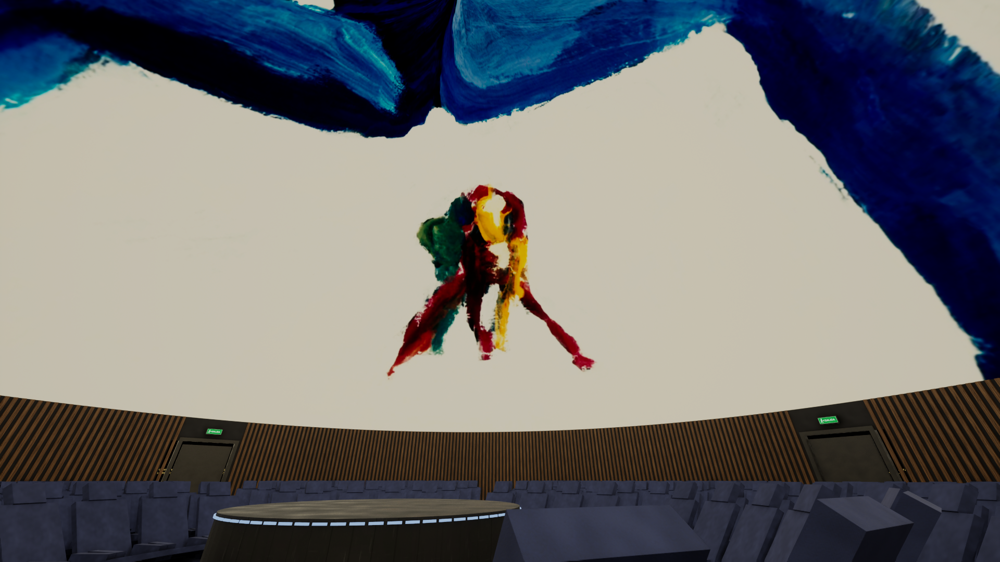
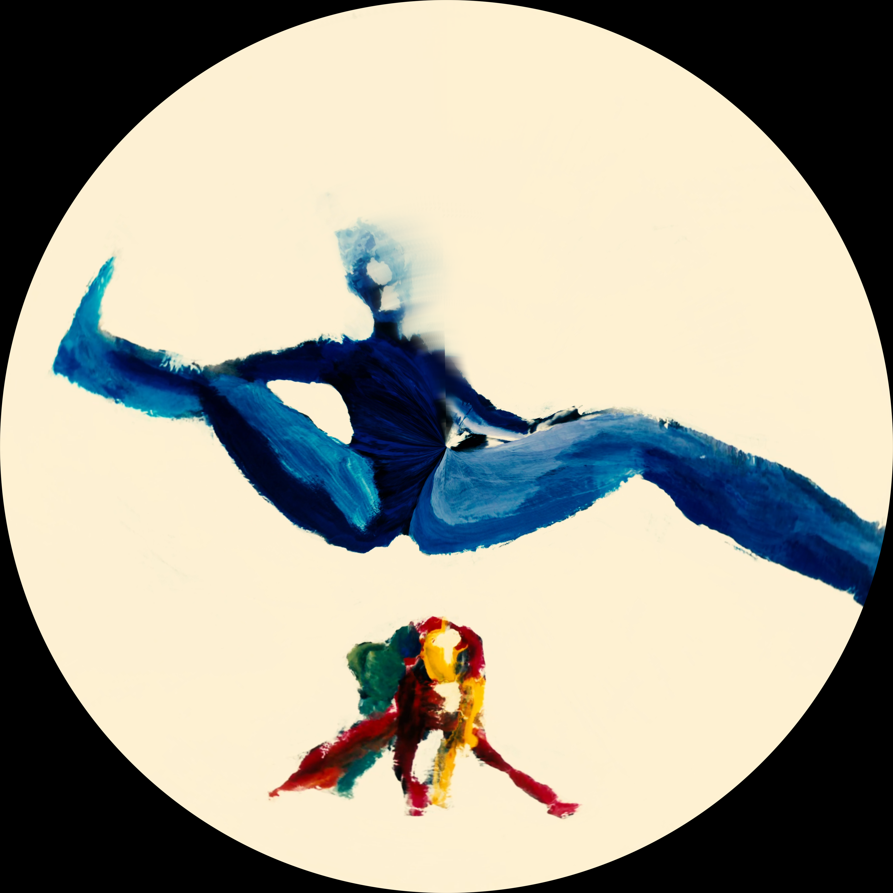
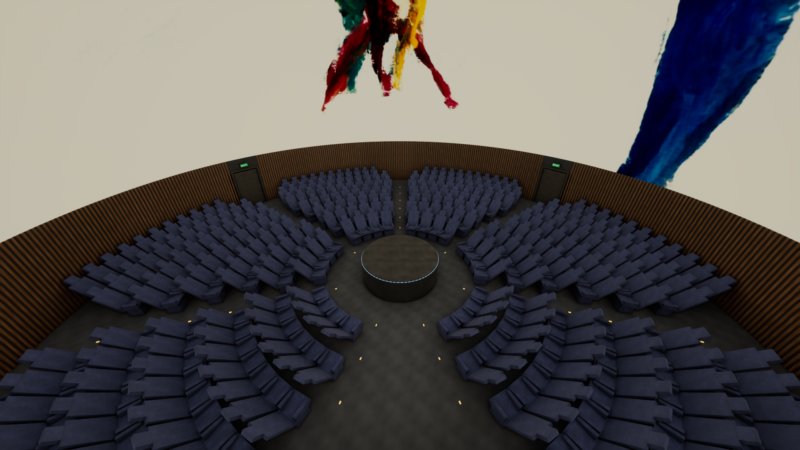
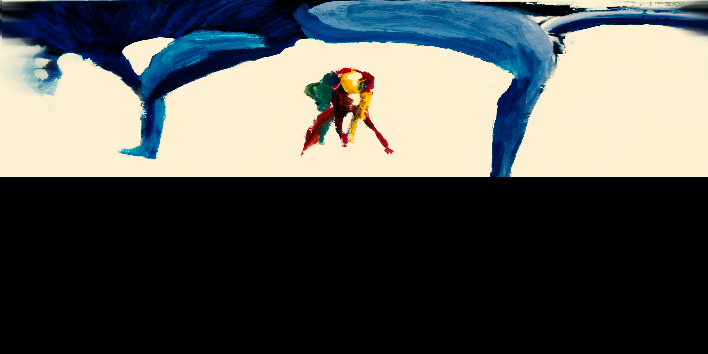
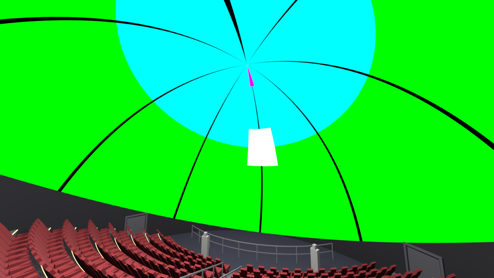
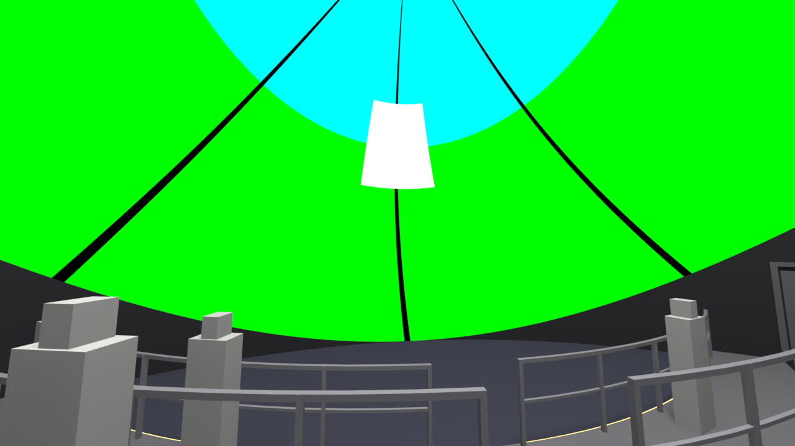
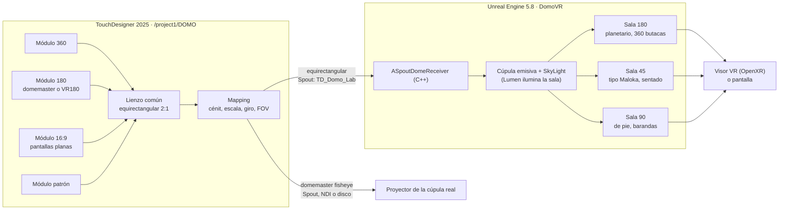

# domo-lab

Probar un video de domo desde la butaca, en realidad virtual, antes de pisar la cúpula.

[](LICENSE)
[](LICENSE-CONTENT)
[](https://www.unrealengine.com/)
[](https://derivative.ca/)
[](https://www.blender.org/)



*3gracias, de David Vega: pintura a mano fotograma a fotograma, montada en un
formato nuevo para domo y vista aquí dentro de la sala VR.*

## Qué hace

- **TouchDesigner** toma video **360, 180 (domemaster o VR180) o plano 16:9**
  y lo convierte en la señal de una cúpula: un domemaster fisheye para el
  proyector y un equirectangular para la sala virtual.
- **Unreal Engine 5.8** recibe esa señal por **Spout** y la proyecta en una
  **sala de planetario en realidad virtual**, para ver el contenido desde una
  butaca, con visor o en pantalla.
- **Tres modelos de sala** (180 horizontal, 45 tipo Maloka con público
  sentado, 90 de pie con barandas) y las **fichas de los domos de Colombia**,
  para repetir el proceso con otra sala cambiando datos y no código.

Todo se regenera por script: la sala sale de Blender, el nivel de Unreal de
un importador idempotente y la red de TouchDesigner de un constructor. Lo que
se afirma sobre orientaciones y ángulos se midió con un patrón de prueba, y
las capturas están en el repo.

## Galería

| | |
|---|---|
|  |  |
| Domemaster de *3gracias*: lo que sale hacia el proyector | La sala completa con *3gracias* en la cúpula |
|  |  |
| El lienzo equirectangular que recibe la sala VR | El patrón de prueba con el que se midió todo |
|  |  |
| Sala de 45 grados, tipo Maloka, público sentado | Sala de 90 grados, público de pie con barandas |

## Arquitectura



## Inicio rápido

Requisitos: Windows, TouchDesigner 2025 (la licencia Non-Commercial alcanza),
Unreal Engine 5.8 con Visual Studio (el proyecto compila un módulo en C++ para
Spout), Blender 4 solo si se quiere regenerar la sala.

1. Abre `00_TouchDesigner/domo_lab.toe`. En `/project1/DOMO`, página *Domo*,
   deja `Fuente` en *Patrón de prueba* para calibrar, o elige un módulo y pon
   el archivo en su página de la raíz: *360*, *180* o *16:9*. Solo suena el
   audio del video que está al aire.
2. Abre la sala con `03_Unreal/abrir_proyecto.ps1`. La cúpula muestra lo que
   llegue por Spout con el nombre `TD_Domo_Lab`. Si la cúpula se queda negra,
   revisa la lista de comprobación de [03_Puente_Spout.md](04_Docs/03_Puente_Spout.md).
3. Para VR: OpenXR está habilitado; con SteamVR o Virtual Desktop corriendo,
   *Play → VR Preview*.

### Por dónde seguir

| Quiero… | Abre |
|---|---|
| entender el proceso completo y la matemática | [04_Docs/01_Proceso_y_matematica.md](04_Docs/01_Proceso_y_matematica.md) |
| mandar un video a la cúpula desde TouchDesigner | [04_Docs/04_Senal_TouchDesigner.md](04_Docs/04_Senal_TouchDesigner.md) |
| abrir o regenerar la sala en Unreal | [04_Docs/02_Sala_Unreal.md](04_Docs/02_Sala_Unreal.md) |
| conectar TouchDesigner con Unreal (Spout) | [04_Docs/03_Puente_Spout.md](04_Docs/03_Puente_Spout.md) |
| los otros modelos de sala (45 tipo Maloka, sentado; 90 de pie con barandas) | [04_Docs/05_Modelos_de_sala.md](04_Docs/05_Modelos_de_sala.md) |
| las cúpulas de Colombia y cómo corregir sus datos | [06_Modelos/Domos_de_Colombia.md](06_Modelos/Domos_de_Colombia.md) |
| probar montajes de pantallas en el navegador, sin TouchDesigner | [00_TouchDesigner/video_dome/web/estudio_pantallas.html](00_TouchDesigner/video_dome/web/estudio_pantallas.html) |
| la bitácora completa de cómo se construyó la sala (larga, cronológica) | [04_Docs/Unreal_sala_domo.md](04_Docs/Unreal_sala_domo.md) |

Toda la documentación está también como una sola página con buscador en
`docs/index.html` (lista para GitHub Pages); se regenera con
`python 04_Docs/build_docs.py`.

## El proceso en cuatro pasos

1. **Sala real → modelo.** `01_Blender/generar_sala_domo.py` construye la sala
   (cúpula de 23 m como la del Planetario de Bogotá, 360 butacas reclinadas en
   6 sectores, tarima central, zona de control de 7 m, 4 puertas, paredes con
   listones de madera) y exporta el FBX de `02_Export/`.
2. **Modelo → Unreal.** `03_Unreal/importar_sala.py` arma el nivel `DomoVR`:
   materiales, post proceso y una cúpula emisiva marcada como cielo más un
   SkyLight en tiempo real, para que Lumen deje que la cúpula ilumine la sala.
   `conectar_spout.py` pone el receptor Spout (`ASpoutDomeReceiver`, en C++).
3. **TouchDesigner → Spout.** `00_TouchDesigner/build_domo.py` construye
   `/project1/DOMO`: cada módulo de entrada entrega el mismo lienzo
   equirectangular; de ahí sale el domemaster fisheye con el FOV del modelo de
   sala (180, 90, 45) por Spout, NDI o a disco, y la versión equirectangular
   que espera la sala VR (sender `TD_Domo_Lab`).
4. **Verificación con patrón.** El módulo `patron` manda un lienzo de bandas y
   marcas; con él se comprobó dónde cae cada parte del lienzo en la cúpula
   virtual. Capturas en `05_Preview/pruebas/`.

## Lo que se midió y conviene saber

- El lienzo común es equirectangular 2:1: u 0.5 es el frente, v 0.5 el
  horizonte, v 1 el cénit. La cúpula de Unreal lee solo la mitad superior y el
  frente cae en +X, el lado opuesto a la zona de control.
- En el Projection TOP, el giro en azimut no se hace con las rotaciones: es un
  corrimiento horizontal del lienzo. La inclinación va como `rx = 90 − Pitch`.
- La costura de un 360 es un meridiano de polo a polo: girar en azimut solo la
  cambia de lugar y siempre sube hasta el cénit. Para sacarla de la cúpula hay
  que girar la esfera (página *360*: `Rpitch` 90, o `Rroll` 90 con `Rpitch` 30),
  medido con el patrón.
- El receptor Spout de Unreal solo lee texturas de 8 bits. Con 16-bit float se
  queda con el último frame que pudo leer y no avisa.
- Unreal en segundo plano frena el editor; para ver la señal en vivo hay que
  tenerlo al frente.
- Desde TouchDesigner se mueve el cénit, se escala, se rota y se elige cuántos
  grados de contenido caben en la cúpula (página *Mapping* de `DOMO`; 230
  grados sobre una cúpula de 180 verificado con el patrón), sin tocar Unreal,
  igual que en el mapping en vivo de un domo real.

La lista completa, con fechas, está en la sección 5 de
[01_Proceso_y_matematica.md](04_Docs/01_Proceso_y_matematica.md).

## Qué hay adentro

```
00_TouchDesigner/       el sistema de señal
  build_domo.py           constructor de /project1/DOMO (idempotente, conserva la configuración)
  domo_lab.toe, DOMO.tox  el resultado guardado; abrir y usar
  shaders/                costura del 360, giro esférico del lienzo, patrón de prueba, pantalla plana
  video_dome/             el sistema de pantallas para video plano (corona, salas, anillos, cilindro)
    web/estudio_pantallas.html   estudio WebGL para mover pantallas con el mouse
01_Blender/             generar_sala_domo.py y el .blend
02_Export/              sala_domo.fbx (y los de los otros modelos de sala)
03_Unreal/              DomoVR (proyecto UE 5.8), importar_sala.py, conectar_spout.py, abrir_proyecto.ps1
04_Docs/                la documentación, numerada en orden de lectura
05_Preview/             renders de Blender, capturas de Unreal y las pruebas del patrón
06_Modelos/             domos_colombia.json y su documento
```

## Contribuir

- **Corregir o agregar una sala de Colombia:** edita
  `06_Modelos/domos_colombia.json`, un pull request por sala, con la fuente de
  cada dato o diciendo que es medida en sitio.
- **Un modelo de sala nuevo:** ver [05_Modelos_de_sala.md](04_Docs/05_Modelos_de_sala.md).
- **Un módulo de entrada nuevo en TouchDesigner:** ver la sección 9 de
  [04_Senal_TouchDesigner.md](04_Docs/04_Senal_TouchDesigner.md).
- Si cambias una afirmación sobre ángulos u orientaciones, acompáñala de la
  captura del patrón que la demuestra en `05_Preview/pruebas/`.

Al contribuir aceptas que tu aporte se publique bajo las mismas licencias del
repo (MIT para código, CC BY 4.0 para contenido).

## Créditos

- Sala, scripts, documentación y renders: [David Vega](https://davidvega.org)
  ([@Danvegamo](https://github.com/Danvegamo)), 2026.
- *3gracias*: video de David Vega, pintado a mano fotograma a fotograma.
- Sistema de pantallas para video plano: viene del sistema de pantallas de un
  proyecto anterior del autor, probado entonces con un video plano de prueba.
- Plugin Spout para Unreal: [kessoning/Spout-UE5](https://github.com/kessoning/Spout-UE5),
  rama `5.8_fix`; su README declara licencia MIT.
- Las notas de referencia citan a Paul Bourke y el material *Fulldome 101*; ver
  la sección 4 del documento del proceso.

## Licencia

| Qué | Licencia |
|---|---|
| Código (scripts de Python, shaders, C++, redes de TouchDesigner, HTML) | [MIT](LICENSE) |
| Documentación, imágenes, renders, capturas y modelos 3D | [CC BY 4.0](LICENSE-CONTENT) |
| Video *3gracias* y sus fotogramas | Todos los derechos reservados; ver [LICENSE-CONTENT](LICENSE-CONTENT) |
| Plugin `03_Unreal/DomoVR/Plugins/SpoutPlugin` | MIT de su autor ([kessoning/Spout-UE5](https://github.com/kessoning/Spout-UE5)) |

Las dos licencias piden crédito. Para el contenido, la atribución es:

> domo-lab por David Vega (davidvega.org), CC BY 4.0

## Cómo citar

GitHub muestra el botón *Cite this repository* a partir de
[CITATION.cff](CITATION.cff). En texto:

> Vega, D. (2026). *domo-lab: laboratorio abierto de domo con TouchDesigner y
> Unreal Engine* [Software]. https://github.com/Danvegamo/domo-lab

```bibtex
@software{vega_domo_lab_2026,
  author = {Vega, David},
  title  = {domo-lab: laboratorio abierto de domo con TouchDesigner y Unreal Engine},
  year   = {2026},
  url    = {https://github.com/Danvegamo/domo-lab}
}
```
