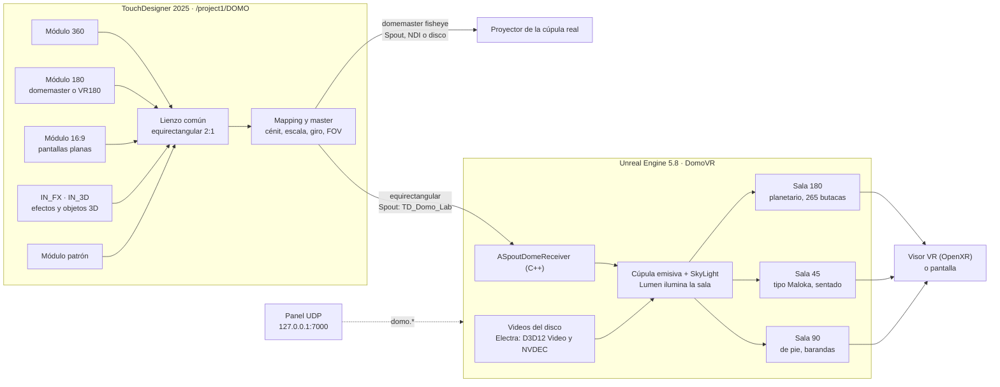
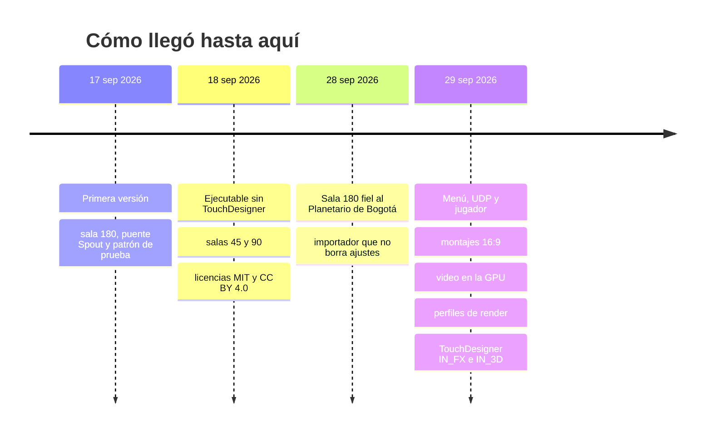

<div align="center">

# domo-lab

**Probar un video de domo desde la butaca, en realidad virtual, antes de pisar la cúpula.**

**Español** · [English](README.en.md) · [Português](README.pt-BR.md)

[](LICENSE)
[](LICENSE-CONTENT)
[](https://www.unrealengine.com/)
[](https://derivative.ca/)
[](https://www.blender.org/)
[](04_Docs/06_Unreal_standalone.md)
[](#inicio-rápido)
[](04_Docs/07_GPUs_AMD_e_Intel.md)

[Novedades](#novedades) · [Galería](#galería) · [Qué hace](#qué-hace) · [Inicio rápido](#inicio-rápido) · [Ejecutable](#el-ejecutable-sin-touchdesigner) · [TouchDesigner](#touchdesigner) · [Tarjetas gráficas](#tarjetas-gráficas) · [Hoja de ruta](#hoja-de-ruta) · [Documentación](#documentación)


*3gracias, de David Vega: pintura a mano fotograma a fotograma, montada en un formato
nuevo para domo y vista desde una butaca de la sala virtual (captura del ejecutable).*

</div>

## Novedades

Lo último que cambió, del más reciente al más antiguo. La bitácora completa está en el [CHANGELOG](CHANGELOG.md).

| Fecha | Qué |
|---|---|
| 29 sep 2026 | **TouchDesigner:** montajes 16:9 corregidos (cilindro, túnel y recorte), efectos `IN_FX`, objetos 3D `IN_3D`, master de imagen y **panel de control de Unreal por UDP**. Las plantillas del ejecutable se generan desde las de TouchDesigner. |
| 29 sep 2026 | **Sala y render:** paredes negras, piso con menos reflejo, **fondo desenfocado** detrás de las pantallas 16:9, **perfiles de render** según la pantalla y la tarjeta, y `ajustes.json` que recuerda todo. |
| 29 sep 2026 | **Video en la GPU:** el ejecutable decodifica con Electra (D3D12 Video y NVDEC) sin salir de DirectX 12. Un video HEVC de 4096 × 4096 pasó de 6,5 a 1,5 núcleos de CPU. |
| 29 sep 2026 | **AMD e Intel:** investigación, decisiones y un plan de verificación en [07_GPUs_AMD_e_Intel.md](04_Docs/07_GPUs_AMD_e_Intel.md). |
| 28 sep 2026 | **Sala 180 rehecha** contra fotos del Planetario de Bogotá: cuatro grupos de butacas, cuatro pasillos a las salidas, cabina de control cerrada. |

## Galería

<table>
<tr>
<td width="50%"><br><sub><b>Sala 180</b>, luces encendidas: 265 butacas, tarima de 3 m y muro negro con luces en lo alto.</sub></td>
<td width="50%"><br><sub><b>Con señal</b>: la cúpula ilumina la sala y las luces se apagan solas.</sub></td>
</tr>
<tr>
<td width="50%"><br><sub><b>Pasillos</b> que terminan en las cuatro salidas de emergencia.</sub></td>
<td width="50%"><br><sub><b>Cabina de control</b>: cerrada, detrás del grupo de butacas de atrás; el operador no ve al público.</sub></td>
</tr>
<tr>
<td width="50%"><br><sub><b>Sala 45</b>, tipo Maloka: público sentado frente a una media esfera inclinada.</sub></td>
<td width="50%"><br><sub><b>Sala 90</b>, de pie con barandas, como en los museos.</sub></td>
</tr>
</table>

<details>
<summary><b>Ver más: la señal de TouchDesigner y el patrón de prueba</b></summary>

| | |
|---|---|
|  |  |
| Domemaster de *3gracias*: lo que sale hacia el proyector | El lienzo equirectangular que recibe la sala VR |
|  |  |
| El patrón de prueba con el que se midió todo | El mismo patrón en la cúpula virtual |

</details>

## Qué hace

- **TouchDesigner** toma video **360, 180 (domemaster o VR180) o plano 16:9** y lo convierte en la señal de una
  cúpula: un domemaster fisheye para el proyector y un equirectangular para la sala virtual.
- **Unreal Engine 5.8** recibe esa señal por **Spout** y la proyecta en una **sala de planetario en realidad
  virtual**, para ver el contenido desde una butaca, con visor o en pantalla.
- **Un ejecutable de Windows sin TouchDesigner** reproduce los videos de una lista directamente en la cúpula, con
  menú en pantalla, jugador que camina o vuela, montajes de pantallas 16:9 editables en vivo, control por UDP y
  decodificación de video en la GPU.
- **Tres modelos de sala** (180 horizontal, 45 tipo Maloka con público sentado, 90 de pie con barandas) y las
  **fichas de los domos de Colombia**, para repetir el proceso con otra sala cambiando datos y no código.

Todo se regenera por script: la sala sale de Blender, el nivel de Unreal de un importador que no borra tus ajustes
y la red de TouchDesigner de un constructor. Lo que se afirma sobre orientaciones y ángulos se midió con un patrón
de prueba, y las capturas están en el repositorio.

## Arquitectura


```mermaid
flowchart LR
    subgraph TD["TouchDesigner 2025 · /project1/DOMO"]
        M360["Módulo 360"]
        M180["Módulo 180<br/>domemaster o VR180"]
        M169["Módulo 16:9<br/>pantallas planas"]
        FX["IN_FX · IN_3D<br/>efectos y objetos 3D"]
        PAT["Módulo patrón"]
        EQ["Lienzo común<br/>equirectangular 2:1"]
        MAP["Mapping y master<br/>cénit, escala, giro, FOV"]
        M360 --> EQ
        M180 --> EQ
        M169 --> EQ
        FX --> EQ
        PAT --> EQ
        EQ --> MAP
    end
    MAP -->|"domemaster fisheye<br/>Spout, NDI o disco"| PROY["Proyector de la cúpula real"]
    MAP -->|"equirectangular<br/>Spout: TD_Domo_Lab"| RX["ASpoutDomeReceiver (C++)"]
    subgraph UE["Unreal Engine 5.8 · DomoVR"]
        RX --> DOMO["Cúpula emisiva + SkyLight<br/>Lumen ilumina la sala"]
        VID["Videos del disco<br/>Electra: D3D12 Video y NVDEC"] --> DOMO
        DOMO --> S180["Sala 180<br/>planetario, 265 butacas"]
        DOMO --> S45["Sala 45<br/>tipo Maloka, sentado"]
        DOMO --> S90["Sala 90<br/>de pie, barandas"]
    end
    UDP["Panel UDP<br/>127.0.0.1:7000"] -.->|"domo.*"| UE
    S180 --> VR["Visor VR (OpenXR)<br/>o pantalla"]
    S45 --> VR
    S90 --> VR
```

## Inicio rápido

**Requisitos:** Windows 10 u 11, tarjeta gráfica con DirectX 12, TouchDesigner 2025 (alcanza la licencia
Non-Commercial), Unreal Engine 5.8 con Visual Studio (el proyecto compila un módulo en C++) y Blender 5.2 solo si
se quiere regenerar la sala.

<details open>
<summary><b>A. Con TouchDesigner: la señal en vivo</b></summary>

1. Abre `00_TouchDesigner/domo_lab.toe`. En `/project1/DOMO`, página *Domo*, deja `Fuente` en *Patrón de prueba*
   para calibrar, o elige un módulo (360, 180, 16:9, `IN_FX` o `IN_3D`) y pon el archivo en su página. Solo
   suena el audio del video que está al aire.
2. Abre la sala con `03_Unreal/abrir_proyecto.ps1`. En el editor, los niveles muestran lo que llegue por Spout con
   el nombre `TD_Domo_Lab`. Si la cúpula se queda negra, revisa la lista de comprobación de
   [03_Puente_Spout.md](04_Docs/03_Puente_Spout.md).
3. Para VR, OpenXR está habilitado: con SteamVR o Virtual Desktop corriendo, *Play → VR Preview*.

</details>

<details>
<summary><b>B. Sin TouchDesigner: el ejecutable</b></summary>

1. Cierra el editor y corre `03_Unreal/empaquetar.ps1`. Deja el programa en `03_Unreal/Build/Windows/DomoVR.exe`.
2. Pon tus videos y la lista (`playlist.json`) en `Content/Movies/`, junto al ejecutable.
3. Abre `DomoVR.exe` y pulsa **F2** para el menú. Con **F3** cambias entre la señal de Spout y los videos.
4. Los videos H.264 y HEVC de hasta 4096 × 4096 se decodifican en la GPU. Ver
   [06_Unreal_standalone.md](04_Docs/06_Unreal_standalone.md).

</details>

<details>
<summary><b>C. Otra sala o regenerar el modelo</b></summary>

```powershell
# Blender, sin interfaz (la sala 180 hornea texturas: unos 10 minutos; 45 y 90, unos 20 segundos)
blender.exe -b -P 01_Blender\generar_sala_domo.py
blender.exe -b -P 01_Blender\generar_sala_domo.py -- --fov 45
blender.exe -b -P 01_Blender\generar_sala_domo.py -- --fov 90
```

Después, el importador actualiza el nivel de Unreal **sin borrar tus ajustes** (`03_Unreal/importar_sala.ps1`).
El detalle está en [05_Modelos_de_sala.md](04_Docs/05_Modelos_de_sala.md).

</details>

## El ejecutable sin TouchDesigner

`DomoVR.exe` es la sala empaquetada como programa suelto. Lleva todo lo necesario para ensayar un show sin salir de
una sola máquina.

<table>
<tr>
<td width="58%" valign="top">

| Función | Cómo se usa |
|---|---|
| **Menú en pantalla** | F2 o M: fuente, videos, formato, luces, puntos de vista, calidad y sala |
| **Playlist** | `playlist.json` con cues; formato 360, domemaster, VR180 o 16:9 |
| **Montajes 16:9** | 21 plantillas (corona, salas de 2 y 4 pantallas, anillo, cilindro, túnel…) editables en vivo |
| **Fondo desenfocado** | tres modos detrás de las pantallas: sin fondo, lavado y envolvente |
| **Jugador** | camina, vuela o atraviesa; teclas remapeables (`controles.json`) |
| **Control por UDP** | `127.0.0.1:7000`, líneas `domo.*` desde TouchDesigner, Resolume, QLab o un script |
| **Perfiles de render** | automático, visor VR, monitor, proyector o domo, y ligero |
| **Ajustes guardados** | `ajustes.json` recuerda perfil, paredes, piso, velo, luces y decodificador |
| **Video en la GPU** | Electra con D3D12 Video y NVDEC; respaldo por etapas hasta la CPU |
| **Optimizar video** | copia H.264 liviana con ffmpeg (NVENC, AMF o Quick Sync según la tarjeta) |

</td>
<td width="42%" valign="top">


<sub>El menú (F2): calidad de render, paredes, piso, decodificador y montajes.</sub>

</td>
</tr>
</table>

### Montajes 16:9

Un video plano se reparte en pantallas que rodean al público. Las plantillas son las mismas en TouchDesigner y en
Unreal: salen de `00_TouchDesigner/video_dome/plantillas_ue.json`, y `03_Unreal/generar_plantillas.py` las lleva
al ejecutable, así que las cifras no se desfasan.

<div align="center">


<sub>Seis de las 21 plantillas, vistas desde la sala: corona, sala de cuatro pantallas, anillo, cilindro, túnel y cine.</sub>

</div>

<details>
<summary><b>Comandos de consola y UDP más usados</b></summary>

| Comando | Qué hace |
|---|---|
| `domo.Abrir RutaCompleta` | agrega el video a la lista y lo pone en la cúpula |
| `domo.Cue N`, `domo.Siguiente`, `domo.Anterior` | cambia de cue |
| `domo.Plantilla id` | montaje 16:9 (`cine`, `sala_2`, `sala_4`, `sala_corona`, `tunel`, `anillo`, `cilindro`…) |
| `domo.Param Nombre Valor` | cualquier parámetro: Yaw, Pitch, Horizonte, Brillo, `S_Fondo_Desenfoque`… |
| `domo.Perfil auto\|vr\|monitor\|proyector\|ligero` | perfil de render |
| `domo.Paredes 0\|1` | paredes negras o con la madera original |
| `domo.Reproductor auto\|electra\|protron\|wmf` | decodificador de video |
| `domo.Luces 0\|1\|auto` | luces de la sala; `auto` las hace seguir a la señal |
| `domo.Optimizar` | copia H.264 liviana del video actual |
| `domo.Guardar` | escribe la lista y los ajustes |

La lista completa está en [06_Unreal_standalone.md](04_Docs/06_Unreal_standalone.md).

</details>

## TouchDesigner

El sistema de señal vive en `/project1/DOMO`. Cada módulo de entrada entrega el mismo lienzo equirectangular; de
ahí salen el domemaster para el proyector y el equirectangular para la sala virtual.

| Módulo | Para qué |
|---|---|
| **360, 180 y 16:9** | video de cada formato; el 16:9 trae las plantillas de pantallas y 34 valores con rango para ajustarlas |
| **IN_FX** | ocho efectos GLSL reactivos al audio |
| **IN_3D** | objetos 3D animados con cámara orbital, sin importar modelos (hay una ranura para uno propio) |
| **Master** | brillo, contraste, gamma y negro de toda la salida |
| **Panel UDP** | manda comandos `domo.*` al ejecutable de Unreal |
| **Patrón** | lienzo de bandas y marcas para verificar orientaciones |

<details>
<summary><b>Efectos e imágenes de IN_FX e IN_3D</b></summary>

| | |
|---|---|
|  |  |
| Efectos reactivos al audio | Objetos 3D animados |

</details>

## Tarjetas gráficas

El ejecutable usa DirectX 12 y no depende del fabricante. **Solo se probó en NVIDIA**; para AMD e Intel están
escritas las decisiones y el plan de verificación, y lo pendiente queda a la vista.

| Tema | NVIDIA | AMD | Intel |
|---|---|---|---|
| Render (Lumen, Nanite, TSR) | ✅ verificado (RTX 3090) | 🟡 previsto | 🟡 previsto |
| Video H.264 y HEVC en la GPU | ✅ NVDEC y D3D12 Video | 🟡 D3D12 Video y Media Foundation | 🟡 D3D12 Video y Media Foundation |
| Optimizar video (ffmpeg) | ✅ `h264_nvenc` | 🟡 `h264_amf` | 🟡 `h264_qsv` |
| Perfil de render automático | ✅ | 🟡 detecta el fabricante | 🟡 detecta el fabricante |

✅ verificado con la tarjeta · 🟡 implementado o decidido, sin verificar en esa tarjeta. Quien tenga una tarjeta
AMD o Intel puede ayudar siguiendo la sección *Sin verificar* de
[07_GPUs_AMD_e_Intel.md](04_Docs/07_GPUs_AMD_e_Intel.md).

## Lo que se midió y conviene saber

- El lienzo común es equirectangular 2:1: `u` 0,5 es el frente, `v` 0,5 el horizonte, `v` 1 el cénit. La cúpula de
  Unreal lee solo la mitad superior y el frente cae en +X, el lado opuesto a la zona de control.
- En el Projection TOP, el giro en azimut no se hace con las rotaciones: es un corrimiento horizontal del lienzo. La
  inclinación va como `rx = 90 − Pitch`.
- La costura de un 360 es un meridiano de polo a polo: girar en azimut solo la cambia de lugar y siempre sube hasta
  el cénit. Para sacarla de la cúpula hay que girar la esfera (página *360*: `Rpitch` 90, o `Rroll` 90 con `Rpitch` 30).
- El receptor Spout de Unreal solo lee texturas de 8 bits. Con 16-bit float se queda con el último frame que pudo
  leer y no avisa.
- Unreal en segundo plano frena el editor; para ver la señal en vivo hay que tenerlo al frente.
- En el motor, el decodificador D3D12 Video de Electra viene apagado en Windows; el controlador lo enciende al
  arrancar. En NVIDIA decodifica NVDEC, que tiene prioridad.
- Desde TouchDesigner se mueve el cénit, se escala, se rota y se elige cuántos grados de contenido caben en la
  cúpula (230 sobre una cúpula de 180 verificado con el patrón), sin tocar Unreal.

La lista completa, con fechas, está en la sección 5 de [01_Proceso_y_matematica.md](04_Docs/01_Proceso_y_matematica.md).

## El proceso en cuatro pasos

1. **Sala real → modelo.** `01_Blender/generar_sala_domo.py` construye la sala (cúpula de 23 m como la del
   Planetario de Bogotá, 265 butacas reclinadas en 4 grupos separados por 4 pasillos que terminan en las 4 salidas
   de emergencia, tarima de 3 m, cabina de control cerrada detrás del grupo de atrás y luces en lo alto del muro) y
   exporta FBX y un manifiesto JSON a `02_Export/`.
2. **Modelo → Unreal.** `03_Unreal/importar_sala.py` arma el nivel `DomoVR`: materiales PBR con texturas
   generadas por script, Nanite, Lumen con trazado de rayos por hardware, TSR, y una cúpula emisiva marcada como
   cielo más un SkyLight en tiempo real, para que la cúpula ilumine la sala. Volver a correrlo **actualiza el nivel
   sin borrar tus ajustes**.
3. **TouchDesigner → Spout.** `00_TouchDesigner/build_domo.py` construye `/project1/DOMO` y entrega el domemaster
   con el FOV de la sala (180, 90, 45) por Spout, NDI o disco, y el equirectangular que espera la sala VR (sender
   `TD_Domo_Lab`).
4. **Verificación con patrón.** El módulo `patron` manda un lienzo de bandas y marcas; con él se comprobó dónde cae
   cada parte del lienzo en la cúpula virtual. Capturas en `05_Preview/pruebas/`.

## Hoja de ruta

Lo que ya funciona está en el [CHANGELOG](CHANGELOG.md). Esto es lo que sigue; **nada está prometido para una fecha**.


```mermaid
timeline
    title Cómo llegó hasta aquí
    17 sep 2026 : Primera versión : sala 180, puente Spout y patrón de prueba
    18 sep 2026 : Ejecutable sin TouchDesigner : salas 45 y 90 : licencias MIT y CC BY 4.0
    28 sep 2026 : Sala 180 fiel al Planetario de Bogotá : importador que no borra ajustes
    29 sep 2026 : Menú, UDP y jugador : montajes 16:9 : video en la GPU : perfiles de render : TouchDesigner IN_FX e IN_3D
```

| Ahora | Después | Más adelante |
|---|---|---|
| **Cerrar la cadena en vivo** | **Más control del show** | **Más alcance** |
| Probar el panel UDP de TouchDesigner contra el ejecutable abierto | Fundido entre cues y un segundo reproductor para mezclar dos videos | Más salas de Colombia, con medidas en sitio |
| Llevar los arreglos del shader de pantallas a `estudio_pantallas.html` | Remote Control en el build (`-RCWebControlEnable`) como segundo camino de control | Una sala armada desde una ficha de `domos_colombia.json`, sin editar código |
| Probar el ejecutable en un visor (SteamVR, Virtual Desktop) | Costura fundida del 360 dentro del material de la cúpula | Códec HAP cuando el disco sea más barato que la GPU |
| Verificar video y render en AMD e Intel | Textura de la cúpula en 16 bits o HDR (hoy 8 bits, igual que Spout) | Un paquete descargable (*release*) con el build y los videos de prueba |
| Medir los cuadros por segundo con Unreal y TouchDesigner abiertos a la vez | Enchufar un modelo 3D propio en `IN_3D` | Documentación traducida a inglés y portugués (hoy solo lo está este README) |

**Hecho en septiembre de 2026**

- [x] Sala 180 fiel al Planetario de Bogotá, salas 45 y 90, importador que no borra ajustes.
- [x] Ejecutable sin TouchDesigner: menú, playlist, control por UDP, jugador y teclas remapeables.
- [x] Montajes 16:9 (21 plantillas) editables en vivo, con fondo desenfocado y brillo por pantalla.
- [x] Decodificación de video en la GPU con DirectX 12 y respaldo a CPU.
- [x] Paredes negras, piso menos reflectante, perfiles de render y ajustes guardados.
- [x] TouchDesigner: montajes corregidos, `IN_FX`, `IN_3D`, master y panel UDP.
- [x] Investigación de AMD e Intel.
- [x] README en español, inglés y portugués.

Las propuestas se abren como *issue* o *pull request*; ver [Contribuir](#contribuir).

## Documentación

| Quiero… | Abre |
|---|---|
| entender el proceso completo y la matemática | [01_Proceso_y_matematica.md](04_Docs/01_Proceso_y_matematica.md) |
| mandar un video a la cúpula desde TouchDesigner | [04_Senal_TouchDesigner.md](04_Docs/04_Senal_TouchDesigner.md) |
| abrir o regenerar la sala en Unreal | [02_Sala_Unreal.md](04_Docs/02_Sala_Unreal.md) |
| conectar TouchDesigner con Unreal (Spout) | [03_Puente_Spout.md](04_Docs/03_Puente_Spout.md) |
| usar el ejecutable sin TouchDesigner y empaquetarlo | [06_Unreal_standalone.md](04_Docs/06_Unreal_standalone.md) |
| usarlo con una tarjeta AMD o Intel | [07_GPUs_AMD_e_Intel.md](04_Docs/07_GPUs_AMD_e_Intel.md) |
| los otros modelos de sala (45 y 90) | [05_Modelos_de_sala.md](04_Docs/05_Modelos_de_sala.md) |
| las cúpulas de Colombia y cómo corregir sus datos | [06_Modelos/Domos_de_Colombia.md](06_Modelos/Domos_de_Colombia.md) |
| probar montajes de pantallas en el navegador | [estudio_pantallas.html](00_TouchDesigner/video_dome/web/estudio_pantallas.html) |
| qué cambió y cuándo | [CHANGELOG.md](CHANGELOG.md) |
| la bitácora completa de cómo se construyó la sala | [Unreal_sala_domo.md](04_Docs/Unreal_sala_domo.md) |

Toda la documentación está también como una sola página con buscador en `docs/index.html`; se regenera con
`python 04_Docs/build_docs.py`. Los documentos están en español; este README existe también en
[inglés](README.en.md) y [portugués](README.pt-BR.md).

## Qué hay adentro

```
00_TouchDesigner/       el sistema de señal
  build_domo.py           constructor de /project1/DOMO (idempotente, conserva la configuración)
  domo_lab.toe, DOMO.tox  el resultado guardado; abrir y usar
  modulos/                IN_FX, IN_3D, master y panel UDP
  shaders/                costura del 360, giro esférico, patrón de prueba, pantalla plana, efectos
  video_dome/             el sistema de pantallas para video plano (corona, salas, anillos, cilindro)
    web/estudio_pantallas.html   estudio WebGL para mover pantallas con el mouse
01_Blender/             generar_sala_domo.py y los .blend
02_Export/              FBX y manifiestos JSON de las tres salas
03_Unreal/              DomoVR (proyecto UE 5.8), importar_sala.py, conectar_spout.py, empaquetar.ps1,
                          crear_media_domo.py (material de la cúpula), generar_plantillas.py
04_Docs/                la documentación, numerada en orden de lectura
05_Preview/             renders, capturas de Unreal y las pruebas del patrón
06_Modelos/             domos_colombia.json y su documento
CHANGELOG.md            bitácora de cambios
```

## Contribuir

- **Corregir o agregar una sala de Colombia:** edita `06_Modelos/domos_colombia.json`, un pull request por sala,
  con la fuente de cada dato o diciendo que es medida en sitio.
- **Probar en una tarjeta AMD o Intel:** sigue la sección *Sin verificar* de
  [07_GPUs_AMD_e_Intel.md](04_Docs/07_GPUs_AMD_e_Intel.md) y abre un *issue* con el resultado.
- **Un modelo de sala nuevo:** ver [05_Modelos_de_sala.md](04_Docs/05_Modelos_de_sala.md).
- **Un módulo de entrada nuevo en TouchDesigner:** ver la sección 9 de
  [04_Senal_TouchDesigner.md](04_Docs/04_Senal_TouchDesigner.md).
- **Traducir la documentación:** los documentos de `04_Docs/` están solo en español.
- Si cambias una afirmación sobre ángulos u orientaciones, acompáñala de la captura del patrón que la demuestra en
  `05_Preview/pruebas/`.

Al contribuir aceptas que tu aporte se publique bajo las mismas licencias del repo (MIT para código, CC BY 4.0 para
contenido).

## Créditos

- Sala, scripts, documentación y renders: [David Vega](https://davidvega.org)
  ([@Danvegamo](https://github.com/Danvegamo)), 2026.
- *3gracias*: video de David Vega, pintado a mano fotograma a fotograma.
- Sistema de pantallas para video plano: viene del sistema de pantallas de un proyecto anterior del autor, probado
  entonces con un video plano de prueba.
- Plugin Spout para Unreal: [kessoning/Spout-UE5](https://github.com/kessoning/Spout-UE5), rama `5.8_fix`; su README
  declara licencia MIT.
- Las notas de referencia citan a Paul Bourke y el material *Fulldome 101*; ver la sección 4 del documento del proceso.

## Licencia

| Qué | Licencia |
|---|---|
| Código (scripts de Python, shaders, C++, redes de TouchDesigner, HTML) | [MIT](LICENSE) |
| Documentación, imágenes, renders, capturas y modelos 3D | [CC BY 4.0](LICENSE-CONTENT) |
| Video *3gracias* y sus fotogramas | Todos los derechos reservados; ver [LICENSE-CONTENT](LICENSE-CONTENT) |
| Plugin `03_Unreal/DomoVR/Plugins/SpoutPlugin` | MIT de su autor ([kessoning/Spout-UE5](https://github.com/kessoning/Spout-UE5)) |

Las dos licencias piden crédito. Para el contenido, la atribución es:

> domo-lab por David Vega (davidvega.org), CC BY 4.0

## Cómo citar

GitHub muestra el botón *Cite this repository* a partir de [CITATION.cff](CITATION.cff). En texto:

> Vega, D. (2026). *domo-lab: laboratorio abierto de domo con TouchDesigner y Unreal Engine* [Software].
> https://github.com/Danvegamo/domo-lab

```bibtex
@software{vega_domo_lab_2026,
  author = {Vega, David},
  title  = {domo-lab: laboratorio abierto de domo con TouchDesigner y Unreal Engine},
  year   = {2026},
  url    = {https://github.com/Danvegamo/domo-lab}
}
```
