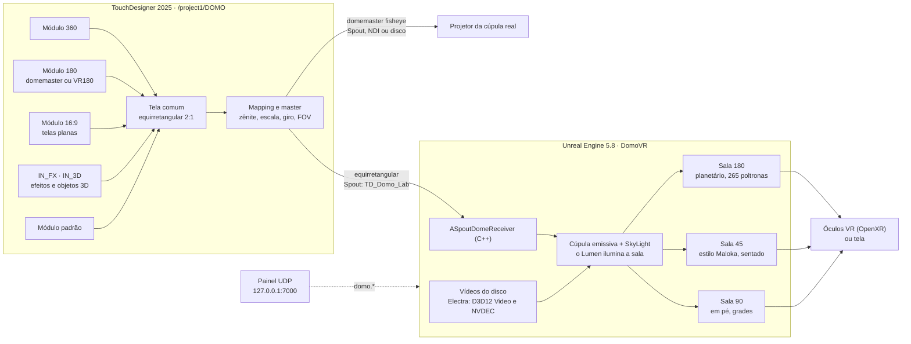
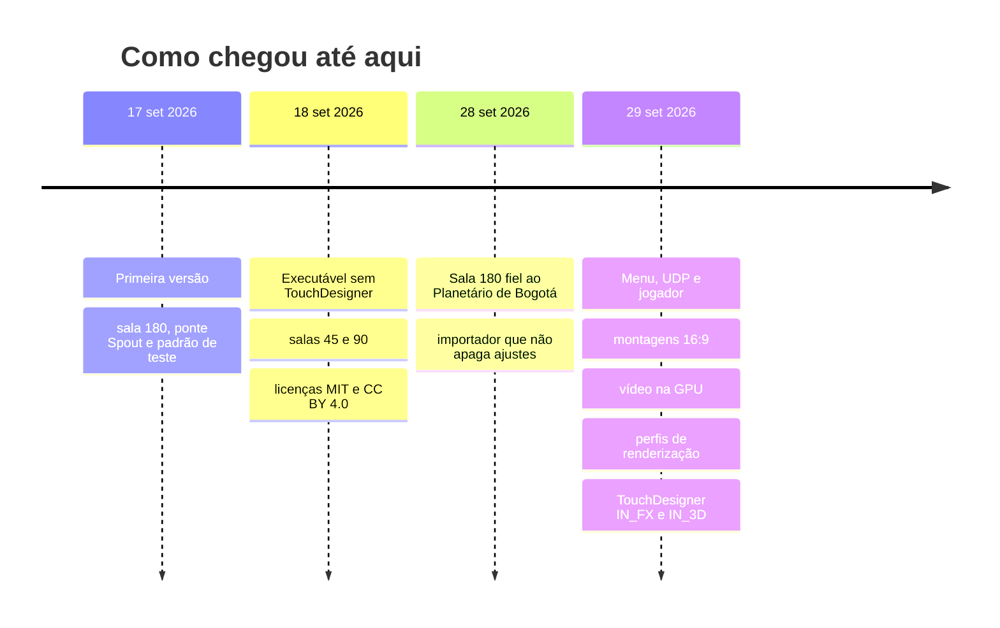

<div align="center">

# domo-lab

**Testar um vídeo de domo a partir da poltrona, em realidade virtual, antes de entrar na cúpula real.**

[Español](README.md) · [English](README.en.md) · **Português**

[](LICENSE)
[](LICENSE-CONTENT)
[](https://www.unrealengine.com/)
[](https://derivative.ca/)
[](https://www.blender.org/)
[](04_Docs/06_Unreal_standalone.md)
[](#início-rápido)
[](04_Docs/07_GPUs_AMD_e_Intel.md)

[Novidades](#novidades) · [Galeria](#galeria) · [O que faz](#o-que-faz) · [Início rápido](#início-rápido) · [Executável](#o-executável-sem-touchdesigner) · [TouchDesigner](#touchdesigner) · [Placas de vídeo](#placas-de-vídeo) · [Roteiro](#roteiro) · [Documentação](#documentação)


*3gracias, de David Vega: pintura à mão quadro a quadro, montada em um formato novo para domo e vista de uma
poltrona da sala virtual (captura do executável).*

</div>

> **Sobre os idiomas.** O projeto foi escrito em espanhol. Este README está traduzido por completo para o inglês e o
> português. Os documentos técnicos de [`04_Docs/`](04_Docs/) e o [CHANGELOG](CHANGELOG.md) continuam só em espanhol;
> o tradutor do navegador funciona bem neles, e traduzi-los está no [roteiro](#roteiro).

## Novidades

Últimas mudanças, da mais recente para a mais antiga. O registro completo está no [CHANGELOG](CHANGELOG.md) (em espanhol).

| Data | O quê |
|---|---|
| 29 set 2026 | **TouchDesigner:** montagens 16:9 corrigidas (cilindro, túnel e corte), efeitos `IN_FX`, objetos 3D `IN_3D`, um master de imagem e um **painel de controle do Unreal por UDP**. Os modelos do executável passam a ser gerados a partir dos do TouchDesigner. |
| 29 set 2026 | **Sala e renderização:** paredes pretas, piso menos reflexivo, **fundo desfocado** atrás das telas 16:9, **perfis de renderização** que se adaptam à tela e à placa de vídeo, e um `ajustes.json` que lembra as configurações. |
| 29 set 2026 | **Vídeo na GPU:** o executável decodifica com o Electra (D3D12 Video e NVDEC) sem sair do DirectX 12. Um vídeo HEVC de 4096 × 4096 passou de 6,5 para 1,5 núcleos de CPU. |
| 29 set 2026 | **AMD e Intel:** pesquisa, decisões e um plano de verificação em [07_GPUs_AMD_e_Intel.md](04_Docs/07_GPUs_AMD_e_Intel.md). |
| 28 set 2026 | **Sala 180 refeita** a partir de fotos do Planetário de Bogotá: quatro grupos de poltronas, quatro corredores até as saídas, cabine de controle fechada. |

## Galeria

<table>
<tr>
<td width="50%"><br><sub><b>Sala 180</b>, luzes acesas: 265 poltronas, palco de 3 m e parede preta com luzes no alto.</sub></td>
<td width="50%"><br><sub><b>Com sinal</b>: a cúpula ilumina a sala e as luzes da sala se apagam sozinhas.</sub></td>
</tr>
<tr>
<td width="50%"><br><sub><b>Corredores</b> que terminam nas quatro saídas de emergência.</sub></td>
<td width="50%"><br><sub><b>Cabine de controle</b>: fechada, atrás do grupo de poltronas do fundo; o operador não vê o público.</sub></td>
</tr>
<tr>
<td width="50%"><br><sub><b>Sala 45</b>, estilo Maloka: público sentado diante de uma meia esfera inclinada.</sub></td>
<td width="50%"><br><sub><b>Sala 90</b>, em pé com grades, como nos museus.</sub></td>
</tr>
</table>

<details>
<summary><b>Ver mais: o sinal do TouchDesigner e o padrão de teste</b></summary>

| | |
|---|---|
|  |  |
| Domemaster de *3gracias*: o que sai para o projetor | A tela equirretangular que a sala VR recebe |
|  |  |
| O padrão de teste com o qual tudo foi medido | O mesmo padrão na cúpula virtual |

</details>

## O que faz

- O **TouchDesigner** recebe vídeo **360, 180 (domemaster ou VR180) ou plano 16:9** e o transforma no sinal de uma
  cúpula: um domemaster fisheye para o projetor e um equirretangular para a sala virtual.
- O **Unreal Engine 5.8** recebe esse sinal por **Spout** e o projeta em uma **sala de planetário em realidade
  virtual**, para ver o conteúdo de uma poltrona, com óculos VR ou em uma tela.
- **Um executável para Windows que dispensa o TouchDesigner** reproduz os vídeos de uma lista direto na cúpula, com
  menu na tela, jogador que anda ou voa, montagens de telas 16:9 editáveis ao vivo, controle por UDP e decodificação
  de vídeo na GPU.
- **Três modelos de sala** (180 horizontal, 45 estilo Maloka com público sentado, 90 em pé com grades) e as **fichas
  dos domos da Colômbia**, para repetir o processo com outra sala trocando dados e não código.

Tudo se regenera por script: a sala sai do Blender, o nível do Unreal de um importador que não apaga os seus ajustes
e a rede do TouchDesigner de um construtor. O que se afirma sobre orientações e ângulos foi medido com um padrão de
teste, e as capturas estão no repositório.

## Arquitetura



## Início rápido

**Requisitos:** Windows 10 ou 11, placa de vídeo com DirectX 12, TouchDesigner 2025 (a licença Non-Commercial
basta), Unreal Engine 5.8 com Visual Studio (o projeto compila um módulo em C++) e Blender 5.2 só se quiser
regenerar a sala.

<details open>
<summary><b>A. Com o TouchDesigner: o sinal ao vivo</b></summary>

1. Abra `00_TouchDesigner/domo_lab.toe`. Em `/project1/DOMO`, página *Domo*, deixe `Fuente` (fonte) no padrão de
   teste para calibrar, ou escolha um módulo (360, 180, 16:9, `IN_FX` ou `IN_3D`) e coloque o arquivo na página dele.
   Só se ouve o áudio do vídeo que está no ar.
2. Abra a sala com `03_Unreal/abrir_proyecto.ps1`. No editor, os níveis mostram o que chegar por Spout com o nome
   `TD_Domo_Lab`. Se a cúpula ficar preta, revise a lista de verificação de
   [03_Puente_Spout.md](04_Docs/03_Puente_Spout.md).
3. Para VR, o OpenXR está habilitado: com o SteamVR ou o Virtual Desktop rodando, *Play → VR Preview*.

</details>

<details>
<summary><b>B. Sem o TouchDesigner: o executável</b></summary>

1. Feche o editor e rode `03_Unreal/empaquetar.ps1`. Ele deixa o programa em `03_Unreal/Build/Windows/DomoVR.exe`.
2. Coloque os seus vídeos e a lista (`playlist.json`) em `Content/Movies/`, ao lado do executável.
3. Abra o `DomoVR.exe` e pressione **F2** para o menu. **F3** alterna entre o sinal do Spout e os vídeos.
4. Vídeos H.264 e HEVC de até 4096 × 4096 são decodificados na GPU. Veja
   [06_Unreal_standalone.md](04_Docs/06_Unreal_standalone.md) (em espanhol).

</details>

<details>
<summary><b>C. Outra sala ou regenerar o modelo</b></summary>

```powershell
# Blender, sem interface (a sala 180 assa texturas: uns 10 minutos; a 45 e a 90, uns 20 segundos)
blender.exe -b -P 01_Blender\generar_sala_domo.py
blender.exe -b -P 01_Blender\generar_sala_domo.py -- --fov 45
blender.exe -b -P 01_Blender\generar_sala_domo.py -- --fov 90
```

Depois, o importador atualiza o nível do Unreal **sem apagar os seus ajustes** (`03_Unreal/importar_sala.ps1`).
Os detalhes estão em [05_Modelos_de_sala.md](04_Docs/05_Modelos_de_sala.md) (em espanhol).

</details>

## O executável sem TouchDesigner

O `DomoVR.exe` é a sala empacotada como programa independente. Traz tudo o que é preciso para ensaiar um show em uma
única máquina.

<table>
<tr>
<td width="58%" valign="top">

| Função | Como se usa |
|---|---|
| **Menu na tela** | F2 ou M: fonte, vídeos, formato, luzes, pontos de vista, qualidade e sala |
| **Playlist** | `playlist.json` com cues; formato 360, domemaster, VR180 ou 16:9 |
| **Montagens 16:9** | 21 modelos (coroa, salas de 2 e 4 telas, anel, cilindro, túnel…) editáveis ao vivo |
| **Fundo desfocado** | três modos atrás das telas: sem fundo, lavado e envolvente |
| **Jogador** | anda, voa ou atravessa paredes; teclas remapeáveis (`controles.json`) |
| **Controle por UDP** | `127.0.0.1:7000`, linhas `domo.*` do TouchDesigner, Resolume, QLab ou de um script |
| **Perfis de renderização** | automático, óculos VR, monitor, projetor ou domo, e leve |
| **Ajustes salvos** | o `ajustes.json` lembra perfil, paredes, piso, véu, luzes e decodificador |
| **Vídeo na GPU** | Electra com D3D12 Video e NVDEC; reserva em etapas até a CPU |
| **Otimizar vídeo** | cópia H.264 leve com ffmpeg (NVENC, AMF ou Quick Sync conforme a placa) |

</td>
<td width="42%" valign="top">


<sub>O menu (F2): qualidade de renderização, paredes, piso, decodificador e montagens.</sub>

</td>
</tr>
</table>

### Montagens 16:9

Um vídeo plano é dividido em telas que cercam o público. Os modelos são os mesmos no TouchDesigner e no Unreal: saem
de `00_TouchDesigner/video_dome/plantillas_ue.json`, e o `03_Unreal/generar_plantillas.py` os leva ao executável;
assim os números não se desencontram.

<div align="center">


<sub>Seis dos 21 modelos, vistos da sala: coroa, sala de quatro telas, anel, cilindro, túnel e cinema.</sub>

</div>

<details>
<summary><b>Comandos de console e UDP mais usados</b></summary>

| Comando | O que faz |
|---|---|
| `domo.Abrir CaminhoCompleto` | adiciona o vídeo à lista e o coloca na cúpula |
| `domo.Cue N`, `domo.Siguiente`, `domo.Anterior` | muda de cue |
| `domo.Plantilla id` | montagem 16:9 (`cine`, `sala_2`, `sala_4`, `sala_corona`, `tunel`, `anillo`, `cilindro`…) |
| `domo.Param Nome Valor` | qualquer parâmetro: Yaw, Pitch, Horizonte, Brillo, `S_Fondo_Desenfoque`… |
| `domo.Perfil auto\|vr\|monitor\|proyector\|ligero` | perfil de renderização |
| `domo.Paredes 0\|1` | paredes pretas ou com a madeira original |
| `domo.Reproductor auto\|electra\|protron\|wmf` | decodificador de vídeo |
| `domo.Luces 0\|1\|auto` | luzes da sala; `auto` faz com que sigam o sinal |
| `domo.Optimizar` | cópia H.264 leve do vídeo atual |
| `domo.Guardar` | grava a lista e os ajustes |

A lista completa está em [06_Unreal_standalone.md](04_Docs/06_Unreal_standalone.md) (em espanhol). Os nomes dos
comandos são em espanhol.

</details>

## TouchDesigner

O sistema de sinal vive em `/project1/DOMO`. Cada módulo de entrada entrega a mesma tela equirretangular; dela saem
o domemaster para o projetor e o equirretangular para a sala virtual.

| Módulo | Para quê |
|---|---|
| **360, 180 e 16:9** | vídeo de cada formato; o 16:9 traz os modelos de telas e 34 valores com faixa para ajustá-los |
| **IN_FX** | oito efeitos GLSL reativos ao áudio |
| **IN_3D** | objetos 3D animados com câmera orbital, sem importar modelos (há um encaixe para o seu) |
| **Master** | brilho, contraste, gama e preto de toda a saída |
| **Painel UDP** | envia comandos `domo.*` ao executável do Unreal |
| **Padrão** | tela de faixas e marcas para verificar orientações |

<details>
<summary><b>Imagens do IN_FX e do IN_3D</b></summary>

| | |
|---|---|
|  |  |
| Efeitos reativos ao áudio | Objetos 3D animados |

</details>

## O abismo: o Unreal como fonte

O sentido inverso: em vez de receber vídeo, o Unreal **gera o domo** e o envia por **NDI**. Uma cena em tempo real (fundo
marinho com partículas e brilho, criaturas que cruzam a Colômbia de hoje com o mar do Cretáceo de Villa de Leyva, e lixo
plástico com o qual dialogam) é renderizada como domemaster por uma câmera que percorre o espaço. Medido: 2048 × 2048 a 30 fps
estáveis por NDI na RTX 3090, no editor e no executável empacotado. Falta recebê-lo dentro do TouchDesigner.

<div align="center">


<sub>O domemaster que sai do Unreal por NDI: o diálogo com o lixo, e uma tartaruga que cruza diante da câmera.</sub>

</div>

Detalhes, parâmetros e armadilhas em [09_Abismo_Unreal_a_NDI.md](04_Docs/09_Abismo_Unreal_a_NDI.md) (em espanhol); as criaturas em
[08_Criaturas_abismo.md](04_Docs/08_Criaturas_abismo.md) (em espanhol).

## Placas de vídeo

O executável usa DirectX 12 e não depende do fabricante. **Só foi testado em NVIDIA**; para AMD e Intel estão escritas
as decisões e o plano de verificação, e o que falta fica à vista.

| Tema | NVIDIA | AMD | Intel |
|---|---|---|---|
| Renderização (Lumen, Nanite, TSR) | ✅ verificado (RTX 3090) | 🟡 previsto | 🟡 previsto |
| Vídeo H.264 e HEVC na GPU | ✅ NVDEC e D3D12 Video | 🟡 D3D12 Video e Media Foundation | 🟡 D3D12 Video e Media Foundation |
| Otimizar vídeo (ffmpeg) | ✅ `h264_nvenc` | 🟡 `h264_amf` | 🟡 `h264_qsv` |
| Perfil de renderização automático | ✅ | 🟡 detecta o fabricante | 🟡 detecta o fabricante |

✅ verificado com a placa · 🟡 implementado ou decidido, ainda sem verificar nessa placa. Quem tiver uma placa AMD ou
Intel pode ajudar seguindo a seção *Sin verificar* (sem verificar) de
[07_GPUs_AMD_e_Intel.md](04_Docs/07_GPUs_AMD_e_Intel.md) (em espanhol).

## O que foi medido e vale saber

- A tela comum é equirretangular 2:1: `u` 0,5 é a frente, `v` 0,5 o horizonte, `v` 1 o zênite. A cúpula do Unreal lê
  só a metade superior e a frente cai em +X, o lado oposto à área de controle.
- No Projection TOP, o giro em azimute não se faz com as rotações: é um deslocamento horizontal da tela. A
  inclinação vai como `rx = 90 − Pitch`.
- A costura de um 360 é um meridiano de polo a polo: girar em azimute só a muda de lugar e ela sempre sobe até o
  zênite. Para tirá-la da cúpula é preciso girar a esfera (página *360*: `Rpitch` 90, ou `Rroll` 90 com `Rpitch` 30).
- O receptor Spout do Unreal só lê texturas de 8 bits. Com 16-bit float ele fica com o último quadro que conseguiu
  ler e não avisa.
- O Unreal em segundo plano reduz o ritmo do editor; para ver o sinal ao vivo é preciso deixá-lo à frente.
- No motor, o decodificador D3D12 Video do Electra vem desligado no Windows; o controlador o liga ao iniciar. Em
  NVIDIA, quem decodifica é o NVDEC, que tem prioridade.
- No TouchDesigner se move o zênite, se escala, se gira e se escolhe quantos graus de conteúdo cabem na cúpula (230
  sobre uma cúpula de 180, verificado com o padrão), sem tocar no Unreal.

A lista completa, com datas, está na seção 5 de [01_Proceso_y_matematica.md](04_Docs/01_Proceso_y_matematica.md).

## O processo em quatro passos

1. **Sala real → modelo.** O `01_Blender/generar_sala_domo.py` constrói a sala (cúpula de 23 m como a do Planetário
   de Bogotá, 265 poltronas reclinadas em 4 grupos separados por 4 corredores que terminam nas 4 saídas de
   emergência, palco de 3 m, cabine de controle fechada atrás do grupo do fundo e luzes no alto da parede) e exporta
   FBX e um manifesto JSON para `02_Export/`.
2. **Modelo → Unreal.** O `03_Unreal/importar_sala.py` monta o nível `DomoVR`: materiais PBR com texturas geradas por
   script, Nanite, Lumen com ray tracing por hardware, TSR, e uma cúpula emissiva marcada como céu mais um SkyLight em
   tempo real, para que a cúpula ilumine a sala. Rodá-lo de novo **atualiza o nível sem apagar os seus ajustes**.
3. **TouchDesigner → Spout.** O `00_TouchDesigner/build_domo.py` constrói `/project1/DOMO` e entrega o domemaster com
   o FOV da sala (180, 90, 45) por Spout, NDI ou disco, e o equirretangular que a sala VR espera (sender
   `TD_Domo_Lab`).
4. **Verificação com padrão.** O módulo `patron` envia uma tela de faixas e marcas; com ele se comprovou onde cai cada
   parte da tela na cúpula virtual. Capturas em `05_Preview/pruebas/`.

## Roteiro

O que já funciona está no [CHANGELOG](CHANGELOG.md). Isto é o que vem a seguir; **nada está prometido para uma data**.



| Agora | Depois | Mais adiante |
|---|---|---|
| **Fechar a cadeia ao vivo** | **Mais controle do show** | **Mais alcance** |
| Receber o abismo dentro do TouchDesigner (módulo `IN_UE`) e devolver um Spout In ao `VIDEO_DOME` sem erros | Áudio do abismo por NDI e controle por UDP | O abismo como textura da cúpula da sala virtual |
| Testar o painel UDP do TouchDesigner contra o executável aberto | Transição entre cues e um segundo reprodutor para misturar dois vídeos | Mais salas da Colômbia, com medidas no local |
| Levar as correções do shader de telas para o `estudio_pantallas.html` | Remote Control no build (`-RCWebControlEnable`) como segundo caminho de controle | Uma sala montada a partir de uma ficha do `domos_colombia.json`, sem editar código |
| Testar o executável em óculos VR (SteamVR, Virtual Desktop) | Costura suavizada do 360 dentro do material da cúpula | Codec HAP para quando o disco for mais barato que a GPU |
| Verificar vídeo e renderização em AMD e Intel | Textura da cúpula em 16 bits ou HDR (hoje 8 bits, igual ao Spout) | Um pacote para baixar (uma *release*) com o build e os vídeos de teste |
| Medir os quadros por segundo com Unreal e TouchDesigner abertos ao mesmo tempo | Encaixar um modelo 3D próprio no `IN_3D` | Documentação traduzida para inglês e português (hoje só este README) |

**Feito em setembro de 2026**

- [x] Sala 180 fiel ao Planetário de Bogotá, salas 45 e 90, importador que não apaga ajustes.
- [x] Executável sem TouchDesigner: menu, playlist, controle por UDP, jogador e teclas remapeáveis.
- [x] Montagens 16:9 (21 modelos) editáveis ao vivo, com fundo desfocado e brilho por tela.
- [x] Decodificação de vídeo na GPU com DirectX 12 e reserva na CPU.
- [x] Paredes pretas, piso menos reflexivo, perfis de renderização e ajustes salvos.
- [x] TouchDesigner: montagens corrigidas, `IN_FX`, `IN_3D`, master e painel UDP.
- [x] Pesquisa sobre AMD e Intel.
- [x] **O abismo:** o Unreal gera um domo em tempo real e o envia por NDI (cena, criaturas e diálogo com o lixo).
- [x] README em espanhol, inglês e português.

As propostas são abertas como *issue* ou *pull request*; veja [Contribuir](#contribuir).

## Documentação

| Quero… | Abra |
|---|---|
| entender o processo completo e a matemática | [01_Proceso_y_matematica.md](04_Docs/01_Proceso_y_matematica.md) |
| enviar um vídeo à cúpula pelo TouchDesigner | [04_Senal_TouchDesigner.md](04_Docs/04_Senal_TouchDesigner.md) |
| abrir ou regenerar a sala no Unreal | [02_Sala_Unreal.md](04_Docs/02_Sala_Unreal.md) |
| conectar o TouchDesigner ao Unreal (Spout) | [03_Puente_Spout.md](04_Docs/03_Puente_Spout.md) |
| usar o executável sem TouchDesigner e empacotá-lo | [06_Unreal_standalone.md](04_Docs/06_Unreal_standalone.md) |
| usá-lo com uma placa AMD ou Intel | [07_GPUs_AMD_e_Intel.md](04_Docs/07_GPUs_AMD_e_Intel.md) |
| fazer o Unreal gerar o domo e enviá-lo por NDI (o abismo) | [09_Abismo_Unreal_a_NDI.md](04_Docs/09_Abismo_Unreal_a_NDI.md) |
| as criaturas e o lixo plástico do abismo | [08_Criaturas_abismo.md](04_Docs/08_Criaturas_abismo.md) |
| os outros modelos de sala (45 e 90) | [05_Modelos_de_sala.md](04_Docs/05_Modelos_de_sala.md) |
| as cúpulas da Colômbia e como corrigir seus dados | [06_Modelos/Domos_de_Colombia.md](06_Modelos/Domos_de_Colombia.md) |
| testar montagens de telas no navegador | [estudio_pantallas.html](00_TouchDesigner/video_dome/web/estudio_pantallas.html) |
| o que mudou e quando | [CHANGELOG.md](CHANGELOG.md) |
| o registro completo de como a sala foi construída | [Unreal_sala_domo.md](04_Docs/Unreal_sala_domo.md) |

Toda a documentação também está em uma única página com busca em `docs/index.html`; ela se regenera com
`python 04_Docs/build_docs.py`. Os documentos estão em espanhol; este README também existe em
[espanhol](README.md) e [inglês](README.en.md).

## O que há dentro

```
00_TouchDesigner/       o sistema de sinal
  build_domo.py           construtor de /project1/DOMO (idempotente, conserva a configuração)
  domo_lab.toe, DOMO.tox  o resultado salvo; abrir e usar
  modulos/                IN_FX, IN_3D, master e painel UDP
  shaders/                costura do 360, giro esférico, padrão de teste, tela plana, efeitos
  video_dome/             o sistema de telas para vídeo plano (coroa, salas, anéis, cilindro)
    web/estudio_pantallas.html   estúdio WebGL para mover telas com o mouse
01_Blender/             generar_sala_domo.py e os arquivos .blend
02_Export/              FBX e manifestos JSON das três salas
03_Unreal/              DomoVR (projeto UE 5.8), importar_sala.py, conectar_spout.py, empaquetar.ps1,
                          crear_media_domo.py (material da cúpula), generar_plantillas.py
04_Docs/                a documentação, numerada em ordem de leitura
05_Preview/             renders, capturas do Unreal e os testes do padrão
06_Modelos/             domos_colombia.json e seu documento
CHANGELOG.md            registro de mudanças
```

## Contribuir

- **Corrigir ou adicionar uma sala da Colômbia:** edite `06_Modelos/domos_colombia.json`, um pull request por sala,
  com a fonte de cada dado ou dizendo que foi medido no local.
- **Testar em uma placa AMD ou Intel:** siga a seção *Sin verificar* de
  [07_GPUs_AMD_e_Intel.md](04_Docs/07_GPUs_AMD_e_Intel.md) e abra uma *issue* com o resultado.
- **Um modelo de sala novo:** veja [05_Modelos_de_sala.md](04_Docs/05_Modelos_de_sala.md).
- **Um módulo de entrada novo no TouchDesigner:** veja a seção 9 de
  [04_Senal_TouchDesigner.md](04_Docs/04_Senal_TouchDesigner.md).
- **Traduzir a documentação:** os documentos de `04_Docs/` estão só em espanhol.
- Se você mudar uma afirmação sobre ângulos ou orientações, acompanhe-a da captura do padrão que a comprova em
  `05_Preview/pruebas/`.

Ao contribuir, você aceita que a sua contribuição seja publicada sob as mesmas licenças do repositório (MIT para
código, CC BY 4.0 para conteúdo).

## Créditos

- Sala, scripts, documentação e renders: [David Vega](https://davidvega.org)
  ([@Danvegamo](https://github.com/Danvegamo)), 2026.
- *3gracias*: vídeo de David Vega, pintado à mão quadro a quadro.
- Sistema de telas para vídeo plano: vem do sistema de telas de um projeto anterior do autor, testado então com um
  vídeo plano de teste.
- Plugin Spout para o Unreal: [kessoning/Spout-UE5](https://github.com/kessoning/Spout-UE5), ramo `5.8_fix`; o
  README dele declara a licença MIT.
- As notas de referência citam Paul Bourke e o material *Fulldome 101*; veja a seção 4 do documento do processo.

## Licença

| O quê | Licença |
|---|---|
| Código (scripts Python, shaders, C++, redes do TouchDesigner, HTML) | [MIT](LICENSE) |
| Documentação, imagens, renders, capturas e modelos 3D | [CC BY 4.0](LICENSE-CONTENT) |
| O vídeo *3gracias* e seus quadros | Todos os direitos reservados; veja [LICENSE-CONTENT](LICENSE-CONTENT) |
| Plugin `03_Unreal/DomoVR/Plugins/SpoutPlugin` | MIT do seu autor ([kessoning/Spout-UE5](https://github.com/kessoning/Spout-UE5)) |

As duas licenças pedem crédito. Para o conteúdo, a atribuição é:

> domo-lab por David Vega (davidvega.org), CC BY 4.0

## Como citar

O GitHub mostra o botão *Cite this repository* a partir do [CITATION.cff](CITATION.cff). Em texto:

> Vega, D. (2026). *domo-lab: laboratório aberto de domo com TouchDesigner e Unreal Engine* [Software].
> https://github.com/Danvegamo/domo-lab

```bibtex
@software{vega_domo_lab_2026,
  author = {Vega, David},
  title  = {domo-lab: laboratorio abierto de domo con TouchDesigner y Unreal Engine},
  year   = {2026},
  url    = {https://github.com/Danvegamo/domo-lab}
}
```
